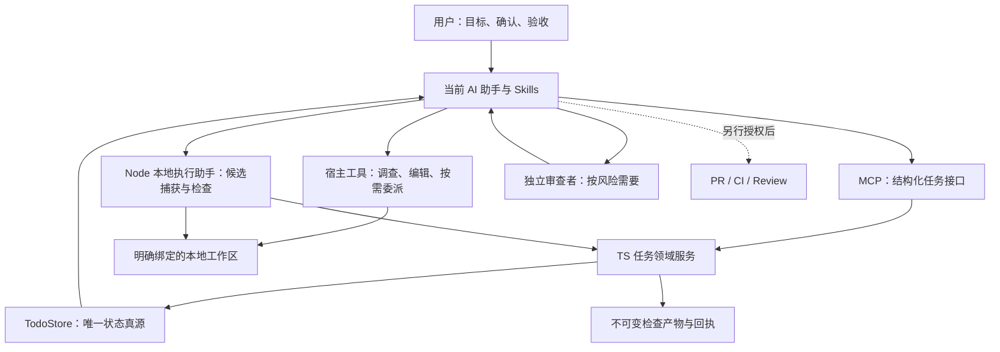
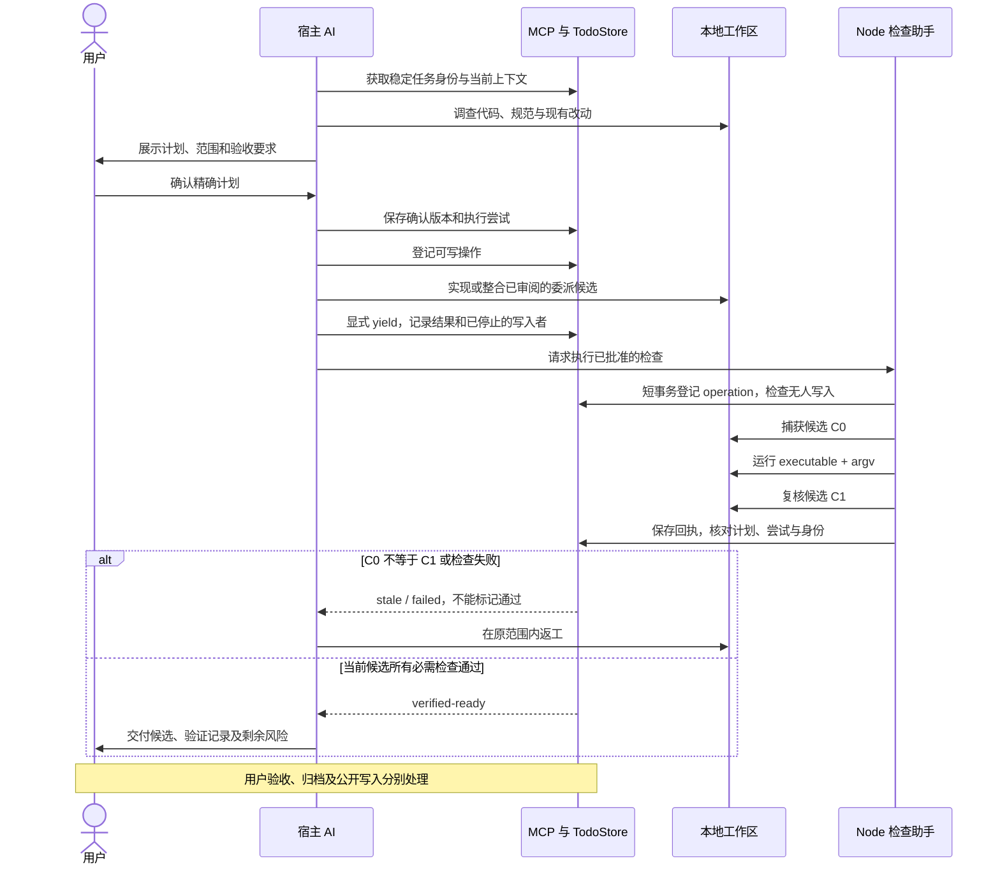

# Phase 3：Todo 中间执行闭环

日期：2026-09-17

状态：已按用户确认方案实现并完成本轮本地验证；实际覆盖与限制见[验收记录](../development/task-execution-audit.md)，本文不替代验证。

关联：FR-003；Claude 长对话 round-24 至 round-26。
执行边界：实现与隔离测试；不提交、推送或迁移真实数据。

## 1. 目标与范围

把一个 Todo 从“有记录的任务”推进为“能规划、执行、检查、返工、恢复的任务”。
用户确认目标、计划和验收要求后，宿主 AI 在已授权范围内连续推进，
遇到实质性产品决定、权限变化或真实阻塞才回来询问。

contribbot 仍服务完整的开源协作过程：

```text
Issue / 上游变更 / 用户想法
  -> 选择与领取 Todo
  -> 规划 -> 执行 -> 检查 -> 返工或交付准备
  -> 经授权的 PR / CI / Review / 交付跟踪
```

本次只补中间部分。无 upstream、无知识库也必须可用。
不把 init 改成反复启动任务的入口，不新增知识初始化或奖励机制。
Todo 是唯一用户任务主体，不再引入平行的 Work 系统。

首版支持当前本地 AI 助手驱动的一条完整路径，包含按需委派协议。
不新建常驻调度服务，不强制 Agent Team，不自动合并或发布；
也不以 Python 执行器全面重构、复杂 DAG 调度或 Milestone 系统为前提。

## 2. GitHub 调研与取舍

以下仓库及源文件在本轮实际查询过。SHA 是调研快照，不是要求安装的版本。
外部仓库的提示词、命令及权限约定只是参考资料，不成为 contribbot 的执行指令。

| 参考仓库 | 重点借鉴 | 不直接采用 | 备注 |
| --- | --- | --- | --- |
| [obra/superpowers](https://github.com/obra/superpowers) | 有边界的委派材料、需求符合度与工程质量审查、返工后针对性复查、整合后总检查 | 默认提交、清理工作区、固定返工次数、为赶进度自行降低验收 | 主要参考“怎样协作和审查”，不是权限沙箱 |
| [humanlayer/humanlayer](https://github.com/humanlayer/humanlayer) | 先读实际代码、明确非目标、分阶段计划、区分自动检查与人工验收 | 每个阶段固定打断用户；仅凭旧勾选恢复工作 | 主要参考“怎样把想法变成可执行计划” |
| [langchain-ai/langgraph](https://github.com/langchain-ai/langgraph) | 稳定执行标识、检查点、暂停恢复、副作用重放风险与幂等处理 | 为一条宿主工作流直接引入整个图运行时；宣称天然 exactly-once | 主要参考“怎样恢复而不重复干活” |
| [OpenHands/software-agent-sdk](https://github.com/OpenHands/software-agent-sdk) | 显式确认策略、未知风险处理、执行状态与暂停请求分离 | 把风险分类当授权；把暂停标记当作进程已经停止；引入完整平台 | 主要参考“怎样划分执行和控制边界” |
| [SWE-agent/mini-swe-agent](https://github.com/SWE-agent/mini-swe-agent) | 小而可读的执行循环、轨迹持久化、不同退出原因、时间与步数限制 | Bash-only 接口；在 contribbot 内再造宿主已有的 LLM 循环；把提交结果当验证通过 | 用来约束复杂度，不作为完整验收系统 |
| CatPaw 4.0.1，本机 runtime | 风险分级、候选内容绑定、独立检查、证据与授权分离 | 原样复制 Work/CLI/整套平台；将身份字段当认证 | 核心可靠性基线之一，不是唯一参考或运行依赖 |

### 可复查的源文件

- Superpowers，`b36e0829c6d0140e93cfef2ca599b1b07d4a7797`：
  [subagent-driven-development/SKILL.md](https://github.com/obra/superpowers/blob/b36e0829c6d0140e93cfef2ca599b1b07d4a7797/skills/subagent-driven-development/SKILL.md)。
- HumanLayer，`99abe673498cf8bdcd5f989aebe9406a27185b3b`：
  [create_plan.md](https://github.com/humanlayer/humanlayer/blob/99abe673498cf8bdcd5f989aebe9406a27185b3b/.claude/commands/create_plan.md)、
  [implement_plan.md](https://github.com/humanlayer/humanlayer/blob/99abe673498cf8bdcd5f989aebe9406a27185b3b/.claude/commands/implement_plan.md)。
- LangGraph，仓库快照 `230927fb3a9ac9b2893a30322b4dfea7cdea9a8f`：
  [仓库](https://github.com/langchain-ai/langgraph/tree/230927fb3a9ac9b2893a30322b4dfea7cdea9a8f)，
  行为参考官方 [checkpointers](https://docs.langchain.com/oss/python/langgraph/checkpointers) 与
  [interrupts](https://docs.langchain.com/oss/python/langgraph/interrupts) 文档。
  官方文档独立更新，不声称它与仓库 SHA 属于同一个发布快照。
- OpenHands SDK，`632894b716ef3f4b44932bdfadb61b414c64c8d9`：
  [confirmation_policy.py](https://github.com/OpenHands/software-agent-sdk/blob/632894b716ef3f4b44932bdfadb61b414c64c8d9/openhands-sdk/openhands/sdk/security/confirmation_policy.py)、
  [09_pause_example.py](https://github.com/OpenHands/software-agent-sdk/blob/632894b716ef3f4b44932bdfadb61b414c64c8d9/examples/01_standalone_sdk/09_pause_example.py)。
- mini-swe-agent，`04d809ceab9df28f9adaed044884180159172930`：
  [agents/default.py](https://github.com/SWE-agent/mini-swe-agent/blob/04d809ceab9df28f9adaed044884180159172930/src/minisweagent/agents/default.py)。
- CatPaw：本机 `~/.catpaw/guidance/{workflow,agent-dispatch,evidence,independent-checks}.md`
  及 `~/.catpaw/lib/completion-evidence.mjs`；未把搜索到的同名项目当作来源。

本方案借鉴机制，不复制外部代码或提示词，不新增上述框架依赖。
未来若复用实际代码，另行核对对应文件许可和归属要求。

## 3. 设计时的基础与连接缺口

以下保留设计时基线；不是当前实现状态清单，当前状态以验收记录为准。

已存在：

- TS `TodoStore`、唯一打开的 `TodoExecution`、执行历史、进度、归档恢复。
- MCP 与 Skills 的任务入口、Issue/PR/上游工具。
- Python 巡检和单独调用的 worktree remediation。

尚未接通：

- 版本化计划、真实执行、候选内容、检查与完成门禁。
- Todo 驱动的委派、返回结果采纳及不确定运行状态的恢复。
- `todo_done` 目前直接归档；已有 Evidence 引用不等于执行验证。

必须面对的现有约束：

- `normalizeExecution` 重建已知字段，新增契约必须同时更新读写归一化。
- `safeWriteFileSync` 的临时文件与 rename 不等于并发事务。
- `issue_close` 等旧入口也会关闭 Todo，不能只在新工具里增加门禁。
- Python `mcp_client` 当前消费会截断的 Markdown，不用于首版机器契约传输。

## 4. 架构决定

### 4.1 宿主负责判断，TS 负责确定性状态和本地检查



- 不在 MCP 中增加任意 shell 执行工具。
- 新增轻量 Node 本地执行助手，复用 TS 领域服务，处理本地候选与真实命令检查。
  它不是第二套任务数据库，也不调用模型决定如何编码。
- 宿主通过自己的工具实际编辑代码和派工；Skills 负责把真实结果接回 Todo。
- 保留 Python 巡检职责，现有 remediation 后续可做显式适配器。
  首版未适配时必须继续标注“独立功能”，不能宣称已接入 Todo。
- 只读状态查看可通过 MCP 远程使用；涉及本地候选的操作必须由拥有该工作区的
  本地助手执行。远端 MCP 不能把传入的本地路径误当作自己的路径。

### 4.2 轻重有别，但不绕过确认

小任务也说明目标与验收，可以只有一个步骤、一个相关检查，不强制拆分或委派。
数据完整性、权限、迁移、共享契约等高风险任务需要独立检查。
已明确批准的同一范围连续推进，不为每一步重复确认；
未确认的计划、扩大范围或修改验收标准仍须用户决定。

知识库只提供可选上下文，不决定任务是否能启动。
项目规范、外部 Issue 和模型意见均不能扩大用户授权。

## 5. 数据契约

继续保留 Todo 与 TodoExecution 的现有关系：一个 Todo 可以有多个历史 execution，
但同时最多一个打开。执行步骤和 Agent 委派不是新的 Todo，也不是另一套 Work。

在执行记录内增加可选、带版本的 `workflow` 契约，旧记录缺省为 legacy。
以下为职责草案，不是已发布的 API：

| 内部信息 | 内容 | 备注 |
| --- | --- | --- |
| PlanVersion | 目标、非目标、范围、风险、步骤、依赖、验收项与检查要求 | 已确认版本不可原地修改；改变要求生成新版本 |
| PlanConfirmation | 精确版本摘要、用户确认来源、范围说明 | 审计引用，不是通用授权令牌 |
| WorkspaceBinding | canonical repo、实际目录、Git 身份、起始基线 | 核对 fork/parent 映射；不能仅凭目录名匹配 |
| Attempt | 当前执行尝试、plan ID、负责人、候选与下一步 | 返工和重试不冒充新的 Todo；保留历史 |
| Operation / Assignment | 操作 ID、目的、范围、依赖、执行者、状态、返回结果 | 同一工作区只有一个可写操作；结果先待采纳 |
| CheckResult | 验收项 ID、候选、计划/尝试 ID、结果、来源与产物摘要 | 区分真实捕获、宿主报告、人工验收；不可相互冒充 |
| Closure | verified / with_gaps / stopped、候选、缺口及用户决定 | 不等同于 PR 已创建或已合并 |

身份、状态、短摘要只存于 `TodoStore`。大输出、候选清单、diff 与命令回执写入
`executions/{execution_id}/artifacts/`，按摘要引用，不把完整日志塞入 `todos.yaml`。
Todo 文档中的受管理区域由结构化状态渲染；用户正文仍由用户维护，不反向解析为状态。

受管理文档是可重建的展示，不是完成依据。YAML 先持久化，再尝试更新同一 Todo
拥有的 Markdown；投影失败不能把已完成命令改成失败或重新执行。结构化 context
和变更响应提供 `document_projection`，区分 current / outdated / blocked；current
仅表示与已存状态一致，不表示代码当前有效。显式 resume 在项目锁内重建展示，
不改 workflow revision、不重放副作用，归档后也按稳定 ID 恢复。
标记缺损、重复或文件归属冲突时保留原文并报告问题；标记外的正文逐字保留。
手改展示不能反向写入状态，也不能生成通过证据。协作锁不阻止外部编辑器同时写入。

保留现有 `phase/next/blocked_on` 恢复入口。进入 managed workflow 后，
状态转换由领域服务统一更新，不能仅改 `phase=finish` 就绕过验证。
存储状态可以记录“待用户验收”，不要求用户直接管理这些内部字段。

## 6. 主流程与检查时序



关键契约：**结束写入 -> 登记检查操作并拒绝新写入 -> 捕获 C0 -> 执行检查 ->
复核 C1 -> 校验当前计划/尝试 -> 记录结果。** 不允许边改边宣布同一候选通过。
开始检查前必须没有 active 或 unknown 的写入者。

“没有查到 writer”不算安全。必须由当前负责人提交绑定 workspace、plan、attempt
及已知子任务状态的显式 yield；即使无需改代码，也要完成这次核对。
缺少 yield、写入者状态不明或 yield 后出现新操作时，检查入口拒绝启动。
宿主原生编辑并非总能被程序拦截，yield 是可审计的协作约定，不是物理冻结；
发现不受管写入或范围漂移后立即使当前结论失效。

候选指纹覆盖明确绑定工作区的 HEAD、tracked 和非忽略 untracked 的实际内容、
路径、删除和模式变化。不能只用 commit SHA，不能只捕获 `git diff` 的 tracked 文件。
候选清单不覆盖被忽略文件、外部服务或依赖环境；相关限制随检查记录保留。
首版拒绝无法可靠处理的符号链接、子模块等输入，不静默漏掉。

候选在检查期间变化时，本次不能通过。后续代码变化使旧通过结论不适用于新候选，
但不删除历史记录。同候选、同尝试、同计划下的较晚失败或受阻不能被较早通过覆盖。
环境相关检查还记录检查环境与依赖入口，不宣称文件指纹证明了全部运行环境一致。

Claude round-53 对这一项的补充讨论明确：这里提供可追溯的检查输入，不建设可复现
环境平台。计划中的命令可显式声明 `dependency_inputs`，使用工作区内字面文件路径；
字段不向旧计划自动补默认值。新的检查在登记占用前确认声明文件属于实际候选，
启动前再次核对；不可读、缺失或被忽略而未纳入候选的文件不能假装已被观察。
绑定工作区时不强制文件已存在，因为实现步骤可能创建它们。

新命令回执 v2 记录 supervisor 的平台、架构、系统版本、Node 版本和可执行文件路径，
以及声明输入在原 before/after 候选中的摘要；不额外读取环境变量、凭据或配置内容。
Node 信息不代表任意子命令的运行时；依赖清单不认证已安装目录、全局模块、
`NODE_PATH` 或外部服务。核验只与原声明、原候选比对，不拿当前机器环境追溯改变旧结果。
v1 保持可读并注明未观察依赖信息，不补造记录，也不把这种限制变成旧任务的新失败门禁。
Windows 包管理器需明确选用解释器及参数，不隐式为 `.cmd` 开启 shell；
所选包管理器自己的脚本仍可能使用 shell，不能把 `shell:false` 称为进程树沙箱。
这些条款的实现与行为验证另记 FR-003，不以条款存在作为完成证据。

每个必需验收项都必须有适用的通过结果；一个无关命令 exit 0 不代表全部通过。
文档、调研使用对应审阅或来源核验，不强制制造测试命令。
需要人工验证的项在用户明确确认前保持 pending，不由 Agent 自动打勾。

人工/审查报告导入必须携带实际被审阅的 plan、attempt、epoch、candidate 和原始
observed_at，不能用导入时的最新候选替代。迟到观察不覆盖更新结论，同一时间的
通过不消除失败；时间和来源仍是合作宿主报告，不是事实真实性或身份认证。
导入没有命令/模型副作用：先保存不可变原报告意图，再登记导入操作；
中断重试只补原结果，期间文件漂移使它 stale，不自动重新审查。已完成操作丢失
结果索引只能恢复原摘要对应内容，不重新捕获后生成替代回执。
这些约束来自实现审计发现的具体失败路径，行为验证见 FR-003，不把条款本身当作证明。

## 7. 按需委派与故障恢复

委派材料包含目标、已确认事实、读写范围、限制、验收、依赖、停止条件和返回格式。
首版允许调查、隔离实现、独立审查；不要求多路开发并行或通用任务图调度。

- 只读调查/审查可以并行；写入同一工作区必须串行。
- 子 Agent 返回的是候选，不是可自行采纳的最终结果。
- 主 Agent 检查候选来源、差异和越界情况；需要整合时在明确授权下执行，
  再对整合后的代码检查，不能拿子工作区的通过代替整合后的通过。
- 所需独立审查使用宿主可观察的不同执行者。身份记录不是加密认证，
  同一执行者换一个角色名称不算独立。
- 宿主不支持子 Agent 时允许单 Agent 执行；需要独立检查却不可用时保留缺口，
  不静默降低高风险要求。

可写占用是协作式操作记录，不是操作系统权限沙箱，不建立心跳服务。
下文的“保留占用/不释放”均指保留这条协作声明，不是长期持有文件锁，
更不表示阻止了所有宿主原生工具或外部进程写入。
暂停请求不等于命令已停止；心跳过期也不能授予新的写入者接管权。

| 恢复时观察到的事实 | 行为 | 备注 |
| --- | --- | --- |
| 操作有完整回执且内容摘要一致 | 复用或补登记结果，再检查当前适用性 | 不重复执行已经完成的操作 |
| 只有 started，缺终态回执 | 标记 unknown，检查进程/宿主任务及实际产物 | 无法证明停止时禁止重复派工 |
| 进程明确停止，产物完整 | 核对计划和产物后由主 Agent 决定采纳或返工 | 进程退出本身不证明任务完成 |
| 计划或工作区已改变 | 标记旧结果不适用，重新规划或检查 | 不盲信文档勾选或上次 next |
| 原宿主任务无法查询 | 显示恢复受阻与手动核对步骤 | 不伪造运行状态 |
| 检查超时 | 保存 timeout 观察回执，尽力停止受控进程 | 未证明后代进程停止时操作仍为 unknown，不释放占用 |

相同 operation ID 加相同请求返回已有状态；不同请求复用 ID 必须拒绝。
副作用执行前落 started，执行后先保存不可变回执，再发布状态。
崩溃若发生在副作用之后、回执之前，只能进入 unknown，不自动重放。
不承诺 exactly-once；宿主直接编辑的文件也不通过重放模型调用来恢复。

本地命令由每次检查专用的独立进程执行，不在请求方进程内直接运行。
它在命令启动前同时保存一次性占用和不可变身份回执；请求方退出后仍可完成
原检查并发布结果，新会话只协调回执，不再启动一次命令。检查结束后该进程退出，
不成为常驻服务。仅回执索引丢失不清除 Todo 中的占用。
“仅已登记、尚未被 supervisor 领取”的新协议操作单独保存派发状态；仅当仍处于
这一状态、没有任何领取或命令/结果回执时，才允许用原请求继续首次派发。
多次派发仍经同一个一次性领取门禁。旧操作缺少这项记录或活性已被标记未知时，
不从回执缺失推断“从没启动过”。机器身份与领取资格在不可变回执发布前核验。
这只解决请求方退出的恢复：独立执行进程本身也退出且缺少结果时，仍须保留
未知状态；不能用父进程消失、占用超时或 `force=true` 推断后代停止。

检查命令应是有界、不分离后台任务的命令。超时、被杀或发现后台后代时，
先保留观察事实，不把 timeout 回执伪装成“工作区已经静止”的终态回执。
未确认进程及后代停止前，即使当时 C0 等于 C1，也不能通过、自动重试或开启新 writer。
首版不声称能够发现所有脱离宿主控制的外部进程。

## 8. 并发、权限与数据安全

- 新版所有 Todo 写入口使用同一个短事务锁，锁内完成读取、校验和写回。
  期望版本检查本身不是 CAS；只有和互斥读改写结合才防止覆盖。
- 复用或提取已有锁处理经验，不另造分布式租约平台。锁所有者不明确时停止，
  不仅按年龄抢锁；长命令和远端请求不得长期持有存储锁。
- 命令返回时按 stable execution/operation/plan 身份重新读取并校验。
  无关 Todo 更新可以推进文件版本，但不能让一个有效的检查永远无法回写。
  对应尝试、计划或操作已改变时，不覆盖新状态。
- 工作区可写占用与存储锁分别处理。开始检查时占用检查位置，
  新写入请求被拒绝，结束后释放；unknown 占用需先核对。
- 物理工作区的占用不能只扫描当前项目。真实 Git `common_dir` 下保存
  `contribbot-workspaces/participants.json`，只登记 canonical Todo 数据目录及其 UUID；
  操作状态仍以各项目的 `todos.yaml` 为准，项目 `.execution-store.json` 保存本地身份及注册表身份。
  common_dir 中另存 `.contribbot-workspaces.json` 初始化身份，使从未登记的新项目也能
  识别注册表丢失或替换；不把该文件当作第二份占用记录。初始化中断时保守拒绝，不重建空登记。
  锁顺序为自身项目锁、公共目录短锁；仅读取其他项目的原子快照，不获取其他项目锁。
  获取先登记再保存操作；释放先保存已处置状态，再在同一临界区重新读取、清理空登记。
  不使用异步清理、不凭 PID 消失或等待超时释放工作区。进程崩溃可以多留登记，
  不能使已保存的运行操作没有登记。此顺序不声称提供整机断电或网络文件系统持久性。
- 所有占用变化都经过这一短事务，包括 unknown、returned、检查结束、委派及 closing；
  已完成请求重试不重新获取历史占用。记录事实和释放不因其他数据目录不可读而被拒绝。
  运行中的只读操作可共享；写入、检查、unknown、returned 和 closing 为互斥占用。
  只比较实际 root/git_dir，不把整个 common_dir 当成长时间独占工作区。
- 登记数据丢失、损坏或 UUID 不符视为未知，不能作为空项目清除；已知注册表丢失或
  被替换也不自动重建。正常处置全部操作后清理登记，历史尝试不永久占用。
  首次使用这一协议前需处置旧执行者；无法从 Git 中发现从未登记的任意外部数据根，
  不支持与旧运行时混用。手工清空 YAML 同时保留身份、清除全部独立登记等任意篡改
  不在协作保证内。数据重置工具不因此获权删除 `.git` 元数据。
- 预先存在的用户改动记录为基线，不 reset、不覆盖、不自动清理。
  与计划写范围冲突时先确认；本次候选检查可以包含它们，但不能把它们认领为本次贡献。
- 执行助手接收 executable 和 argv，默认不经 shell。需要平台包装器或 shell 脚本时，
  必须明确记录解释器与参数，不暗中拼接命令字符串。
- 使用 Node 文件接口及原生跨平台路径/子进程接口；Windows 测试包含空格和中文路径、
  包管理器启动与超时。不能把“本机 Windows 通过”写成“三个平台已实测”。
- 命令输出有大小上限、摘要和脱敏；脱敏不是绝对保证，不自动公开日志，
  不把凭据或原始环境变量写入任务文档。
- 工具契约与本地来源记录防止流程错误，不保证抵御有本地任意写权限的恶意宿主。
  真正的权限边界仍由用户、项目与宿主工具共同决定。

## 9. 工具与模块草案

以下名称为设计建议，不是已经可以调用的 MCP 工具或命令。
工具只做机械操作，方案判断、风险评估与任务拆解仍由宿主 AI 完成。

| 入口 | 职责 | 备注 |
| --- | --- | --- |
| `todo_context` | 返回身份、版本、计划、执行、工作区、缺口和恢复动作 | 结构化响应附人类摘要，不解析 Markdown 找身份 |
| `todo_plan` | 提出新版本、确认精确版本 | 记录确认来源，不生成权限 |
| `todo_operation` | 登记、接收、采纳或拒绝一次宿主操作/委派 | 结果默认 reported，不自动变成 passed |
| `todo_check` | 查看检查、接入本地捕获结果或人工/审查结果 | 标注来源与适用候选，区分宿主报告与实际捕获 |
| `todo_resume` | 协调状态、回执与当前工作区核对 | 不自动重启 writer |
| `todo_done` 等现有入口 | 统一使用 managed execution 收尾规则 | 保留 legacy 行为，新增流程不能旁路 |
| Node 本地助手 | 候选捕获、运行检查、回执恢复、最终新鲜度核对 | 共享 TS 领域服务，不是通用远程命令执行器 |

建议模块落点：

```text
packages/mcp/src/core/storage/
  todo-store.ts                    # 唯一任务状态、版本与事务
packages/mcp/src/core/execution/
  contracts / workflow             # 计划、操作、检查、收尾不变量
  candidate / artifacts / checks   # 本地内容与真实命令结果
packages/mcp/src/core/tools/core/
  todo-*                           # MCP 适配
packages/mcp/src/
  cli/                             # 小型本地执行助手入口
skills/
  start-task / todo                # 用户工作流与宿主协作
```

先使用现有包，不为了目录对称增加 packages/runtime。
机器响应须有 schema/version，稳定 ID 和结构化错误；数据量大时返回产物引用或分页，
不能静默截断关键契约。新链路不经过 Python 当前的文本截断 API。

## 10. 收尾、兼容与 PR 交接

### 宿主委派的候选交接

round-34/35 对委派边界进一步明确：

1. 先保存派发意图：关联 token、精确 brief、宿主工具、计划/attempt/epoch、
   主工作区与隔离 worktree 的基线清单；再由宿主实际派工。
   token 必须进入实际 brief。派发后、挂接句柄前中断属于未知，不能自动再派一次。
2. 保存真实返回的 provider/task ID，以及后续原始观察、来源位置、观察者和时间。
   这些属于 `host_report`，不是 provider 身份认证。子任务和其范围内后代均须核对，
   不能用一个自填的 verified/quiescent 标签替代依据。
3. 以实际文件捕获候选差异，包含新增、删除和未跟踪文件。越界路径必须列出；
   不得过滤后当作合格候选。首版拒绝 HEAD/index 变化，不执行 Git 整合。
4. 负责人审阅精确候选，核对主工作区尚未漂移。
   整合是**同一委派操作中的子步骤**，保持占用，不先接纳以腾出一个新 writer。
   主工作区必须等于原基线加被审阅的差异，才能记录接纳。
5. 接纳后主工作区重新 yield 并执行必需检查，不能继承子工作区的检查。
   `inspect` 和关闭核对派发、句柄、观察、差异、审阅、整合及候选清单；
   回执缺失或损坏不能继续显示为可交付。

占用覆盖主目标和子 worktree 的物理 root/git_dir，不锁住全部 common_dir 兄弟工作区。
共享 Git 元数据写入不在本委派授权中。主机报告仍依赖合作宿主；
源候选不变仅在接纳时有界观察，不声称后续永远静止。
规则与文档是设计约束，不是这些行为已通过验收的证据。

### 工作区迁移与公开收尾

Claude round-37/38 对机器边界和恢复进一步讨论：

- 公开 `todo_done` / `issue_close` 接受同一 `completion`，精确关联稳定 Todo 和
  execution。显式关联失败不能默默降级为只关闭远端，响应保留部分成功回执。
- 本地绑定记录 hostname/platform；缺失或不匹配时禁止新的本地验证声明。
  这是协作式环境核对，不是认证；不能抵御有本地任意写权限的恶意宿主。
- 普通 bind 不改变工作区/机器。显式 relocate 要求原操作已结算、没有 closing、
  同仓库/原负责人/当前精确计划摘要和用户迁移决定来源。它保存不可变迁移回执与
  新基线，创建新 attempt，不复制代码、不继承旧 yield 或检查。
- 计划内容未变才可沿用同一确认版本；迁移决定说明环境变化仍适用该方案。
  若目标或验收变化，另提新方案并确认。历史绑定用于溯源，不单独形成永久占用。
- relocate 不是崩溃恢复：有 unknown supervisor/宿主任务时仍拒绝。
  unknown 的安全对账必须单独实现，不能靠改名、新绑定或手改状态放行。
- prepared 关闭的重试仍需核验当前机器、候选和证据；
  final outcome 已持久化后只协调归档，不因后续工作区变化否定历史交付。

讨论中未采纳“缺口必须完全等集”“更换旧评论 marker”的建议：现有逻辑要求真实
缺口都被明确接受，同一关闭意图固定评论摘要；保留旧 marker 可避免重复遗留评论。
Claude 接受以上事实修正。这些是设计意见，不是 Claude 已运行测试或审查实现。

### 中断检查的显式对账

Claude round-40/41 继续同一会话讨论；round-39 超时且无可用输出。
没有采用 round-40 中“候选未变化即可静默释放”的建议：文件未变不能证明
进程已停止，分离后代仍可能稍后写入。round-41 接受这一修正。

本地 `reconcile` 只处理原 command check 的占用，不生成验收通过：

1. 读取精确 Todo/execution/operation、原 attempt、负责人和预期版本；
   必须提供用户决定来源及用户/宿主的实际核对报告。报告包括原始观察、来源、
   时间、后代范围依据、进程句柄、缺失元数据的核对情况和仍未解决的问题。
2. 本机重新观察原 supervisor、命令和报告列出的后代；仍运行或身份无法核实时拒绝。
   对未使用 supervisor 协议的旧版检查，同时核对原 runner；它可能就是仍存活的执行者，
   不能因缺少 supervisor/command 回执而跳过。新版仅负责请求的 runner 不因此被误拦。
   缺少句柄不是“从未启动”。有可正常恢复的完整结果时必须走 recover，
   不能通过对账丢弃结果。原进程和后代尚未查清时继续阻塞，不填写套话强行放行。
3. 捕获实际当前候选并与报告审阅摘要核对；文件变化需要额外明确审阅。
   保存原 operation、原结果/进程回执引用、候选清单、报告、机器和本次观察，
   发布后重新核对文件。短事务核对版本、原占用及回执指针，拒绝期间的变化。
4. 记录终态 reconciled，保持“未验证”，清空 yield 并推进 epoch；
   不重跑旧命令、不改写失败或超时、不创建新的 passed check。
   负责人重新 yield，后续验收必须在当前代码上实际执行。
5. 记录先发布、状态未保存的重试重新观察进程及文件，复用原不可变记录；
   新漂移需要重新核对并使用新请求。已成功的原请求只返回原结论。
   对账证据/候选清单丢失会阻止 verified 收尾；迟到旧结果不能覆写该结论。

已停止的同一进程实例不会重新启动；PID 复用通过启动时间识别。慢 OS 查询放在
存储事务外，不跨查询持锁。这里不提供 OS 进程树隔离，仍依赖合作宿主对未列出
后代的真实核对；本地任意写入者也不受任务锁约束。机器、actor、decision 和
report 字段是溯源数据，不是身份认证、权限凭证或事实真实性证明。

verified-ready 是可交付候选，不自动归档。用户要求完成时再检查候选新鲜度。
三种执行结论：

- `verified`：当前候选全部必需验收通过，并已获得对应完成指令。
- `with_gaps`：用户明确接受列出的验证缺口，保持“未验证”的显示和交接说明。
- `stopped`：停止或不做，保留原因、操作记录和恢复资料。

`done` 等旧生命周期字段不再独自表达“已验证”。保留旧 `done/abandoned` 执行结局，
增加明确的验证结论；暂停保持执行打开，不等于 abandoned。
若存在仍在运行或 unknown 的写入者，不能通过带缺口关闭来假装已经安全停止。
高风险缺口可以停止或明确作未验证交付，不能把缺口签字变成通过证明。

新版的 done、update、archive、issue_close 自动关联关闭等路径使用同一收尾规则。
关联关闭的顺序必须明确：

1. 远端副作用之前，检查本地收尾方式、验证覆盖、新鲜度和写入静止状态。
   不满足时拒绝这次关联关闭，尚不发布评论或关闭 Issue。
2. 以稳定 operation ID 保存精确关闭意图，绑定 Todo、execution、计划和候选。
   设置 closing 操作记录，阻止同一任务另开 writer；不跨远端请求持有文件锁。
3. 执行已获授权的远端操作，持久化远端回执。
4. 再检查本地绑定和新鲜度并归档。若期间漂移或归档失败，明确返回
   “远端成功、本地待协调”，保留回执；不假装 verified，不自动重开 Issue 或重发评论。
5. 恢复时依据回执核对真实远端状态，只协调本地部分；身份发生变化则阻塞，
   不能归档另一次 execution。

如果关闭后出现应保留的新改动，增加显式 `reconcile-close`，让用户决定保留远端关闭、
继续同一 execution/attempt 的本地工作。核对原请求及写入者后保存原 closing、
关闭历史或只读观察、已审阅候选、实际报告和决定；推进 epoch、清空 yield，
旧检查不能用于新一轮完成。该入口不完成 Todo，不评论、重开或再次关闭 Issue。
原记录缺失时，互斥锁内的 CLOSED 查询只记 `observed_closed`，与历史
`recorded_closed` 区分，不推断关闭操作者；评论标记也不能证明关闭因果。
原请求或写入者无法核实则继续受阻，不用非空报告或关键词代替事实。
恢复与原发布共用 Issue 锁；记录先发布、状态后保存、最后清理精确原日志，
中断可重试。新 managed journal 保存 closure ID，旧请求不清理新请求日志。
恢复证据与候选清单丢失会使 verified 不可用；确认后继续工作仍须新检查。
Claude round-47/48 参与本设计，主执行者未采纳“评论标记证明是谁关闭”的建议。
实现审查与原有锁的实际接管规则单独核验，不把设计意见当成通过证据。

用户也可以明确选择只关闭远端 Issue，不触发本地完成；
不能把未获确认的“只关远端”当作关联关闭失败时的隐式降级。
外部 Issue 关闭本身不证明代码通过验收。
已有远端操作恢复回执继续保留，不能为了新门禁重复公开写入。
PR 创建、CI 结果、review 回流各自关联当前候选；本阶段只准备交接，不自动发表。

旧 Todo、历史 execution 和归档不自动迁移成“曾通过验证”。
新契约只在明确进入新版执行流程时启用。更新归一化和所有写入路径以保留它，
带缺口的归档恢复后仍可查看原结论；重新执行不能借用旧周期通过作为新验收。

**旧运行时混写不受支持。** 旧版会丢弃未知字段，不能靠新增版本号阻止旧进程写入。
真实启用前备份数据、停止旧 MCP/CLI 写入进程、重启新版并核对已连接运行时能力；
预检只能确认已知连接，不能证明机器上不存在未知旧进程。
首次开发与测试使用独立数据根目录，不自动迁移 `~/.contribbot`，不自动重启用户工具。

## 11. 实现顺序与验收

先证明纵向闭环，不先堆满通用框架。每步保持旧任务可读，新增行为有针对性测试。
交付条件必须表达可观察的行为：输入、动作、输出和失败边界。
文档命中关键词、状态字段写成 passed、测试数量增加或单测全绿均不能单独作为交付条件。
自动验证通过也不替代明确需要真人观察的验收。

| 顺序 | 交付内容 | 必须证明 | 备注 |
| --- | --- | --- | --- |
| 1 | 单 Todo 计划与本地真实检查的纵向路径 | 确认版本后执行；捕获真实命令结果；变化的候选不能通过 | 包含本路径必要的锁、版本、结构化响应，不是只加字段 |
| 2 | 收尾门禁覆盖全部入口 | 不能从旧 done/archive/issue_close 绕过；人工验收不被伪造 | 保留 legacy 语义和已有 crash receipt |
| 3 | 中断、回执恢复与幂等 | 崩溃重启不重复执行不确定操作；旧身份结果不能覆盖新尝试 | 无需心跳服务或后台调度器 |
| 4 | 宿主委派、整合与独立审查 | 委派候选先审阅；整合后重新检查；失联不重复派工 | 首版不强求多路开发并行 |
| 5 | Skills、说明、综合回归与用户试验入口 | 无知识库、无 upstream 的任务也能走完并跨会话继续 | 用户真实仓库验证在自动验证之后 |

| 验收场景 | 预期结果 | 备注 |
| --- | --- | --- |
| 计划未确认、确认旧版本、事后降低验收 | 拒绝进入新版实现/验证完成流程 | 不能只校验一个 confirmed 布尔值 |
| 修改未提交文件、新增文件、删除或模式变化 | 候选变化；原检查不适用 | 包含 untracked，不只比较 HEAD |
| 检查期间改文件；同候选后一次检查失败 | 不能保留有效通过结论 | 明确时序与失败优先 |
| 未登记 writer 或缺少显式 yield | 拒绝检查，而非默认空闲 | 宿主原生编辑不能靠“记录不存在”判定已停止 |
| 两进程同时改 Todo；回写时其他 Todo 已更新 | 无静默覆盖；无关更新不丢失有效结果 | 真实子进程/临时目录测试 |
| 命令完成后、状态回写前崩溃 | 用完整回执协调；无回执则 unknown | 不自动再跑副作用 |
| 子 Agent 失联、暂停请求、超时后仍有子进程 | 显示未知占用，不启动第二个 writer | 退出码或心跳不足以证明停止 |
| 子分支检查通过，但整合改变了内容 | 对整合候选重新检查 | 不继承另一工作区的通过 |
| 旧 Todo、归档恢复、关闭 Issue 的重复请求 | 历史保留，不伪造验证，不重复远端动作 | 包含事务中断注入 |
| 关联关闭前门禁失败；远端成功后本地漂移 | 前者不做远端副作用，后者保留部分成功回执 | 不自动公开回滚，也不误关另一次执行 |
| 文档任务、需人工观察的任务、审查者不可用 | 使用合适验收；缺口显式保留 | 不要求每种任务都有测试命令 |
| Windows 空格/中文路径、argv、跨平台路径 | 不依赖 Bash 字符串处理文件 | Linux/macOS 实测结果单列 |
| 断开后新会话继续同一 Todo | 找回精确计划、候选、检查与 Next | 不靠完整聊天历史 |
| 查询请求结构 | 任意目录无需 repo/任务即可查询动作帮助，不读取请求、不创建数据 | schema 从实际输入派生，不是状态或权限契约 |
| 同一报告的并发导入 | 相同报告只登记一次；冲突内容拒绝，原结果不被覆盖 | 使用真实独立进程，在发布窗口重叠 |

CLI 提供动作级 `--help` 和 `--schema`。后者从实际 Zod 输入规则派生，
仅去除顶层传输字段；公开 `apply` 与运行时共用动作白名单，不暴露内部完成入口。
JSON Schema 不能表达所有精化、状态、候选新鲜度与权限，必须输出机器可读的
`structure-only` 标识与限制。新请求使用返回的实际版本；完全相同的请求重放
不保证递增，也不应递增。结构快照用于发现接口漂移，不替代用户流程验收。
Claude round-55 提出省略规则漂移、精化丢失、损坏请求文件负例等风险；
已采纳，未采纳“每个接受的请求都递增”的表述，因为原请求重放保持状态。

## 12. 设计审查与待确认

Claude round-24 支持内嵌契约、不可变产物和先接通真实检查，
指出检查时序、并发写和旧运行时混用是必须说清楚的风险。
协调者保留短事务锁、命令超时与基本跨平台处理，未采纳“只靠版本号防并发覆盖”。
round-25 指出显式 yield、超时后代进程、关联关闭顺序三个缺口，已补入第 6、7、10 节。
round-26 根据提供的精确修订条款确认三处书面契约已收敛，并建议明确
“协作占用声明”不等于长期持锁；已补入第 7 节。这不是对完整实现的独立验证，
也不声称 Claude 读取了未提供给它的全部文档。原始讨论保留在同一长对话目录。

用户随后明确同意开始设计实现，并要求完善单测；当前目标是与 Claude 共同推进实现和验证。
单测只是质量要求之一，还需集成验证真实执行、返工、恢复和收尾路径。
设计审查不算代码验证；实现证据、剩余缺口及下一步持续记录在 FR-003 中。

## 13. Todo 多 Agent 与 Agent Team 的边界

本节记录 2026-09-21 对既有架构的澄清，不新增 Agent Team 实施授权。

Todo 是任务状态主体，保存目标、计划、执行、检查、验收与交付事实；Agent 是参与
某次工作的执行者，不拥有 Todo 状态。一个 Todo 可以由主 Agent 单独完成，也可以按需
加入只读顾问、隔离开发者和独立检查者。使用多个模型或派发一个子任务，只能称为
Todo 内协作，不能因此宣称已经具备 Agent Team。

| 概念 | 作用范围 | 当前能力 | 备注 |
| --- | --- | --- | --- |
| Todo | 一个具体任务的完整生命周期 | 六态、受管执行、检查、暂停恢复、验收与交付已实现 | 唯一用户任务主体，不是 Agent |
| 主 Agent | 对当前 Todo 负责，综合信息并推进计划 | 由 Codex、Claude Code 等宿主承担 | 宿主身份不替代 Todo 的持久状态 |
| Consult | 为设计、调查或代码提供只读第二意见 | Claude/Codex one-shot V1 已实现 | 建议不是 Evidence、权限、验收或完成决定 |
| Todo 委派 | 在一个 Todo 内将有边界的开发或检查交给其他 Agent | 候选绑定、隔离 worktree、返回、审阅与整合协议已实现 | 当前由宿主实际派发，contribbot 不自动组队 |
| Patrol | 观察仓库并形成发现、报告和候选动作 | 单仓、多仓与定时 report-only 能力已有 | 当前不是自主维护者，不自动公开写入 |
| Agent Team | 跨多个 Todo 自动编排发现、triage、派工、检查和通知 | 尚未实现 | 位于 Todo 之上，复用 Todo 与 Patrol，不建立第二套任务状态 |

目标关系如下：

```text
调度器 / Agent Team
  -> Patrol 发现候选
  -> triage 判断是否值得形成任务
  -> 创建或建议 Todo
  -> Todo 主 Agent 负责推进
       -> 可选 Consult：只读建议
       -> 可选 Build Agent：隔离实现
       -> 可选 Check Agent：独立检查
  -> 根据已确认验收条件形成完成建议或确定性结果
  -> 另行处理交付、归档和知识提案
```

因此，Todo 多 Agent 解决“一个任务如何协作完成”，未来 Agent Team 解决“系统应该发现、
建立、安排和推进哪些任务”。一个 Agent Team 可以管理多个 Todo，一个 Todo 也可以包含
多个 Agent 操作；二者是上下层关系，不是互相替代。Todo、Patrol Run、Consult 和 Knowledge
继续分别保存任务、观察、建议与知识事实，不能把 Agent 的聊天上下文作为唯一状态来源。

当前缺少的是这些能力之间的自动编排：Patrol 不会自动把发现变为已批准 Todo，contribbot
不会自动选择并启动完整执行团队，也不会仅凭 Agent 声称或测试退出码自动验收所有任务。
下一阶段应先用真实 Todo 验证 Consult、委派、检查和人工验收是否顺手，再依据实际摩擦
决定 Agent Team 首批自动化范围。
