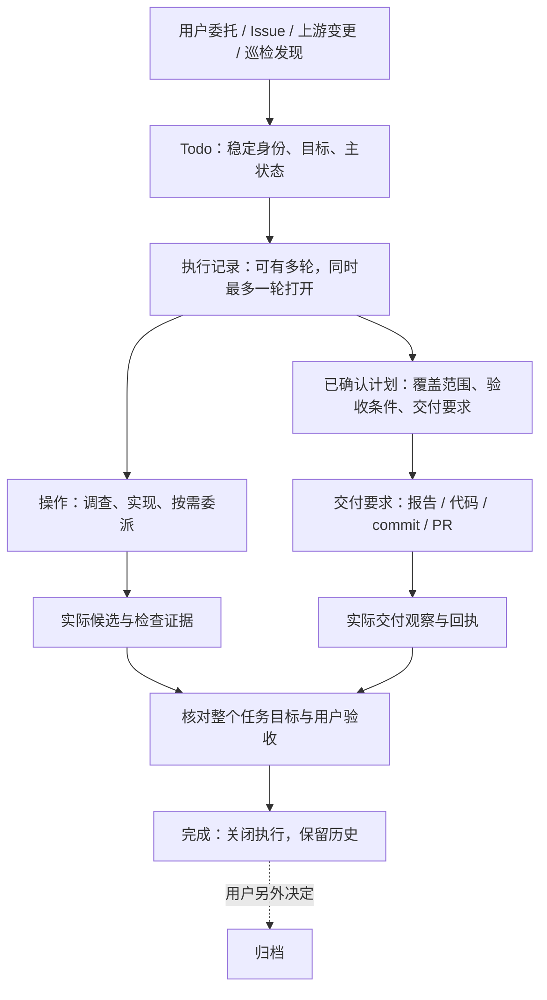
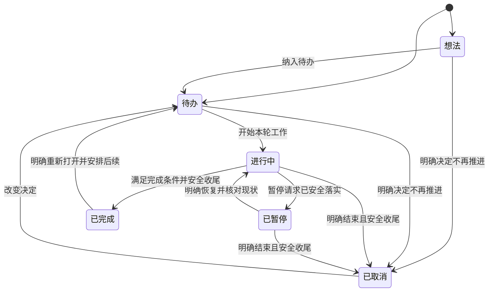
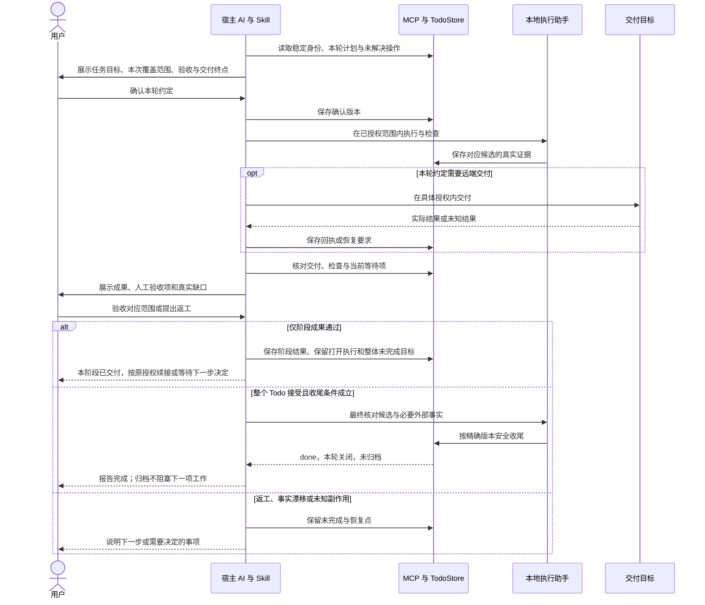

# Todo 生命周期、执行验收与交付关系

## 最新决定：不保留旧状态兼容

2026-09-19，用户明确：“不用兼容，不用管老的”。
源码直接收敛至 `idea / backlog / active / paused / done / cancelled`，
删除 Todo 的旧枚举与专用兼容路径，不开发数据迁移或多版本共存。
未开工任务通过明确取消入口结束；受管执行继续通过停止控制安全收尾。
当前操作的安全和显式归档重试仍保留，上游领域自己的 `pr_submitted` 不变。

本决定替代下文历史上的“兼容边界待确认”和“必须保留旧状态读取”提案；
不授权清空个人数据、启用运行时、提交或推送。
当前实现和验证见 [Todo 六态收敛](../development/todo-six-state.md)。

## 前序记录

日期：2026-09-18。状态：用户已确认产品方向，A、C 批代码与本地定向验证完成；不是全部已实现的能力清单。
用户确认六态、PR 独立交付进度和计划覆盖声明；A 之后已授权按 C -> B -> D 推进。
当前保留旧枚举；B 主路径已实现，D 的 PR 关联、独立进度与本地交付声明已完成本地验证。
2026-09-19 后续已实现显式远端分支、提交/合并 PR 的现场核验，固定源码完整回归与独立窄范围复审已完成；
随后真实 `gh` 只读四场景与源码 Skill 22 场景通过；仍非用户产品验收。
实施证据见 [交付实现记录](../development/todo-delivery.md#d-增量远端交付核验)。旧枚举迁移等 D 验证后另行考虑，
不迁移真实数据、安装运行时或提交推送。
关联 Todo：`todo-completion-archive-separation`，`t-7a4e458d-b057-400e-b697-abf21939bb49`。

最新整体核对见 [C/B/D 验收核对](../development/todo-cbd-audit.md)。
整体核对曾复现一个 B 缺口：联合关闭已准备、原请求均已返回、Issue 仍 open 时，
用户要求暂停，原实现无法安全撤回关闭预留并完成暂停。用户随后明确回复“可以”，
确认撤回本地关闭意图、安全暂停，恢复工作不自动重发关闭；再次关闭需新明确决定。
round-131 已与 Claude 核对记录兼容方案，新增独立 v3 暂停记录并保留 v1/v2 历史。
四项新增用例先失败后通过，最终 11 文件 222 项回归、26 个构建 CLI/MCP 场景、
两个实际处理器/CLI 缺口复测、类型检查/构建与独立窄范围复核通过。
此前 777 项完整回归属于修改前基线，不冒充本增量的全量或用户产品验收；
本增量仍未进行真实数据迁移、运行时替换或真实 Issue 写入。
随后在源码不变的情况下补跑完整 MCP：58 文件、798 项通过、1 项 Windows 跳过，
耗时 1135.33 秒，前后源码指纹一致。已补齐暂停修改后的全量回归缺口；
独立只读核对 C/D 需求与断言未发现可操作问题，不等同于用户产品验收或部署许可。
报告与限制见 [当前源码完整回归](../development/todo-cbd-audit.md#current-source-full-regression)。

旧状态退役已进入源码核对与差异设计：round-132/133 延续 Claude 长期会话，
六个隔离源码处理器探针确认了新旧写入及历史恢复入口；业务源码保持不变。
建议先停止产生新 `pr_submitted/not_planned`，补齐未开工/非受管取消路径，
保留旧记录、显式重开与精确中断恢复；不是立即删除所有兼容枚举或迁移个人数据。
这会改变旧客户端发起新停止请求的行为，实施边界待用户确认。
事实、方案、退出条件与验证清单见
[旧状态退役核对](../development/todo-cbd-audit.md#retirement-investigation-2026-09-19)。

最新明确决定：`failed` 保留为待验证候选，不立即加入主状态。
2026-09-19，用户确认远端交付证据规则：仅有用户或 Agent 的合并报告时，
先记录“据报告已合并，待核实”；查询确认后才满足交付条件。
该决定解除 D 的报告能否替代核实这一待决项，不表示相关代码已实现或 Todo 已完成。
正文保留设计讨论的历史“待确认”表述；以本段最新确认记录为准。
六态及覆盖规则已获确认，不等于批准真实数据迁移或跳过实施前的新格式兼容设计。

本文收拢此前讨论，不重建执行器。领域边界见
[概念与关系](2026-09-18-contribbot-domain-map.md)，主动记录与反悔见
[接入设计](2026-09-18-todo-intake-design.md)，既有执行机制见
[中间执行闭环](2026-09-17-phase3-task-execution-design.md)。
接入设计按时间保留了多个旧提案，阅读时以其后续明确确认记录为准。

## 当前实施进展

A 批已完成代码与本地回归，行为和实际验证集中记录于
[完成与归档分离](../development/todo-lifecycle-separation.md)。
完成保留终态、精确归档、恢复/重开、列表计数与入口规范已修改；
完整回归 MCP 559 通过/1 跳过；最后停止态修补后受影响回归 368 项通过，
A 批当时构建的 CLI/MCP 15 个场景与类型检查通过，独立窄范围复审无新发现。
真实宿主、线上 GitHub、其他操作系统及用户验收仍需单独验证。
为防止同日恢复/重开复用旧归档选择，Claude round-94 咨询后增加可选
`lifecycle_revision`；旧记录不因读取而补写，不等于新六态数据迁移。

C 批已在既有计划和门禁上实现阶段/整体覆盖声明，记录于
[阶段覆盖实现与验证](../development/todo-plan-coverage.md)。
新 `verified/with_gaps` 收尾必须有已确认的整体声明和显式空剩余数组；
阶段检查通过仍保留打开执行及剩余目标，不把阶段成功记为取消。
旧计划不补默认值，既有 reserved/prepared 收尾保留原请求恢复路径。
最终定向回归 79 项通过、类型检查和构建通过、构建后 16 个 CLI/MCP 场景通过；
独立窄范围复审无新发现。此前全量回归为 573 通过、1 失败、1 跳过，
其中失败的部分声明用例已修复；原记录保留，不改记为全绿。
随后在未修改业务代码的情况下重跑完整 MCP 测试，2026-09-19 凌晨本地结束：
47 个文件全部通过，574 项通过、1 项 Windows 平台跳过，耗时 699.12 秒，
类型检查再次通过。跳过的是未暂存可执行位变化；不代表跨平台或线上 GitHub 验收。
源码快照及命令见上述验证记录。

| 批次 | 当前状态 | 备注 |
| --- | --- | --- |
| A | 代码和本地验证完成 | 完成与归档分开；真实宿主试用和用户验收单独进行 |
| C | 代码和本地定向验证完成 | 覆盖声明不等于验收证据；完整记录见上方链接 |
| B | 主路径已实现并验证，边界保留 | 补本地收尾撤回、远端在途日志和重放保护；全量结果及修复后 61 项复测、18 个构建场景见实现记录 |
| D | 本地及显式远端分支/PR 核验已实现，固定源码自动化与有界真实只读验证完成 | 58 文件、744 项通过/1 Windows 跳过、22 构建场景及22源码Skill场景通过；独立发现已修复复审；真实gh四个明确文件范围通过，跨平台和用户验收未完成 |

2026-09-19 round-123/124 核对后，B 的 prepared Issue 取消并非“全部完成后仅留风险”：
现有门禁确实缺少某些已知结果下的安全取消路径。用户于 2026-09-19 明确确认：
用户明确取消后，证明原操作未派发或全部结算，保留已发生的 Issue/评论事实，
只将本地 Todo 安全结束为 cancelled；不自动 done、归档、重开 Issue 或重发公开请求。
未知结果继续保留占用，不将缺少日志当成未派发证明。该规则已补源码路径并完成本地验证：
最终关联回归 159 项、依赖变化复测 2 项、构建后 CLI/MCP 24 场景通过，类型检查、构建、
Web API 测试和独立窄范围复审完成。旧全量的失败及各次修复证据保留，不冒称最终全量全绿；
具体讨论见 [停止控制的确认规则](../development/todo-control.md#prepared-issue-cancellation-confirmed-outcome)。
旧枚举仍被历史恢复、legacy 停止及 Web 统计使用，当前没有删除或迁移授权。

B 本轮实现记录见 [停止控制](../development/todo-control.md)。请求先落盘并阻止新派工，
安全安顿后才暂停；本地明确继续保留同轮并使旧检查失去当前适用性。
此处不表示 B 全部验收通过，也未启用运行时或迁移真实数据。
已确认的 Issue 取消规则已实现控制绑定的对账、原请求结果记录与本地取消路径，
本轮关联回归及独立复审已完成；无法恢复的远端未知结果保留待核实门禁；
线上 GitHub、真实宿主、其他操作系统和混用旧写入器的部署验收未完成。

round-107 已将 D 的待决场景说明给用户：仅有 Agent/用户提供的结构化
“PR 已合并”报告、没有 GitHub 读回证据时，是否足以支持任务完成。
Claude 当时建议允许且显式标注报告来源；主助手建议保留报告，但实际读回仓库、
PR 和提交身份后才认定远端交付终点满足。用户于 2026-09-19 确认后者：
“先记录‘据报告已合并，待核实’，查询确认后才满足交付条件”。
查询不可用时保留报告及待核实结果，不把该项必需交付算作满足；
核实交付事实也不自动替代其他验收、任务完成决定或归档授权。
该产品规则已确认，具体远端观察接口及恢复契约仍须继续讨论、实现和验证。
历史交付事实与当前候选的验收适用性需要分开，
不能因为本地有改动就抹去合入事实，也不能以旧合入事实证明新代码已交付。

round-108 已咨询独立推进 PR 关联与展示的边界；源码现在保留多个 PR，
关联不再自动写 `pr_submitted`，详情展示只读远端进度而不自动完成任务。
兼容行为、实际回归结果与剩余范围见 [PR 关联与独立进度](../development/todo-delivery.md)。
这里没有新增必需交付或完成证据契约，也没有启用运行时或迁移真实数据。

后续 round-110/111 已继续讨论并实施本地交付声明：同一计划中的可选
`deliverables` 连接 workspace/file 目标与既有验收，完成时核对实际候选清单。
必需端点缺失不能通过 `with_gaps` 豁免；验收证据缺口与产物缺失分别处理。
旧计划摘要保持不变，文档/上下文只展示声明，不假装已现场检查。
本地交付 25 项定向回归通过，最终完整 MCP 54 文件/668 项通过、1 项 Windows 跳过，
构建后 CLI/MCP 20 场景、类型检查、构建和 Web API 回归通过，独立窄范围复审无发现。
具体结果见上述实现记录，不以本地切片完成代替整个 D。
随后 round-112/113 讨论并继续实现本地 commit 终点：
`target={kind:"commit",scope:[...]}` 检查捕获 HEAD 下的文件、暂存区与实际字节，
内置转换使用隔离 Git 元数据，自定义过滤器不执行；原始验收机制保持不变。
首轮 17 项后继续安全审查，真实复现并修复隐式拉取和属性显示歧义；
Claude round-114/115 继续咨询。最终 25 项 commit 用例与 15 项安全回归通过，
完整 MCP 56 文件、708 项通过、1 项 Windows 跳过，构建后 CLI/MCP 21 场景通过，
类型检查、构建和 Web API 回归通过，独立窄范围复审无新增可操作发现。
当前结果与限制见 [本地 Commit 交付](../development/todo-delivery.md#d-增量本地-commit-交付)。
push/PR 终点与远端证据规则尚未实现；报告不能替代核实的产品决定已确认。
旧枚举迁移继续暂缓。

Claude round-96、97 成功；round-98 因订阅不可用返回 HTTP 403，没有获得后续意见。
round-99 针对 B 的收尾竞争、未绑定暂停及写入器隔离继续咨询，
180 秒超时终止且无返回内容，不能算作设计讨论通过；问题原文已保留。
用户随后要求重试，round-100 成功延续原会话并返回 B 的四项边界建议，
调用约 121 秒、exit 0，会话身份一致。回复位于
`.catpaw/discussions/phase3-claude/round-100.response.md`。
这证明本轮咨询恢复可用，不等于逐项采纳建议、产品决定已确认或 B 已实现。
round-101 再次成功延续原会话。根据现有 `cancel_closure` 规则，
Claude 撤回“所有 prepared 收尾均须完成”的建议；主助手采纳可撤销的本地意图
与已提交终局、已发生远端事实须分开处理的判断。
仍待用户确认：远端 Issue 已关闭、本地 Todo 尚未完成时收到取消请求，
是否保留 Issue 关闭事实，并在核实在途操作和回执后将 Todo 记为 cancelled。
双方建议如此处理，但尚未作为产品规则实施；B、D 仍未改业务代码。
完整答复和主助手保留意见见
`.catpaw/discussions/phase3-claude/round-101.response.md` 与
`.catpaw/discussions/phase3-claude/round-101.coordinator.md`。
本轮用临时数据实际复现旧写入器忽略格式标记并更改暂停状态，详见第 9 节。
CatPaw 看板现有 5 项校验错误未处理，不绕过校验改写 Work。
下文保留历史方案与当时授权边界；当前顺序及进度以上方最新记录为准。

下文第 1、1.1 节的“当前代码”是实施前的核对快照；第 10、11 节包含当时的
待验证和待确认表述，不应覆盖本文件顶部的用户确认记录与上述修复记录。

## 后续讨论：有条件自动完成

用户补充：提出疑问前先说明具体场景、已知事实、不确定点及选择的影响；
不自动取消或归档 Todo。对明确的贡献交付，例如用户提交的关联 PR 已合并，
用户提出可以自动标记 done，但归档仍须另外决定。
这不是所有 PR 合并均自动完成的授权，也不是开始改业务代码的指令。

Claude round-103 与主助手均支持这个方向。主助手建议把完成条件在具体任务的
已确认约定中说清楚，满足后核对并告知，不再重复询问是否标记完成；
这会增加一个有限的自动完成路径，区别于下文历史方案中的最终逐次人工确认。
具体契约仍是本轮设计建议，当前实现没有启用该行为。

| 情况 | 本轮建议 | 备注 |
| --- | --- | --- |
| 整个任务的必需 PR 交付和验收条件均已满足 | 按事先约定核对后自动 done，并告知 | 不伪造人工验收；未解决操作或最新暂停、取消指令不能被覆盖 |
| 仅部分 PR 合并 | 记录交付进度，Todo 不因此结束 | 如前后端任务只合并前端 PR，整体目标仍未完成 |
| Issue 关闭或 PR 未合并就关闭 | 说明实际变化并询问是否继续 | 不自动取消，也不凭外部状态声称任务完成 |
| Todo 完成或取消后的归档 | 用户明确选择后才归档 | 不把自动 done 扩大成自动 archive |

提前约定的是“满足条件后可以完成”，不是提前宣称尚未发生的验收已经通过。
PR 合并能证明相应交付事实，不能替代所有检查；关联关系、目标分支及实际提交
须能对应具体任务。claim 不是所有 Todo 的必需步骤，旧任务也不静默补上自动规则。
讨论原文和主助手取舍分别见 `.catpaw/discussions/phase3-claude/round-103.response.md`
及 `round-103.coordinator.md`。本轮只修改讨论规范与设计记录，不修改运行状态。

### 扩展点：自动完成不局限于 PR 合并

用户明确要求记录：自动完成可能还有其他适用场景，PR 合并只是已经讨论的一个
示例，不是完整场景清单，也不应把这项能力理解成仅服务于 Issue/PR 的联动。
其他场景及其完成条件、可核对依据和授权方式留待后续逐项讨论，不在本次补造规则。

延续前述边界：自动完成不等于自动取消或自动归档；任务目标、完成条件或事实
不清楚时，先向用户说明并询问。这次只记录扩展方向，不表示新场景已获实施批准、
已启用自动行为或可以绕过现有验收与安全收尾。

## 后续讨论：任务级等待与恢复（暂记）

2026-09-19，用户要求先记录此方向，暂不实施。该记录不是最终设计确认，
也不扩大当前 C/B/D 的实施范围。

当前源码可以保存 `blocked_on / next`，并对显式暂停、取消及未处置操作执行
相应限制；描述性阻塞字段本身不是独立的待决事项门禁。此前停止自动续跑的
`functions.update_goal(status=blocked)` 属于 Codex 宿主，不是 contribbot 的实现或验证。

主助手的待讨论建议是补齐任务级等待与恢复：跨会话保留具体卡点、受影响动作、
解除条件和恢复位置；解决卡点后核对当前事实与授权，再推进相关工作。
例如等待用户确认交付规则时，换会话后仍能恢复这个问题，不能因普通进度更新
而默认为已经确认；不依赖该决定且已获授权的工作不应一并停止。

这不等于新增 Todo 主状态、常驻调度器或宿主自动唤醒能力，也不等于自动暂停、
取消或归档。具体约束范围与恢复规则尚未定案。
Claude 原长期会话的 round-116、117 均返回 API 400，没有取得本轮设计意见；
咨询记录见 `.catpaw/discussions/phase3-claude/round-117.coordinator.md`。

本项先作为后续讨论保留，不把它当作当前主线必须先实现的前提。
随后用户已确认 D 的远端交付规则：仅有用户或 Agent 的“PR 已合并”报告时
保持待核实，查询确认后才满足交付条件。该决定不等于批准本节的等待与恢复机制。

## 1. 先分清现状与方案

| 分类 | 内容 | 备注 |
| --- | --- | --- |
| 代码已有 | idea、backlog、active、pr_submitted、done、not_planned | 暂停、取消的完整新语义尚未实现 |
| 代码已有 | 执行历史、版本化计划、操作、委派记录、候选、检查与收尾门禁 | 复用这些机制，不另造 Work 或任意命令 MCP |
| 代码已有 | 单个 ref/pr、归档与恢复入口 | 不等于已有多交付物模型或独立的完成/归档流程 |
| 已确认原则 | Todo 独立于 Issue/PR，结束结果不能从代码数量猜测 | 来源不强制决定生命周期 |
| 已确认原则 | 完成和决定不做不自动归档；保留历史与重新打开能力 | 当前实现仍耦合归档，不能说已修好 |
| 最新明确决定 | failed 保留为待验证候选，不立即加入主状态 | 一次失败、超时或逾期不自动结束整个任务 |
| 历史决定与重新讨论 | 曾确认拆分 not_planned/cancelled，后重新讨论统一取消 | 保留历史，不把合并讨论记成已经迁移或最终批准 |
| 当前候选 | 6 个主状态，等待/验收/PR 进度独立展示 | 取消合并、paused 新增、pr_submitted 移出主状态仍属草案 |
| 本轮建议 | 计划明确覆盖整个目标还是仅一个阶段；整体验收可同时确认完成 | 阶段交付不自动缩小 Todo 目标，不等于整个任务完成 |

根 `AGENTS.md` 与当前 Skill 仍写有 `not_planned` 自动归档，与用户此前明确选择
不一致。实施前必须统一入口规范、工具行为与测试；本文不静默更改规则或数据。

### 1.1 本轮源码核对：哪些复用，哪些补齐

2026-09-18 本轮是差异设计，不是重新开发执行系统。下列结论来自当前工作树，
不是仅对照 main 的已提交版本，也不把未提交代码当成尚未实现。

| 部分 | 已有实现与入口 | 具体增量 | 备注 |
| --- | --- | --- | --- |
| 计划、执行与验收 | `execution/contracts.ts` 的计划及确认、`workflow.ts` 的 `workflowReadiness` / `assertClosureCoverage`、本地执行助手 | 保留精确计划、候选、真实检查、yield、恢复与收尾门禁 | 不再设计一套计划或验收引擎 |
| 完成与停止 | `TodoStore.applyWorkflow` 已关闭执行并保存结果，但同时设置 `pending_transition=archive`；`closure.ts::finalizeClosure` 再调用归档 | 新完成不再产生归档请求；返回结束结果，不要求必须是 `ArchivedTodoItem` | legacy `todoDone`、`todo_update(not_planned)`、Issue 联动也须同步 |
| 归档与恢复 | `archiveAndDelete` 已先写后删；`restoreArchivedForActivation` 已保留稳定 ID 与历史，但恢复时强制变成 backlog | 归档只整理明确选中的终态；恢复展示保留终态，重开才改变状态 | 不是重新开发已有的恢复与多轮执行能力 |
| 阶段与整体 | 当前计划含 goal、non_goals、steps、acceptance；门禁核对该计划的必需条件 | 在既有确认计划中明确覆盖范围，阶段计划不能结束整体 Todo | 这是硬化候选，尚未复现错误完成；全目标计划已有的门禁仍有效 |
| PR 交付 | `todoUpdate(pr)`、`prCreate` 会写 `pr_submitted`，Todo 只保留一个 PR 编号 | 状态方案确认后，关联与交付事实不再直接修改主状态 | 交付检查复用现有 review/manual 证据，不重建检查体系 |
| 生命周期与展示 | 当前六个旧枚举、列表分组、项目统计、Web 和 Skills 已存在 | 新增暂停控制及取消候选，统一终态查询与计数 | 尚未实现新六态；新增状态不是只改一个枚举 |

表中源码相对路径均位于 `packages/mcp/src/core/`；工具层详见第 9 节。
例如当前 `project-list.ts` 按 `status !== done` 计未完成，取消不再自动归档之后
就必须同时改计数；`todos.ts::todoList` 也缺少未归档 `not_planned` 的独立展示。
这两处是首批改动的依赖，不宜留到最后再补 UI。

已有执行能力的历史验收见 [执行验收记录](../development/task-execution-audit.md)：
MCP 539 通过、1 Windows 跳过，以及 15 个构建后 CLI/MCP 场景。
它们支持复用已有框架，不证明包含后续 RED 测试的当前工作树全绿。
本轮未重跑整套测试；完成/归档的 RED 结果和未验证平台继续保留。

## 2. 用户只管理一件事

**Todo 管“要做成什么”；执行记录管“这一轮怎么做”；交付约定管“交到哪里算交付”。**



没有 Issue、PR、知识库或子 Agent，仍能跑完这一流程。来源只是产生任务的原因，
不自动成为交付要求；参考某个 PR 与把某个 PR 作为交付物也是不同关系。
分支、worktree 是工作位置，不是任务身份。

任务不必有多个步骤、多个 Agent 或多个交付物。一个目标、一份报告、一次对应审阅
也可以是完整任务；不强制给调研或文档任务安排无关的测试命令。

## 3. 主状态建议

以下为统一取消方向的 6 态候选，不是当前代码枚举，也不是已确认的迁移表。

| 主状态 | 用户看到的含义 | 备注 |
| --- | --- | --- |
| `idea` | 想法 | 尚未决定纳入待办；不是隐藏草稿 |
| `backlog` | 待办 | 已记录，尚未推进；不代表实施方案已批准 |
| `active` | 进行中 | 可以在理解、设计、实现、检查或等待，不保证此刻有进程运行 |
| `paused` | 已暂停 | 用户明确暂缓推进，且当前操作已经安全安顿；未完成、不丢历史 |
| `done` | 已完成 | 整个 Todo 目标按约定验收并完成收尾；验证缺口仍单独展示 |
| `cancelled` | 已取消 | 明确决定不再推进，以非完成结果结束；可尚未开工，也可已有成果 |

推荐增加 `paused`，因为它表达持久的用户意图，并决定能否继续派工。
不推荐将每种等待都放入主状态：等待用户答复、等待 CI、等待 PR 评审、缺权限，
需要不同的下一步，但不必成为四种任务生命周期。
“评估后不采纳”与“推进后撤回”的真实区别留在结束原因与历史中，
不强制再选择两种隐藏的取消子类型；已有成果和未知情况都照实保留。
代价是不能仅凭主状态可靠区分、统计这两类情况，不承诺事后能补齐未记录的事实。



图为常见路径，不是按前一个枚举猜测意图的规则。直接从想法开始设计可以在一次明确
操作中纳入并激活；重新打开后要求立即推进，也可以一次完成身份恢复与新执行创建。
这些动作仍须分别校验，不能靠通用 `status=` 绕过。

**反例：**“评估是否采用 X”的任务，完成报告并得出“不采用 X”，可以是 `done`；
“实施 X”的任务经评估明确决定不做，在合并候选中可以是 `cancelled`。看的是任务目标，
不是答案里有没有“不做”两个字。

### failed 的暂缓决定

用户已明确选择：保留为待验证候选，不立即加入主状态。
仅当真实任务需要区分“主动结束目标”与“目标未达成、且确定失败结束”，
再提出具体场景与转换规则供用户讨论；不预埋枚举或空字段。
普通命令失败、检查失败、Agent 崩溃或预算耗尽先记录为执行事实，
需要修复、恢复或决定下一步时如实展示，不能自动取消 Todo。
超过日期也不自动改状态；若涉及无法再达成的硬目标，说明事实并请用户决定，
不能反复无效重试，也不能擅自延长期限、改变目标或编造用户撤回。

### 自然语言动作与转换

下表是行为契约，不是按关键词机械路由。结合明确目标、当前上下文和实际授权理解，
含糊到会改变任务目标或执行权限时再澄清，不要求用户背诵命令。

| 用户意图/实际动作 | 建议转换 | 备注 |
| --- | --- | --- |
| 明确要求记录想法或待办 | 建立 idea 或 backlog | 匹配意图并查重；模糊想法先问，不静默持久化 |
| 明确委托并开始实质调研、设计或实现 | 进入 active，建立或续接执行 | 记录成功简短告知；不是写了业务代码才算开始，也不需要再问一次是否创建 Todo |
| 确认阶段方案或验收阶段成果 | 保持 active，更新进度和剩余目标 | 不等于确认整个 Todo 完成；不自动获得下一阶段实施权限 |
| 明确暂缓正在推进的任务 | 先受理停止请求，安全安顿后 paused | 暂停过程中不误报已停止；普通技术等待不自动当用户暂停 |
| 明确继续已暂停任务 | 核对现状后恢复 active | 继续同轮，不重复建 Todo；过期的检查结论不能直接复用 |
| 明确不再推进任务 | 安全结束后 cancelled | 记录原因和产物，不要求先通过全部测试 |
| 整个目标满足约定且用户整体验收 | 安全收尾后 done | 可以一次确认结束；不自动归档或操作 GitHub |
| 明确重开已结束任务 | 同一 Todo 回到 backlog，实际开工时进入 active 并建立新执行 | “重开并继续”可一次编排；只恢复归档展示不启动执行 |

### 列表不是只有一个状态字段

建议普通任务视图同时显示主状态、当前环节、交付进度和下一步。
所有终态未归档记录仍可见，但不计入未完成；已暂停单独分组，不冒充正在执行。

| 示例任务 | 主状态 | 当前环节 | 交付进度 | 下一步 | 备注 |
| --- | --- | --- | --- | --- | --- |
| 修改组件行为 | 进行中 | 实现 | 草稿 PR 已创建 | 继续实现与检查 | 有 PR 不表示在等评审 |
| 修复兼容性 | 进行中 | 等待外部评审 | 非草稿 PR 已提交 | 等待评审或回应意见 | 本例约定合并才算交付 |
| 开发本地工具 | 进行中 | 待用户验收 | 本地产物已准备 | 用户验证约定场景 | 人工验收尚未通过 |
| 整理任务模型 | 已暂停 | 保留恢复点 | 设计草案已保存 | 用户明确继续 | 不自动派发后续实现 |
| 调研备选方案 | 已完成 | 本轮已结束 | 报告已验收 | 无必需后续动作 | 未归档；无需再次问是否完成 |

“待用户验收”“等评审”“受阻”“需要返工”可筛选，不能只藏在自由文本详情里。
标签来自计划、控制请求和有时间戳的观察；历史通过不等于当前通过。
读取列表不强制联网或重跑测试，未刷新时明确标注“最近观察”，完成前再核对必要事实。
PR 仅处于 open 状态不足以推断“正在等别人”，还须看本轮是否有未完成的本地工作。

## 4. 暂停、取消与重新打开

### 先受理意图，再确认已经停下

```text
用户提出暂停/取消
  -> 持久化本轮控制请求，阻止新业务派工
  -> 展示“暂停处理中/取消处理中”，保留之前的稳定主状态
  -> 核实已运行操作、子任务、待处置结果、收尾与远端回执
  -> 安全安顿后落实 paused 或 cancelled
  -> 无未解决操作/收尾占用后，工作区可用于其他任务
```

停止请求须绑定 Todo、execution、请求身份和预期版本，重试不得产生第二次结束。
接受请求不是声明进程已经终止。running/unknown、未处置返回结果和未解决的收尾，
都不能靠改状态或删记录消除；观察、回执恢复、必要的 yield 与对账仍被允许。
不能因用户要取消而要求所有测试先通过，也不能自动回滚代码、删除分支或关闭 Issue。

| 动作 | 执行与历史 | 备注 |
| --- | --- | --- |
| 暂停 | 保留本轮执行、计划、已有结果和恢复点 | 新业务派工持续受阻；不要求通过验收 |
| 恢复暂停 | 继续同一轮，核对工作区、候选、计划和权限 | 漂移后重做受影响的验证；工作区/计划变更按现有规则建立新 attempt |
| 取消或决定不做 | 安全关闭本轮，记录实际结果、结束决定与未知部分 | 不把已有真实产出抹掉，也不把未知写成从未开始 |
| 重新打开终态 | 保留 Todo ID 与旧轮次；安排新工作后建立新执行 | 旧结果可解释历史，不能直接变成本轮通过 |
| 恢复归档展示 | 只恢复可见记录，不启动执行 | 明确“恢复并继续”时可编排两个动作，但仍分开校验 |

尚未开始的待办说“先放着”，不必为暂停制造一轮执行；保持待办并解释尚未开工。
已经暂停的任务若用户直接验收现有成果，可以在明确授权下编排恢复核对和完成，
不要求用户先手工操作状态。

等待或暂停本身不长期占用工作区。是否占用仍取决于真实未解决的操作和收尾，
不是 `active` 或 `paused` 字样。允许其他任务使用工作区不等于授权其覆盖未提交成果；
原结果需可定位，恢复时重新核对。需要隔离时遵循既有 worktree 与权限约束，
不自动 stash、提交或删除文件。
进入 paused 的条件包括当时已安全安顿，但历史状态不是永久的进程安全证明。
之后发现未知操作或不受管写入时仍需核查，不能凭 paused 跳过占用检查。

取消过程中用户反悔，不能直接清掉控制请求重启派工；先核对原停止/收尾是否已落实。
已结束则重新打开；尚未结束则安全撤回控制请求。已经发生的远端动作不会因反悔消失。
旧执行的迟到回执仍可用于原轮次对账，但不得改动新执行。

## 5. 执行与验收

继续使用 `understand -> execute -> check -> finish`。阶段不是 Todo 主状态，
进入 `finish` 不等于完成。计划确认允许按约定做事，不证明结果已被用户接受。

### 阶段完成不等于整个 Todo 完成

本轮新增的待确认规则：展示计划时说明它覆盖整个 Todo 目标，还是只覆盖其中一段。
同一份计划写清任务目标、本次范围、验收依据和仍未完成的目标，
不新建独立的阶段对象或另一套 Work，也不强制每个阶段成为一个 Todo。
计划只覆盖阶段时，即使阶段的全部验收已通过，也不具备关闭整个 Todo 的资格。
覆盖整个目标也只是完成门禁的一项，不能靠“整体”两个字替代实际交付与验收证据。

| Todo 的目标 | 当前用户要求 | 阶段交付后的行为 | 备注 |
| --- | --- | --- | --- |
| 实现全局搜索功能 | 先设计，不开发 | 记录方案验收，仍保留 active 与功能未完成项 | 显示等待实施决定，不自动开始编码或将整个任务 done |
| 交付一份全局搜索设计方案 | 完成并审阅方案 | 整份方案达到约定并整体验收后，可安全完成 Todo | 实现功能不是此任务的隐含要求 |
| 实现并验证全局搜索功能 | 已确认的计划与授权包含后续实施 | 设计步骤结束后，在原计划/授权内继续 | 不因阶段切换重复行政确认；实质性计划变更仍须确认 |

推荐在展示阶段计划时直接说：

> 这个 Todo 的目标是实现全局搜索。本次只交付设计方案，功能实现和验证仍待完成；
> 这次不开始开发。

这句话用于解释实际边界，不是要求用户输入的口令或完成条件。
上下文不足以判断“交设计稿”是独立目标还是已有任务的一段时，只澄清这一处，
不能在结束时才从标题、摘要或一句“可以”猜测。
设计获认可不等于整个功能被验收，也不等于用户批准开始开发。

只完成阶段时，保留当前打开的执行，记录对应计划/阶段的结果；
需要调整后续计划时按版本化规则确认并续接，不伪造本轮完整结束。
旧阶段证据保留为真实历史，不自动变成新计划或新候选的通过结果。
不必在开工前设计完所有未来细节，但尚未确认整个目标的完成约定时，
不能宣称仅完成当前阶段就已具备整体验收条件。
如果用户决定把原功能任务缩小为只交设计稿，应明确确认目标变更并保留原要求；
若不改变目标，只改变当前允许做的动作，则原未完成目标继续存在。

### 基于现有计划补齐，而不是另造阶段系统

round-88 后的技术建议：仅在既有计划中加入覆盖声明，例如
`completion_scope: task | stage`，与现有 goal、non_goals、steps、acceptance
一起参与计划摘要和版本确认。字段名是草案，不是已发布 API。
整体目标复用现有执行的 `goal`；本次范围及剩余目标在计划正文中说明，
不再增加独立 Phase 表或重复维护一份目标数据库。
工具验证明确声明和版本，不通过标题关键词自行判断语义是否覆盖完整目标；
宿主必须把整体目标与本次计划一起展示，用户发现不符时可修订。

既有 `workflowReadiness` 继续回答“当前计划的必需条件是否满足”。
完成门禁在它之前额外核对“当前计划能否用来完成整个 Todo”：
阶段计划即便全绿也只能记录阶段成果，`with_gaps` 不能越过这个范围限制；
`stopped` 仍可按安全停止规则结束，不要求先满足交付验收。

旧计划缺字段时保留原内容、摘要与历史，不自动补成 task 或 stage。
读取、观察、恢复及原授权内工作不因缺字段被迫重做；下一次要完成整个 Todo 时，
提出明确覆盖范围的新计划版本并确认，受影响的验证按既有规则重新取得。
已完成的旧轮次不追溯改为未完成。这个兼容选择仍是建议，确认前不迁移真实数据。

### 完成门禁

| 关口 | 需要什么事实 | 备注 |
| --- | --- | --- |
| 开始实施 | 精确版本的范围、步骤、验收和交付约定已确认 | 激活/调查可以先发生；未确认不扩大到实施 |
| 检查 | 适用候选上的真实命令结果、审查或人工观察 | 每项验收有对应依据，不用关键词、非空字段或无关 exit 0 代替 |
| 待用户验收 | 明确验收的是当前阶段还是整个目标；对应非人工检查和交付满足 | 阶段就绪不等于 Todo 可完成；人工未验收不能称为全部通过 |
| 可完成 | 计划覆盖整个目标，整体必需条件满足，且用户明确接受整项交付 | 局部“这个按钮可以”或“设计可以”不是整项功能验收 |
| 完成收尾 | 最终新鲜度核对通过、无未解决执行/收尾、必要外部结果可确认 | 原子保存终态与本轮结束；不自动归档 |

候选、计划或必需交付事实发生变化，原“待验收/可完成”结论不再适用；
保留历史，显示需要重新核对或返工。不能把最新候选身份写到旧审查结果上。
停止派工的控制请求优先于常规推进，不能因迟到的通过结果自动取消用户的暂停。

**推荐交互：一次完整验收同时结束任务。**
助手交代本轮产物、检查、交付结果和缺口后，用户明确说整个 Todo 验收通过，
即可作为完成决定，不再机械追问“是否标记 done”。如果用户明确只验收某一项、
尚有其他条件，或仅认可方案，不能扩大解释。
本轮暂不建议增加通用的“检查全绿就自动完成”策略；这仍需用户确认。

正常完成保留 `verified` 与有缺口完成 `with_gaps` 的区别。
用户明确接受已列出的验证缺口，不把 failed/blocked/未运行改成 passed。
未知进程、未对账副作用、状态冲突不能用风险接受绕过。
实际没有达到的交付终点也不能伪装成达成；若用户决定不再要求某项交付，
应明确修订并确认约定，保留原要求、实际结果与改变原因。

## 6. 交付到哪里算完成

`pr_submitted` 建议移出 Todo 主状态，改为可见的交付进度。
不是把它塞进 Issue 状态，也不是删掉“哪些任务在等 PR”这个产品能力。

| 任务约定的终点 | 交付依据 | 备注 |
| --- | --- | --- |
| 报告或设计稿 | 精确产物与针对内容的审阅/人工确认 | 不强制提交 Git |
| 本地实现 | 可定位的实际候选与适用检查 | 不假定用户要求 commit 或 push |
| 本地提交 | 具体提交、产物与验证的对应关系 | 有 commit 不等于测试通过 |
| 推送提交 | 明确远端/分支上的预期提交及读回结果 | 拥有仓库或 write 权限不等于 push 授权 |
| 提交 PR | 实际 PR、预期仓库/head/base、约定的草稿要求与内容 | 仅创建空壳或部分 PR 不能满足完整约定 |
| PR 合并 | 真实合并对象、目标基线和适用验证 | 不能拿本地旧候选证明合并后的内容已验证 |

整个 Todo 目标的所有必需交付物满足约定后才进入正常完成；
只覆盖阶段的计划满足交付后仍保留后续目标。参考链接或可选产物不参与必需条件。
一项任务可以交付代码与报告、多个 PR，不能只保存“最后一个 PR”覆盖其他结果。
但不为此引入通用依赖图、跨任务调度器或全量 GitHub 对象镜像。

两个例子：

```text
自己的仓库：Todo -> 实现与检查 -> 按约定交付本地代码或推送提交
           -> 用户整体验收 -> done，未归档

社区贡献：Todo -> 按需公开 claim -> 实现与检查 -> 提交 PR
         -> 若约定提交为终点，可进入用户整体验收
         -> 若约定合并为终点，继续显示等待评审/返工/合并
         -> 满足本轮约定后验收与完成
```

PR、Issue 状态独立。关闭 Issue 不自动完成 Todo，完成 Todo 不自动关闭 Issue；
允许显式授权的联合操作，但分别保存本地与远端结果，恢复时不重复发布。
claim 的撤回也不是本地取消的自动副作用。

如果按“提交 PR”完成后出现新评审意见，不能悄悄将历史 done 改成失败或重开。
在现有明确授权内继续跟进；需要新增任务范围或重新启动执行时取得相应决定，
同一目标可重开原 Todo，新目标可以另记任务。

提交、变基或内容编辑可能改变候选；push 本身不一定改变本地 HEAD/文件。
按真实变化判定检查新鲜度，另行核对远端交付事实，不能把两种变化混为一谈。
首版沿用现有严格候选校验，不自动声称不同候选的检查等价；需要时重查相关候选。

## 7. 最小数据职责

以下是职责草图，不是本轮发布的新字段/API；确认产品语义后再确定 schema 版本。

| 所属位置 | 需要表达什么 | 备注 |
| --- | --- | --- |
| Todo | 稳定 ID、目标、主状态、可选来源/参考关系、执行历史 | 来源与参考分开；原 ref/pr 兼容读，不强制补造来源 |
| 已确认 Plan | 对整个目标的覆盖范围、验收条件、交付要求 `deliverables[]` | 区分阶段计划与整体交付；改变目标/要求产生新版本并确认 |
| Execution | 当前控制请求、阶段、阻塞原因、操作和候选 | 暂停请求与已安全暂停分离；不另造独立任务主体 |
| Execution 的交付观察 | 对应要求 ID、计划/执行/候选、具体产物或外部对象、来源、时间、证据 | 实际对象可晚于计划产生，但必须满足约定目标；多次观察保留历史 |
| 完成记录 | 本轮接受决定、验证方式/缺口、实际交付依据与关闭结果 | 验收记录是审计材料，不是权限凭证 |
| 列表投影 | 待验收、等待评审、受阻、需要返工、未归档终态 | 基于结构化事实派生，不能反向靠编辑文档制造通过 |

链接只提供最需要的来源/参考分类；交付要求归属于已确认计划，
不能把一个“相关 PR”链接自动提升成必需交付物，也不能用修改链接绕过约定变更。
同一 PR 可能与多个任务有关，每个任务仍按自己的目标验收。

## 8. 收尾时序



完成、取消、归档、恢复均使用稳定 ID、明确轮次和并发版本保护。
归档授权只覆盖用户看过并确认的精确任务与已结束轮次，不把稍后新增的完成项一起移走。
已归档恢复与终态重开分开；归档/恢复中断沿用先写入目标、后移除原记录的安全原则。
完成后不必每次查询都催问归档。

## 9. 兼容与实施顺序

本轮建议分四批，每批都有用户可见的完整路径；不是先写所有底层，最后才让
MCP、Skill 与 Web 跟上。路由、投影、提示与统计随所属行为同批修改。

| 顺序 | 补齐的用户行为 | 主要改动位置 | 备注 |
| --- | --- | --- | --- |
| A | 验收结束后保留已完成未归档；决定不做也不自动归档；可单独归档、恢复展示、重开 | `storage/todo-store.ts`、`execution/closure.ts`、`tools/core/todos.ts`、`todo-update.ts`、`todo-activate.ts`、`tools/linkage/issue-close.ts` | 沿用旧状态可先完成该批，不必等取消命名和新六态落定 |
| B | 明确暂停或取消后停止派新工作，安全安顿后落实状态；继续时不丢历史 | `execution/contracts.ts`、`workflow.ts`、本地执行助手、MCP 控制入口、占用检查 | 六态及取消合并待确认；先复用现有请求版本、操作观察、恢复和 stopped 收尾 |
| C | 只交设计阶段不能结束功能任务；独立设计任务可以正常完成 | 既有计划 schema、确认入口、完成门禁与上下文投影 | 不改真实检查执行器；覆盖声明进入原计划摘要，验收仍靠证据 |
| D | 无 PR 的本地交付与 PR 提交/合并按各自约定验收，进度可见 | 计划验收及交付关系、`todo-update.ts`、`tools/linkage/pr-create.ts`、详情/列表 | `pr_submitted` 移出主状态待确认；不引入交易、奖励统计或 GitHub 对象镜像 |

表中未带包前缀的源码路径位于 `packages/mcp/src/core/`。
每批同时覆盖 `mcp/server.ts` 的参数和说明、适用 CLI、Skills、文档、
`project-list.ts` 与 `packages/web/` 的相关读取方；其他包如消费该数据也须核对。
不把上游追踪自身的 `pr_submitted` 一并删除，它不是 Todo 生命周期。

### A 批的完整行为契约

| 动作 | 应有结果 | 必须保留的保护 | 备注 |
| --- | --- | --- | --- |
| 完成/停止 | 在原 Todo 事务内保存执行结束与终态，仍留在普通索引中 | managed 继续经过统一门禁；legacy 不伪装成 verified | 既有记录投影失败要能报告并恢复，不能重放结束 |
| 重试结束 | 同一 Todo、执行、结束意图返回已记录的结果 | 不同意图冲突拒绝；旧轮次请求不能结束新轮次 | 是否已另外归档，不影响识别同一次结束 |
| 显式归档 | 只移动用户已选定的终态，保留完成/停止结果与历史 | 不再借归档关闭执行；稳定 ID、轮次及快照匹配后才处理 | 批量归档不把确认后新完成的其他任务一起带走 |
| 归档失败 | 已完成/停止的事实不撤销，不伪称尚未完成 | 原有先写目标后删来源、重复项核对及冲突恢复继续保留 | 批量逐项报告成功、失败和未处理，不宣称跨文件全有或全无 |
| 恢复展示 | 回普通索引，仍为原终态；不创建执行 | 保留 ID、历史、记录所有权与先写后删恢复规则 | 与“恢复并继续”明确区分 |
| 重开/开始 | 重开回 backlog；实际开始才创建新轮次 | 暂停恢复不是重开，仍续原轮；旧历史不冒充新证据 | 用户明确“重开并继续”可以一次编排 |
| 查询/下一任务 | 展示已结束未归档，且不计入待办；已安全收尾可开始其他任务 | `running/unknown`、未采纳结果及 unresolved closing 仍按原规则保留占用 | 不新建靠状态字面释放工作区的机制 |

不能只删 `finalizeClosure` 的归档调用：`applyWorkflow` 当前还会设置
`pending_transition=archive`、写“下一步归档”，工具返回类型和 Issue 恢复分支
也依赖已归档结果。它们必须在同批调整，保持 CLI/MCP/Issue 联动一致。
`todo_archive` 的现有“所有 done”隐式选择改为明确选择及快照复核；
空选择不产生写入，归档授权不延伸到后来新增的任务。

完成记录仍可在之后的显式归档中移动；使用原收尾身份读回历史不是再次验证当前代码。
结束后的任务有新改动，需要新轮次及对应检查，不能拿幂等重试返回的旧结果宣称新代码通过。
Issue 联动只在用户明确要求联合操作时执行，保留预检、远端回执和本地落盘失败恢复，
不能因不再归档就重复评论或关闭 Issue。

### B 至 D 复用的边界

B 的控制请求沿用 request ID 与预期 revision，受理后阻止新业务操作；
观察、已有回执恢复、必要 yield 与对账仍可执行。不得先改状态再希望宿主记得停止，
也不强制杀进程、回滚代码或创建新 Agent。新增状态必须连同转换门禁、恢复、
列表分组与统计实施；状态未确认时只保留草案，不先发布对应字段。

C 按第 5 节加覆盖声明和完成门禁，不重写 plan/attempt/check。
目标改变必须明确确认，不把重新确认覆盖范围解释为用户悄悄放弃原目标。

D 先用现有 acceptance 中的 review/manual 条件承载交付验收，
交付关系只记录第 6、7 节需要的约定和观察，不造第二份“测试已通过”真源。
本地报告/候选、commit、push、PR 提交/合并均可描述；多个交付物逐项关联，
不只保留最后一个 PR。先用无 PR 与一个 PR 的端到端路径验证共同契约，
再补多 PR、可选产物与观察失效场景，不预建全量外部对象字段。
来源 PR、参考 PR 与必需交付 PR 要分清；单纯关联 PR 不足以判定等评审或可完成。

这是一份待确认的实施顺序，不是开始编码的授权。
新结构必须同时覆盖归一化、读写、MCP 输入、CLI、投影与消费方。
旧写入器可能丢弃未知字段或拒绝新状态，需版本识别与明确的升级限制，
不能依赖“只加枚举就自然兼容”。

尤其当前 YAML 顶层读取不检查格式版本，`normalizeExecution` 逐字段重建执行。
因此仅加一个顶层 version 标记不能保证旧程序拒写新数据，也可能丢掉新增执行字段。
B 至 D 启用新格式前，必须先确定可实测的旧写入器隔离/拒写与备份回退方案；
混用旧 MCP、CLI、Web 写入器时不开放新格式写入。具体格式升级方案是实施前置设计，
本轮不以“以后兼容”作为已解决结论，也不静默更新正在使用的运行时。

#### 旧写入器的隔离复现

2026-09-18 通过临时目录中的 YAML 数据复现，而不只依赖静态推断。
读取提交 `f25650ff36dcab3861d1ebd8bbd7babc34ce9a97` 的
`packages/mcp/src/core/storage/todo-store.ts`，
源码 SHA256 为 `9b471b465d8bc1e079fd3cd78de79b0ac0598f466ecc784fb0886cf5c52420e2`。
用 TypeScript 转译后在隔离 VM 调用该类的真实 `list` / `update`，
文件操作仍落在新建临时目录中。

| 观察 | 实际结果 | 备注 |
| --- | --- | --- |
| 未知顶层 `format_version` | 旧读者仍返回 Todo | 单纯加版本标记不能保证旧读者拒写 |
| `paused` 记录改成 `active` | 旧 `update` 直接成功 | 不认识控制请求，也不验证安全安顿 |
| 再次保存 | 顶层版本标记消失 | 旧保存格式只保留 `{todos}` |
| 未识别的任务内部字段 | 此夹具中保留 | 不能把结果夸大为旧写入器必然删除全部执行历史 |

该实验注入当前 `safeWriteFileSync` 和日期函数，断言的是旧类的读取、状态赋值和
序列化行为，不是旧发布包的完整端到端验收，也不验证进程安全。
夹具不是完整受管执行；实验未访问用户 `.contribbot`，结束后仅清理自身临时目录。

B 实施前仍需完成以下边界的设计讨论；本节只登记问题，不自行定案：

| 边界 | 必须回答的问题 | 备注 |
| --- | --- | --- |
| 控制请求与收尾竞争 | 原收尾最终成功时，后来提出的暂停/取消如何保留并结案 | 不能撤回已发生的远端事实，也不能把请求静默算作成功 |
| 尚未绑定的任务 | 设计阶段无 attempt 的暂停和恢复如何表达 | 不为暂停制造虚假的本地检查 |
| 原工作区不可用 | 能否只保存停止意图，同时原占用保持不动 | 不能把意图入口的例外扩大到释放占用或采纳结果 |
| 旧写入器隔离 | 怎样在启用新格式前证明旧写入器不会修改同一数据 | 不靠状态枚举、文档警告或可被旧程序忽略的标记冒充隔离 |

这些问题的 round-99 调用超时；用户要求重试后 round-100 已收到答复。
后续须将 Claude 的建议与现有收尾规则、此前产品决定逐项核对，
不把“所有 prepared 收尾均不可撤销”直接当作现有实现或已确认设计，
也不因咨询成功就启用新格式或迁移真实数据。

旧 `pr_submitted` 保留原事实，不直接推断为待验收或 done；
旧 `not_planned` 不按执行历史批量改成 cancelled。
迁移先提供精确影响预览，保留来源和恢复途径，真实数据转换需用户授权。
历史 `pending_transition=archive` 或远端部分成功必须恢复原意图，
不能以新规则跳过未完成收尾或重复创建 PR/关闭 Issue。
旧记录没有可确认的归档意图时请用户选择，不把字段本身当作用户授权。

主动记录/空白撤销/退出跟踪仍由已有 intake 设计承接；OBS-001 进度过期和
OBS-002 managed 引导保留原任务。本轮不因它们也涉及 Todo 就全部塞入生命周期改造。

## 10. 未来测试清单

| 层面/场景 | 必须验证的行为 | 备注 |
| --- | --- | --- |
| 状态语义 | 评估任务可成功得出不采用；取消不按代码数量判定 | 存储测试验证明确决定；自然语言路由另做宿主试验 |
| 暂缓 failed | 执行失败、逾期或预算耗尽不自动终结任务 | failed 不加入主状态，不以未确认字段绕道实现 |
| 记录与开始 | 明确委托可查重记录并告知；只记录不自动实施 | 模糊想法先问，设计开始可 active，但仍遵守仅设计授权 |
| 阶段与整体 | 同一份设计稿对设计任务可满足目标，对功能任务仅满足阶段 | 全部阶段检查通过也不能绕过整体未完成项；覆盖声明不是验收证据 |
| 暂停与取消 | 请求先持久化；运行中不宣称停止；阻止新派工但允许恢复 | 覆盖 running/unknown/returned/closing 及进程中断 |
| 恢复与重开 | 暂停恢复同轮；终态重开新轮、同一 Todo ID | 旧回执不能污染新轮，仍可用于原轮对账 |
| 等待时占用 | 安全安顿后可开展其他任务；未知操作继续阻塞冲突工作 | 不以任务主状态粗暴释放或永久保留 |
| 验收门禁 | 人工未验收不称全部通过；局部认可不等于整体验收 | 测试明确输入契约，并验证宿主对话，不能只匹配关键词 |
| 证据漂移 | 变更候选/计划使派生准备结论失效；旧记录保留 | 不混淆文档投影与真实验证 |
| 交付路径 | 无 PR、提交、推送、提交 PR、合并 PR 均可按约定表达 | 必需/可选、多交付物、草稿与部分内容分别覆盖 |
| 外部关联 | PR/Issue 事件不直接镜像任务状态，未知结果先恢复 | mock 测试不代替经授权的真实 GitHub 验证 |
| 有缺口完成 | 用户决定可追溯；缺口不变通过；不绕过安全收尾 | 未交付不能伪报；变更约定要保留版本 |
| 完成与归档 | done/cancelled 及保留的 legacy not_planned 不自动归档 | 普通/受管、CLI/MCP/Issue 联动一致；完成不阻塞下一任务 |
| 并发与崩溃 | 重放、同键不同参数、归档中断、恢复中断可核查 | 不覆盖用户编辑，不复制第二条任务或远端动作 |
| 兼容及消费方 | 旧记录不补造事实；新结构不会被旧写入器静默破坏 | 覆盖 normalizer、列表、统计、Skills 与 Web |

实施 A 时优先复用并修正已有 `closure.test.ts` 的 RED 用例，再补 managed/legacy、
本地 CLI/MCP/Issue 联动一致性、完成前后重试、明确归档范围及恢复展示/重开的差异。
“归档失败仍能启动下一任务”必须用同一工作区的新任务实际获取操作来断言，
不能只断言 status=done；未知操作仍占用的反例也要保留。
C 先加同一设计产物分别属于“设计任务”和“功能任务的一阶段”的定向契约测试，
与旧完整计划的既有成功/拒绝用例对照，不把待验证的缺口预写成已复现 Bug。
各批定向回归后，再运行受影响范围的整库回归和构建后 smoke；
真实 GitHub、其他操作系统及原生宿主试验按授权和环境单独列结果。

本轮没有运行上述测试。既有 `closure.test.ts` 的 6 通过、2 失败为此前 RED 记录，
只说明完成/归档问题尚在，不代表本文设计经过验收。
实际实现与验证结果须另记，不修改历史证据让它看起来已通过。

## 11. Claude 讨论与待确认项

沿用会话 `f2d3b361-fd7b-4289-832a-aa10f76a2cd7`。
round-81、round-83 超时且无可用结果；缩短问题后的 round-82、round-84 已成功返回，
并确认延续同一会话。二者是本轮设计第二意见，不是完整文档/源码独立审查或用户批准。

| 议题 | Claude round-82 | 主助手判断 | 备注 |
| --- | --- | --- | --- |
| 主状态 | 推荐带 paused 的 7 状态方案 | 采纳为推荐草案，不按枚举少就认定更好 | 原文开头数量口误不改变列举的 7 项 |
| 待验收与等待 | 用计划/检查派生，不加入主状态 | 采纳，必须可见、可筛选 | 派生信息同样需要可靠事实与失效规则 |
| 暂停处理中 | 可直接显示已暂停并注明停止未完成 | 不采纳该展示，建议先显示暂停处理中 | 避免把停止意图说成已停稳 |
| 候选变化 | 提醒等待期间重新验证 | 采纳原则，修正 push 必然改变本地候选的表述 | 按实际 HEAD/文件与外部观察分别核对 |
| 完成策略 | 最终验收或预先明确授权 | 本轮推荐整体显式验收，不新增通用自动完成策略 | 一次整体验收可以同时确认结束 |
| 交付关系 | 计划内约定端点，观察单独保存 | 采纳，限制为任务需要的关系 | 不建设任意多对多图平台 |

round-84 支持控制请求先持久化、停止过程另行展示，以及将人工验收待办与完成条件
分开派生；提醒“暂停处理中”不能偷偷成为第八个主状态，长期暂停后需要重新验证。
主助手采纳这些意见。其末尾仍重复“paused 只表示不推进”，本文不采用这个更宽定义：
建议进入 paused 时先确认已安全安顿，但不拿历史 paused 状态替代后续安全核查。
这是已提交咨询后的主助手取舍，仍待用户确认。

不将 Claude“派生视图落盘一定出问题”的绝对表述作为一般规则。
本轮不新增重复维护的真源；未来即使缓存投影，也必须绑定来源版本并允许失效重建，
不能由缓存反向决定任务已验收或进程已停止。
咨询原文保存在 `.catpaw/discussions/phase3-claude/round-82.response.md`
与 `round-84.response.md`；超时调用不计为获得意见。

### 取消合并、failed 与流转讨论

round-85、round-86 讨论统一取消与状态覆盖范围。两轮均成功延续同一会话。
Claude 支持当前先不增加失败终态；用户随后明确确认 `failed` 只保留为待验证候选。
这是已确认的暂缓决定，不代表批准了取消合并、整套 6 态方案或代码变更。

主助手接受统一取消可以简化当前操作、同时失去直接按状态区分两类结束原因的取舍。
不采纳 Claude“取消必须表示曾经推进”“中途取消必然反映估算有问题”及
“统计是唯一拆分理由”的绝对判断；任务尚未开始也可以被取消，
状态是否拆分还可能取决于真实交互、筛选与恢复规则。
不把所有失败场景默认排除出 contribbot，只按用户决定暂缓新增状态。

round-87 支持自然语言动作与状态转换，尤其提醒“阶段完成不等于整个 Todo 完成”。
主助手采纳计划确认时明确覆盖范围、保留整体未完成项、不另造阶段对象的建议。
不默认采纳其“另建关联 Todo 承载后续阶段”的选项；同一目标可以在原 Todo 内续接，
只有用户确实需要拆分独立目标时再讨论，不能为结束一个阶段复制任务。
也不把覆盖范围声明本身当作验收证据，仍需真实产物与适用检查。
Claude 的“无静默记录”按既有约定理解为明确委托记录后告知、模糊想法先问，
不是回退为每次创建都必须多问一次。

原文：`.catpaw/discussions/phase3-claude/round-85.response.md`、
`round-86.response.md`、`round-87.response.md`。均为设计咨询，不是代码或行为验证。

### round-88：按现有实现补缺口

本轮成功延续同一会话，咨询输入是主助手核对的源码事实与差异方案，
不是 Claude 自行读取全仓或完成独立测试。原文为
`.catpaw/discussions/phase3-claude/round-88.response.md`。

| 议题 | Claude 意见 | 主助手取舍 | 备注 |
| --- | --- | --- | --- |
| 首批范围 | 所有完成入口一起解耦归档，不能漏 legacy、Issue、恢复与重开 | 采纳；补上列表/计数、旧中断恢复与具体回归范围 | 可以先沿用旧枚举，不等待命名方案落定 |
| 暂停/取消 | 安全控制行为合理，但状态未拍板前不能先实施 | 采纳 | 设计不是实施授权 |
| 阶段覆盖 | 声明进入已有计划摘要，避免另造 Phase/目标结构 | 采纳最小声明，复用现有 goal、正文与验收 | 不把声明当证据 |
| 旧计划 | 正文提醒不静默推断，末尾又提出缺字段是否默认全目标 | 不采用默认全目标选项；完成前补确认版本，历史关闭不追溯 | 兼容读取/继续工作不等于自动获得整项完成资格 |
| 交付关系 | 端点可设计，移出 pr_submitted 仍需确认，多 PR 不预建全字段 | 采纳；用现有检查系统承载交付验收 | 保留真实多交付物场景，不重做执行器 |

用户需要确认的产品选择：

| 决策 | 本轮建议 | 备注 |
| --- | --- | --- |
| 主状态与等待 | 统一取消方向的 6 态候选；待验收/等评审/受阻作为可查询进度 | failed 已明确暂缓；取消合并及其兼容仍待最终确认 |
| 计划覆盖范围 | 新计划必须声明整体/阶段并纳入摘要；旧计划完成前补确认版本 | 只限制实施权限不等于缩小任务目标；不默认把缺字段当整体 |
| PR 的位置 | pr_submitted 从 Todo 主状态移至交付进度 | 不是移入 Issue 状态，旧数据迁移另行确认 |
| 何时结束任务 | 每轮明确交付终点，用户一次整体验收可同时完成 | 完成不自动归档；未满足条件不能靠一句话伪造通过 |

当前可以继续讨论和修改草案。只有用户确认设计并明确要求实施后，
才按第 9 节分批改代码与补测试。
