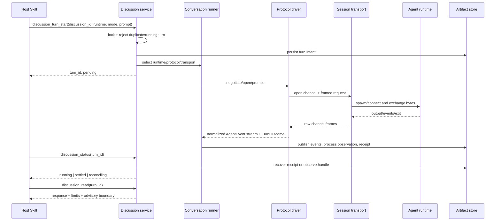

# Cross-platform Agent conversations

Status: historical research and wider adapter roadmap. The confirmed Consult V1 contract is recorded
in the final section, "当前实施契约", and in [Consult V1](../development/consult-v1.md).
Earlier proposals and unresolved questions below are not the current implementation scope.

## Problem

Todo execution should be able to request a bounded discussion from Claude Code, Codex, OpenCode, Pi, or another Agent runtime without making `tmux` a contribbot requirement. The design must distinguish a resumable Agent conversation from a persistent terminal, a supervised child process, and a daemon that survives host restarts.

The current Claude design discussion proves that each round can use Node `child_process.spawn`, exchange data through stdin/stdout/stderr, and exit without a persistent terminal. It also proves that runtime-native `--resume` is not a suitable default interaction path: rounds 120-146 included successful calls taking roughly 190-381 seconds and timeouts at 240-600 seconds. Agent-native resume remains a capability, not the source of truth or the default continuity mechanism.

## What CatPaw actually keeps alive

CatPaw does not persist the model's conversation state itself. Its observable transport creates a
detached tmux session, starts one interactive Claude or Codex CLI process in the pane, pastes later
prompts into that same pane, and reads recent output with `capture-pane`. Output hashes and prompt
line hashes support changed/stable and waiting detection; `remain-on-exit` preserves terminal output
and the exit result after the process ends.

The long-context property therefore belongs to the still-running Agent CLI process, not tmux.
If that process exits, a retained pane or scrollback buffer can help diagnosis but cannot restore the
Agent's in-memory semantic context. The reusable CatPaw idea is the non-blocking lifecycle surface
(`open`, `send`, `status`, `read`, `close`), not the assumption that a terminal is durable memory.

## Reference implementations

| Project | Mechanism worth borrowing | Boundary for contribbot | Notes |
| --- | --- | --- | --- |
| CatPaw | Stable logical session key, non-blocking send, output observation, explicit close | tmux and pane buffers are not cross-platform durable conversation state | Useful as a Live Session UX reference |
| VS Code terminal | Separate process ownership from the UI; reconnect to a surviving process; replay terminal content on revive | Buffer replay restores presentation, not arbitrary process memory or model context | A reference only if a PTY host is later required |
| OpenCode | Durable session/message/part records and explicit compaction events | Do not copy its storage layout or treat a generated summary as confirmed fact | Closest reference for Durable Discussion |
| Cline | Token-aware Auto Compact and separately restorable task/file checkpoints | Do not couple every discussion turn to a full shadow-repository snapshot | Conversation recovery and workspace recovery remain distinct |
| LangGraph | Thread identity, per-step checkpoints, and persisted successful writes that are not repeated after resume | Do not introduce a graph runtime merely to obtain checkpoint semantics | Borrow idempotent recovery concepts for turn supervision |
| Aider | Rebuild each request from selected context; summarize older history while retaining a recent unsummarized tail | Do not depend on its repo-map-specific prompt assembly | Useful for Context Packet budget policy |

No single reference supplies the complete design. The combined lesson is to separate an optional
live process lease from a durable semantic record and from workspace execution checkpoints.

## Agent integration boundary

`node-pty` is not the definition of a long-lived Agent session. OpenCode ACP and Pi RPC can keep a
structured stdio session alive without a pseudo-terminal. The integration therefore has four
independent axes:

```text
Agent Runtime       Claude Code / Codex / OpenCode / Pi / future Agent
        ↓
Agent Protocol      native one-shot / ACP / Pi JSONL RPC / terminal-interactive
        ↓
Session Transport   one-shot pipe / long-lived stdio / PTY / socket
        ↓
Durable Discussion  contribbot-owned turns, events, decisions, and checkpoints
```

The runtime identifies the Agent product; the protocol describes its interaction contract; the
transport carries bytes and process control. A runtime may expose more than one protocol, and a
protocol may run over more than one transport. Durable Discussion remains independent of all three.

| Runtime | Preferred protocol | Initial transport | Integration boundary | Notes |
| --- | --- | --- | --- | --- |
| Claude Code | `native-oneshot` | pipe | Runtime adapter + native protocol driver | Already verified locally; runtime resume remains optional |
| Codex | `native-oneshot` | pipe | Runtime adapter + native protocol driver | Experimental app-server is not the V1 contract |
| OpenCode | ACP v1 | long-lived stdio | Runtime adapter + ACP driver | First proof of a generic multi-runtime path |
| Pi coding agent | Pi JSONL RPC | long-lived stdio | Runtime adapter + Pi RPC driver | Fixture-first; native history never replaces local records |
| TTY-only Agent | `terminal-interactive` | PTY | Runtime adapter + terminal driver | Future fallback; requires echo, ANSI, and readiness handling |

ACP is the preferred generic protocol where an Agent supports it, but it is not mandatory. Native
adapters remain valid for runtimes with richer or more stable native interfaces. Runtime, model
provider, and model identity are stored separately.

## Alternatives

| Option | Cross-platform value | Cost or limitation | Decision | Notes |
| --- | --- | --- | --- | --- |
| Node `child_process.spawn` | Pipe-based process execution on Windows, macOS, and Linux | Low-level timeout, output, cancellation, and receipt handling remain ours | Use as the first backend | Already used by the Claude discussion and MCP execution code |
| `execa` | Better errors, streaming, cancellation, and Windows ergonomics over `child_process` | Adds a dependency and still does not provide durable conversations or a PTY | Re-evaluate later, not required for v1 | Existing contribbot code already implements most required supervision semantics |
| `node-pty` | One Node API over Unix PTY and Windows ConPTY | Native build/runtime dependency; no durable registry, resume protocol, or audit model | Optional future backend | Add only for a TTY-only Agent runtime |
| Python `asyncio.subprocess` + `psutil` | Cross-platform pipe execution and process observation | Duplicates Node ownership; Python PTY support still splits between Unix and Windows packages | Do not use for Agent transport | Keep Python focused on patrol and orchestration |
| Go `os/exec` + `go-pty` | Cross-platform process and PTY options exist | Introduces a third language, build chain, packaging path, and ownership boundary | Do not introduce Go | There is no transport requirement that Node cannot meet |

References:

- Node child processes: https://nodejs.org/api/child_process.html
- Execa: https://github.com/sindresorhus/execa
- node-pty: https://github.com/microsoft/node-pty
- Python asyncio subprocesses: https://docs.python.org/3/library/asyncio-subprocess.html
- psutil: https://psutil.readthedocs.io/
- Go os/exec: https://pkg.go.dev/os/exec
- Cross-platform Go PTY: https://github.com/aymanbagabas/go-pty

## Decision

Use a Node-owned, protocol-driven Agent integration layer with local-first conversation continuity:

1. Node/TypeScript owns Agent discovery, protocol drivers, transport, turn supervision, receipts, and persisted conversation metadata.
2. Python remains the Phase 3 patrol/orchestration layer and calls the Node/MCP surface instead of starting Agent runtimes itself.
3. An Agent turn is bounded by its protocol contract. The local discussion record is the canonical continuity source; runtime-native session resume is an optional deep-discussion mode.
4. PTY support is a capability extension, not the default architecture. `node-pty` is considered only after a real Agent runtime proves structured pipe/stdio protocols insufficient.
5. Go is not added.
6. An Agent result is advisory context. It cannot grant approval, mark a check passed, complete a Todo, or authorize a write.
7. A Context Packet is a reproducible projection of the durable discussion log, not an independently edited memory document.
8. Agent runtime, protocol, and transport are separate extension axes. `node-pty` belongs only to the terminal transport path.
9. ACP is preferred when available; native one-shot, Pi RPC, and future protocols remain first-class adapters.

## Concept boundaries

| Concept | Meaning | V1 requirement | Notes |
| --- | --- | --- | --- |
| Logical conversation recovery | Reconstruct a later turn from durable local context | Required | Default to summary rehydration; runtime-native session resume is optional |
| Turn process supervision | Observe one Agent invocation from reservation to terminal receipt | Required | Persist PID, machine, start time, bounded output, exit result, and timeout/control facts |
| Interactive terminal | Make a CLI believe it owns a real terminal and accept incremental keystrokes | Extension only | No automatic answers to approval or authentication prompts |
| Host restart recovery | Reconcile a turn whose requester or contribbot process disappeared | Partial in v1 | Recover a terminal receipt; otherwise mark `unknown` and never replay automatically |
| Durable daemon | Keep an always-running contribbot service alive across login/reboot | Out of scope | Scheduling/service installation is a separate Phase 3 concern |

## Architecture

```text
Todo Skill / Phase 3 orchestrator
              |
              v
       Discussion service (Node)
       - discussion registry
       - per-discussion lock
       - request idempotency
       - turn state projection
              |
              v
       Conversation runner
       - discussion lock
       - durable turn intent
       - request idempotency
              |
              +--------------------------+
              |                          |
              v                          v
       Runtime adapter             Protocol driver
       - discover Agent            - capability negotiation
       - supported protocols       - session semantics
       - build launch plan         - normalize Agent events
              |                          |
              +------------+-------------+
                           v
                    Session transport
                    - open channel
                    - process control
                    - observation
                           |
                    one-shot pipe (V1)

Optional later:
ACP driver -> long-lived stdio transport
Pi RPC driver -> long-lived stdio transport
terminal-interactive driver -> PTY transport (node-pty)
```

The former `ProviderAdapter` concept is split into runtime metadata, protocol drivers, and transport
responsibilities. Runtime-specific syntax belongs in a pure `RuntimeProtocolBinding`, not in a
duplicated driver:

```ts
interface AgentRuntimeAdapter {
  runtimeId: string
  discover(config: AgentConfig): Promise<Presence>
  protocols(): Promise<ProtocolOffer[]>
  binding(protocolId: string): RuntimeProtocolBinding
}

interface RuntimeProtocolBinding {
  runtimeId: string
  protocolId: string
  version: string
  buildLaunch(request: AgentLaunchRequest): LaunchPlan
  encodeInput?(input: PromptInput): Uint8Array
  decode(chunk: Uint8Array, state: DecodeState): DecodedProtocolData
  classifyError(raw: RawEnd): AgentErrorClass
  sessionToken?: {
    read(event: AgentEvent): string | null
    reuse(token: string): LaunchPlan['resume']
  }
  quirks?: Record<string, unknown>
}

interface AgentProtocolDriver {
  protocolId: string
  negotiate(channel: SessionChannel, init: SessionInit): Promise<Capabilities>
  attach(channel: SessionChannel, binding: RuntimeProtocolBinding, init: SessionInit): Promise<SessionHandle>
  events(handle: SessionHandle): AsyncIterable<AgentEvent>
  prompt(handle: SessionHandle, input: PromptInput, control: TurnControl): Promise<TurnOutcome>
  cancel(handle: SessionHandle, reason: string): Promise<void>
  load?(token: SessionToken): Promise<SessionHandle>
  fork?(handle: SessionHandle): Promise<SessionHandle>
}

interface SessionTransport {
  transportId: string
  open(plan: LaunchPlan): Promise<SessionChannel>
}
```

The common boundary is normalized Agent events and a terminal turn result, not a shared low-level
process API:

```ts
type AgentEvent =
  | { type: 'session.started'; sessionId: string }
  | { type: 'message.delta'; text: string }
  | { type: 'message.final'; text: string }
  | { type: 'tool.call'; name: string; input: unknown }
  | { type: 'tool.result'; name: string; output: unknown }
  | { type: 'permission.request'; requestId: string; scope: string }
  | { type: 'permission.resolved'; requestId: string; decision: 'allow' | 'deny' }
  | { type: 'plan'; value: unknown }
  | { type: 'usage'; value: unknown }
  | { type: 'error'; code: string; message: string }
  | { type: `extension.${string}`; value: unknown }

interface TurnOutcome {
  events: AgentEvent[]
  finalMessage: string | null
  process: ProcessObservation
  exit: { code: number | null; signal: string | null } | null
  outputIntegrity: 'ok' | 'truncated'
  unresolved: string[]
}
```

Capabilities are namespaced (`events`, `permissions`, `tools`, `session`, `attachments`, `mcp`) and
record both declared and observed support. Unsupported optional features are persisted as visible
degradations rather than silently discarded. Permission requests fail closed when no real user
decision channel exists; Agent output cannot manufacture approval.

`ConversationRunner` acquires the discussion lock, records a durable turn intent, selects a
runtime/protocol/transport tuple, opens the transport channel, attaches a driver with its binding,
publishes normalized events and the terminal receipt, and updates the projection. The driver never
creates a transport and cannot select a fallback by itself. V1 starts with native one-shot over pipe
and proves the extension boundary with ACP. Pi RPC and terminal-interactive drivers use the same
event and `TurnOutcome` contracts, so Durable Discussion, Todo integration, and Context Packet
generation remain unchanged. The runner never constructs shell command strings and never starts the
same `request_id` twice.

Selection is explicit and auditable. If a preferred protocol is unavailable, contribbot may report a
candidate degradation, but it must not silently switch to another protocol or runtime. A fallback is a
new visible selection decision recorded in `degradations[]`, not an implicit retry.

Do not force one-shot pipe, long-lived structured stdio, and PTY semantics into one low-level runner.
A pipe turn is bounded by stdin closure and child exit. ACP and Pi RPC keep a framed stdio channel
alive across turns. PTY has incremental keystrokes, merged terminal output, prompt echo, terminal
sizing, readiness detection, and a lease spanning multiple turns. Their common boundary begins only
after protocol-specific normalization.

## Conversation modes

| Mode | Context source | Use | Limit |
| --- | --- | --- | --- |
| `rehydrate` | Local summary, accepted decisions, unresolved questions, cited facts, and selected source snapshots | Default multi-round mode | Summary quality bounds continuity; every injected item keeps provenance |
| `runtime_resume` | Agent-runtime-managed session plus the new question | Explicit deep-discussion mode | Unpredictable latency, runtime retention dependency, and possible incomplete output |
| `fresh` | Only the bounded prompt for this turn | One-off review, challenge, or independent opinion | No assumed prior context |

`runtime_resume` is not an automatic fallback or retry target. A timeout does not prove the Agent produced no answer. Starting a rehydrated turn after a timeout creates a visible new turn and possible context branch; it requires an explicit host/user decision.

## Agent runtime discovery

Discovery order:

1. Use an explicitly configured absolute executable path.
2. During setup or diagnostics only, allow a PATH lookup, show the resolved path, and persist that absolute path after user confirmation.
3. At runtime, fail clearly if that executable is absent or changed. Do not silently switch Agent runtime, protocol, or executable, and do not run a same-named executable from the repository directory.

This is intentionally less strict than Claude's suggestion to require preconfigured absolute paths from the start. One-time visible discovery preserves developer experience while runtime pinning preserves determinism.

## Persistence

Do not place transcripts or per-turn process data in `todos.yaml`. Store discussions separately and link them to a Todo by stable ID.

```text
~/.contribbot/{owner}/{repo}/
├── discussions.yaml
└── discussions/{discussion-id}/
    ├── discussion.yaml
    ├── turns/{turn-id}.prompt.md
    ├── turns/{turn-id}.response.md
    ├── turns/{turn-id}.stderr.txt
    ├── receipts/{turn-id}.json
    └── checkpoints/{checkpoint-id}.yaml
```

Minimum discussion metadata:

```yaml
id: discussion-...
todo_id: t-...
execution_id: te-...        # optional
purpose: design             # design | research | review | challenge
runtime_id: claude-code
protocol_id: native-oneshot
transport_id: pipe
model_provider: anthropic   # optional and distinct from runtime
model_id: ...               # optional
default_mode: rehydrate
runtime_session_token: ...  # optional, used only by runtime_resume turns
capabilities:
  declared: {}
  observed: {}
degradations: []
status: open                # open | closed
created_at: ...
updated_at: ...
latest_turn_id: turn-...
summary: ...
adopted_decisions: []
rejected_suggestions: []
unresolved_questions: []
open_risks: []
cited_facts: []
```

Each summary item carries its source turn ID and content digest. Model-generated summaries are proposals until the primary agent checks them; user/product decisions enter `adopted_decisions` only after confirmation. Summaries are context, not check evidence, approval, or Todo completion input.

Context Packets are generated from the durable log and checkpoint metadata. Each packet records its
source turn range and digests, can be rebuilt, and is superseded rather than silently edited. The
default budget priority is: current question and boundaries, accepted decisions, unresolved
questions, open risks, cited facts, recent verbatim excerpts, then ordinary history. Older low-priority
content is replaced by source pointers. A packet conflict is resolved in favor of the underlying log.

Do not overload one turn status with timeout, process liveness, output completeness, and runtime-context uncertainty. V1 stores a small orthogonal projection:

```yaml
lifecycle: running          # running | settled | reconciling
outcome: null               # returned | failed | cancelled | null
process: running            # running | exited | unconfirmed
output: none                # none | partial | complete
output_integrity: ok        # ok | truncated
deadline_exceeded_at: null  # known local event, not an unknown outcome
unresolved: []              # descendants, remote_consumption, late_result, ...
```

A stop request is control metadata rather than an Agent result. `reconciling` is used only when a concrete fact such as descendant liveness or remote consumption cannot be confirmed; the unknown facts are listed individually in `unresolved`. A result that arrives after the user has started an alternative turn is retained as a late result but is not automatically merged into the summary or decisions.

## MCP and Skill surface

Proposed core tools:

| Tool | Responsibility | Notes |
| --- | --- | --- |
| `discussion_open` | Create a discussion linked to an optional Todo/execution and purpose | Does not invoke an Agent |
| `discussion_turn_start` | Reserve one request and launch a detached bounded turn in `rehydrate`, `runtime_resume`, or `fresh` mode | Returns discussion and turn IDs immediately |
| `discussion_status` | Observe process/receipt state without replay | Used by Skills for waiting and recovery |
| `discussion_read` | Read selected turn output and the maintained summary | Full raw transcript remains an explicit read |
| `discussion_control` | Request stop and reconcile the observed process | No POSIX-signal assumptions on Windows |
| `discussion_close` | Close the logical discussion after no live turn remains | Closing does not complete the Todo |

The Todo Skill should expose the natural action, such as “让 Claude 评审这个方案” or “让 OpenCode 和 Codex 分别给出意见.” It should prepare a bounded prompt from the confirmed Todo goal, current plan, relevant source snapshots, prior accepted decisions, and the exact question. It must distinguish Agent output from the primary assistant's decision and ask the user only for unresolved product choices.

The default user experience is non-blocking. Starting a turn returns its ID immediately. A host wait deadline and an execution deadline are different:

- when only the host wait expires and the process is verified running, record `deadline_exceeded_at` and keep `lifecycle=running`;
- when an execution deadline terminates the process and its exit is verified, settle with `outcome=failed` and reason `timeout`;
- when parent exit, descendants, remote consumption, or result publication cannot be verified, set `lifecycle=reconciling` and list the exact unresolved facts.

The system must not silently retry, switch runtime/protocol/transport, or charge another Agent turn. It exposes the verified state and, when applicable, lets the user continue waiting, explicitly start a new isolated turn, or request termination. Starting a new turn is visibly a new request, not a retry of the old one.

## Sequence



## Reuse boundaries

Reuse from `packages/mcp/src/core/execution`:

- process identity as PID + machine + observed start time;
- immutable artifact/receipt publication;
- detached bounded supervisor pattern;
- idempotent request identity and one-time claim;
- `unknown` reconciliation and never automatically replaying an uncertain effect;
- bounded output and explicit environment limitations.

Do not directly reuse:

- plan/attempt/epoch/candidate and closure state machines, which validate Todo workspace delivery rather than conversations;
- delegation candidate integration, which assumes an isolated writable worktree and terminal quiescence;
- check-specific acceptance semantics;
- any rule that treats Agent output as Proof, approval, or completion.

Shared low-level helpers may be extracted only where doing so reduces duplication without coupling discussion lifecycle to Todo delivery lifecycle.

## V1 scope

1. Add the Agent-neutral discussion store, normalized event model, and state projection.
2. Add runtime/protocol/transport registries and a Node one-shot pipe transport using the existing receipt pattern.
3. Implement the shared `native-oneshot` driver with Claude and Codex bindings.
4. Implement an ACP v1 driver with an OpenCode binding and fixtures or a local smoke adapter. This is required to prove the generic seam, not just Claude compatibility.
5. Add a Pi JSONL RPC driver/binding fixture and capability mapping before claiming broad Agent support.
6. Implement local rehydration as the default continuation mode. Its Context Packet is a generated, provenance-bound projection containing accepted decisions, unresolved questions, risks, cited facts, selected source snapshots, and a recent unsummarized tail.
7. Keep runtime-native resume behind explicit protocol capabilities with a separate caller wait policy, no hard execution deadline, and no automatic fallback.
8. Link discussions into `todo_context` and `todo_detail` without changing Todo lifecycle state.
9. Add a Todo Skill workflow for bounded design/review/challenge discussions.
10. Leave PTY, daemon installation, remote execution, automatic mode fallback, package-level third-party adapter loading, and automatic multi-Agent debate scheduling out of V1; reserve and fixture-test the terminal protocol/transport contract now.

V1 uses an in-process registry with built-in adapters. It does not load arbitrary third-party Agent
packages at runtime; package trust, signing, version compatibility, and permission isolation require
a separate supply-chain design.

Supporting multiple Agent runtimes belongs to this adapter milestone. Multi-Agent Team coordination
does not: it introduces scheduling, role assignment, arbitration, budgets, and shared-workspace
semantics and will be designed as a separate layer above discussions.

## Verification matrix

| Area | Required cases | Notes |
| --- | --- | --- |
| Platforms | Windows, macOS, Linux | CI plus a real Windows run before claiming current-machine support |
| Invocation | Missing runtime, path with spaces, Unicode payloads, explicit cwd, non-zero exit | Always use argv with `shell: false` for local process launch |
| Protocols | Native one-shot with Claude/Codex bindings, ACP fixture, Pi RPC fixture, terminal-interactive fixture | Validate framing, negotiation, ordering, cancellation, and degradations |
| Lifecycle | Fresh, rehydrated and runtime-resume turns; concurrent start rejection; duplicate request id; timeout; stop request | One writer per discussion |
| Recovery | Requester exits, supervisor exits before receipt, terminal receipt recovery, PID reuse, unconfirmed process or descendants | Never auto-replay while concrete facts remain unresolved |
| Limits | Oversized output, malformed protocol frames, session mismatch, closed channel, late Agent result | Preserve raw data, digest, branch relation, and explicit truncation fact |
| Rehydration | Summary provenance, stale digest rejection, unconfirmed decision exclusion, bounded context | Summary is never silently promoted to fact |
| Boundaries | Agent output cannot pass checks, approve writes, complete Todo, or archive data | Contract tests at MCP and Skill instruction layers |

Windows cancellation must not claim that `child.kill()` terminated an Agent runtime's entire process tree. V1 records the parent handle, requested control, observed terminal state, and any unresolved descendant limitation. PTY behavior and mid-turn human input have no V1 support claim.

Future PTY verification must additionally cover terminal echo removal, ANSI normalization, wrapped
lines at different terminal widths, readiness detection, repeated sends on one lease, host and child
process identity, ConPTY cancellation limits, native module installation, and real Windows/macOS/Linux
runs. PTY output is a merged terminal stream and must not be interpreted with pipe-only
stdout/stderr assumptions.

## Claude consultation

Claude round 146 agreed with the Node-first, pipe-first design and recommended optional PTY only after a demonstrated need. After the maintainer pointed out long response times, round 147 agreed that runtime-native resume must be demoted from the default path. Round 148 then accepted the maintainer's correction that timeout is a known local event, not an unknown outcome. It recommended separating lifecycle, process, output, runtime-context uncertainty, and control facts rather than using one overloaded status.

Round 149 clarified that Node is selected because it already owns MCP execution, supervision, and
receipts, not because Node is inherently superior to Python. It also warned that rehydration cannot
preserve every implicit preference or unrecorded detail. Round 150 reviewed CatPaw, VS Code,
OpenCode, Cline, LangGraph, and Aider, and supported a two-layer boundary: Durable Discussion is the
required source of truth; Live Session is an optional process lease. It recommended omitting
`node-pty` from V1 and treating Context Packet as a compaction checkpoint generated from the durable
log. The primary design adopts those boundaries. A three-turn short-session experiment was fast and
retained its test facts, but it is not sufficient evidence to make runtime-native resume the default.

Round 151 reviewed the later `node-pty` extension path. It found the extension straightforward only
if V1 depends on a normalized turn contract rather than directly on `PipeRunner`. Round 152 corrected
an additional simplification: a long-lived session can be structured stdio, not only PTY. The design
therefore separates Agent runtime, Agent protocol, session transport, and Durable Discussion. Pipe,
long-lived stdio, and PTY keep distinct low-level semantics but publish the same durable events and
`TurnOutcome` after protocol-specific normalization. Claude, Codex, OpenCode, and Pi are first-class
runtime targets; multi-Agent Team orchestration remains outside this adapter milestone.

The primary design adopts the semantic correction but keeps the stored model smaller than Claude's proposal: lifecycle, outcome, process, output/integrity, deadline event, and an exact unresolved list. Local records, not Agent runtime sessions, are the canonical discussion state. On executable discovery, one-time visible PATH discovery followed by absolute-path pinning is preferred over requiring manual absolute configuration from the first use.

Round 153 refined the seam further: drivers are shared by wire protocol, while runtime-specific
argv, frame decoding, error classification, and session-token rules live in pure
`RuntimeProtocolBinding` objects. Thus Claude and Codex share one native one-shot driver, OpenCode
uses a shared ACP driver, and Pi uses its own JSONL RPC driver. Transport is opened first and then
attached to the driver; drivers cannot silently select a fallback. V1 uses an in-process registry,
not arbitrary third-party package loading, until a separate adapter supply-chain model exists.

## Decisions still requiring maintainer confirmation

- Which runtime adapters belong to the first implementation milestone (recommended: Claude native + OpenCode ACP + Pi fixture, then Codex native).
- Transcript retention: keep indefinitely, retain summaries plus digests, or expose an explicit compact operation.
- Whether remote provider execution belongs in this feature or remains a later transport extension.
- Whether a real provider requiring PTY is known now; absent such a case, `node-pty` should not be added.
- Whether explicit deep-discussion mode should ship in v1 or remain disabled until the default rehydration path is proven.
- Confirmed for V1: there is no default hard execution deadline. A caller may stop waiting, but contribbot does not terminate the Agent runtime unless the user explicitly requests control. These are separate controls and must not be conflated.
- Whether permission requests always pause for an explicit user decision in V1 (recommended: yes; never auto-approve).
- Whether Pi native session/compaction output is imported as advisory history or used only as a transport optimization (recommended: local Durable Discussion remains authoritative).
- Whether the first implementation should include Codex native in the same milestone as Claude (recommended: yes, sharing the native driver with separate bindings).
- Whether fallback proposals should be shown as a user choice or only be exposed to the caller for a later explicit action (recommended: user-visible choice, never silent).
# 当前实施契约（2026-09-20 补充）

上文是早期完整适配层设计，不能把所有候选内容理解为当前已实现范围。
用户经过 Claude round 158-165 讨论确认的首版为 Main Agent + 只读 Advisor：
独立 Discussion、可选 Todo、有限可撤销授权、精确规则认可、Claude/Codex one-shot、
异步观察与原请求幂等、来源绑定的综合/用户决定、显式 `purge_raw`。
没有模型硬截止时间，不自动重试、换顾问、改计划、验收、完成或归档 Todo。

读取隔离不再作为 V1 硬门禁，改为明确说明 CLI 可读取其他文件并向远程服务发送数据；
写入保护仍是运行前提，无法核实时不可调用。ACP/Pi/PTY、runtime resume、自动多 Agent
讨论与调度是后续适配方向，不是本轮完成要求。
当前实际存储为 `consult/discussions.yaml` 与每轮不可变 packet/result；
工具统一使用 `consult_*`，上文早期 `discussion_*` 名称未对外启用。

Claude round 166 的本地异常恢复边界已获用户“按此实现”确认，并已落地：
通过 `consult_control` 的 `reconcile` 追加本机句柄观察、来源明确的后代报告和用户决定，
以 `reconciled_by_attestation` 释放本地占用。报告不等于整棵进程树的 OS 证明，
远端生成与计费保持未核实；原始结果和消耗不改写，不退款、不重试。
新请求仍需独立通过预览/授权；迟到回复不进入综合，不自动结束或归档 Todo。

独立审查复现过早报告竞态后，round 167 将恢复时序补为两步：
先追加本机原父进程停止的 `release_observation`，再实际检查后代，最终以该事件 ID/revision、
晚于事件的报告和用户决定核对并释放。中间版本变化使旧观察失效。
不在本轮扩展 supervisor 启动追踪；缺少原 supervisor 身份无法建立观察，仍保留占用，
不能把空句柄集合解释为确定未启动。该限制不扩大已确认权限。

实现边界、调用流程和验证入口见 [Consult V1](../development/consult-v1.md)，
实际验证进度以 [当日日报](../progress/2026-09-20.md) 为准。

## 后续分层草案（2026-09-21）

用户随后确认 MCP 不负责启动 Agent，由主助手触发 contribbot 统一入口并按需执行，
第一版不设常驻服务。新的包边界、Consult 工具调整和迁移验收见
[Agent Runtime 分层拆分与 Consult 调整方案](2026-09-21-agent-runtime-separation.md)。
该方案经 Claude round-169 评审，完整接口与实施批次仍待用户确认；
不能将本节理解为旧实现已迁移，也不改写上述 9 月 20 日实现和验证事实。
