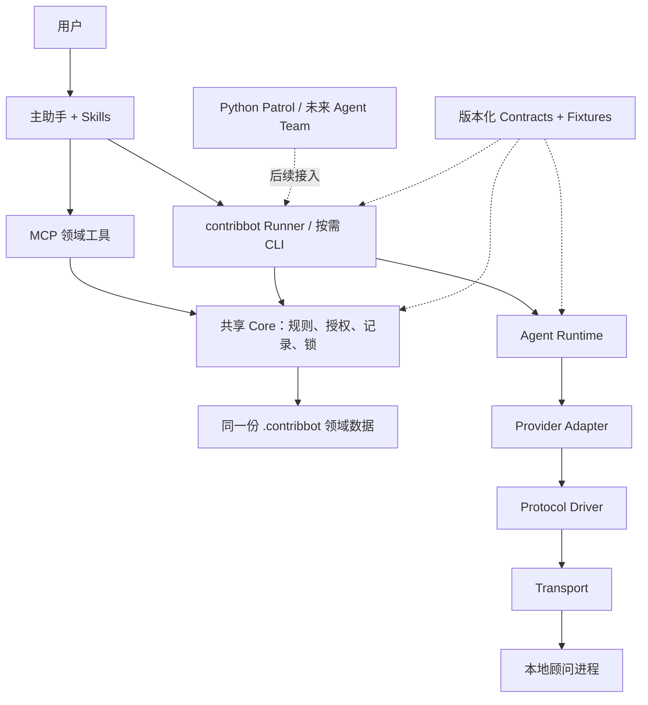
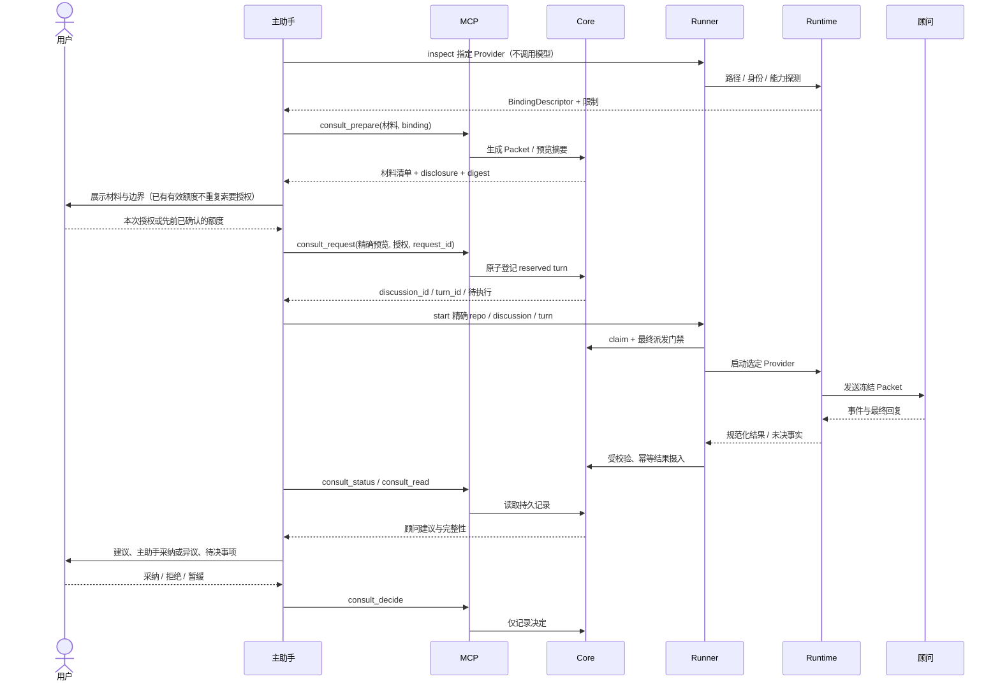

# Agent Runtime 分层拆分与 Consult 调整方案

日期：2026-09-21，Asia/Shanghai。

当前状态（2026-09-23）：用户已同意执行。Consult 必需依赖闭包已迁入 Core，
单轮编排和 worker 在 Runner，Provider/transport 在 Agent Runtime。
MCP 已不依赖 Runner/Runtime；通用进程观察放入 Platform 叶包，Core 只用其类型。
公开工具已切换为 prepare/request/Runner 与显式恢复。源码启动修复、类型检查、
构建、两轮根回归（各1095 passed / 1 skipped）、Python54、source/dist各28场景
与Claude最终静态审查已通过；本批工程验证完成，尚非用户真实使用验收通过。
最终范围、候选和限制见[验证报告](../reviews/2026-09-23-runtime-separation-verification.md)。
本日证据见 [进度记录](../progress/2026-09-23.md)；拆分前的历史证据见
[执行前审查](../reviews/2026-09-22-runtime-separation-preflight.md)。

历史状态（2026-09-21）：当时已完成 Claude 设计评审、待用户确认，
只设计、不改业务代码。下文保留当时的建议与确认过程；9 月 22 日的执行批准
不包含安装激活、真实数据迁移、真实模型产品验收、提交推送或完成归档 Todo。

范围澄清（2026-09-22）：用户进一步说明，整体目标还包括让 contribbot 承接并最终取代
CatPaw 的能力。本文的 Agent Runtime 仅指底层外部 Agent 调用层，不等同于 CatPaw
涵盖任务流程、协作、证据、权限和项目记忆的整个 runtime。本文保留为 Consult 执行
拆分子方案，不是整体替代设计，也未证明能力已覆盖；后续应先核对实际能力差距。
这项澄清不代表用户批准本文所有接口、包结构或实施批次。

用户随后进一步限定：需要在任务推进能力上超越 CatPaw 的主体是 contribbot 的 Todo
体系，产品依赖这套能力；不是重新定义整个产品定位。本文的 Consult 与 Runtime
拆分是服务该目标的子方案，不能代替 Todo 能力差距核对和完整任务闭环设计。

用户最终确认的边界：Todo 是推进工作的主线，目标是承接并超越 CatPaw 的相关任务
推进能力；其他功能围绕任务协作但保留独立使用边界。本文的独立 Consult 设计不变，
不得将“产品依赖 Todo”解释为所有工具和咨询都必须先创建或绑定 Todo。

## 1. 目标与范围

让 contribbot 自己负责调用顾问，用户换主助手时，不需要重新实现每一种顾问的启动逻辑。
MCP 保持领域工具入口，Runtime 独立；主助手负责理解任务、呈现材料、综合意见，
用户保留授权与关键产品决定。

| 类别 | 内容 | 备注 |
| --- | --- | --- |
| 已确认 | 当前主助手触发 contribbot 统一入口，contribbot 按需启动顾问 | 不要求用户每轮手敲命令 |
| 已确认 | MCP 不启动 Agent；第一版不做常驻队列服务 | 登记请求不等于已经开始执行 |
| 沿用 | 顾问只读、读取范围限制如实披露、无模型硬截止时间、不静默重发或换顾问 | 不借重构降低既有安全条件 |
| 9 月 22 日已同意执行 | 抽出共享 Core、独立 Runner、Runtime 与契约边界 | TS 结果一致性已测试；跨语言 schema 随后续 Python 消费批次交付，当前不宣称已有 |
| 不在本轮 | 自动巡检、Agent Team、自动建 Todo、知识初始化、PTY、真实 Pi/OpenCode 接入 | 留接口，不提前实现未来产品 |

“纯 MCP”指不承担 Agent 执行和编排，不指所有工具都只读或禁止所有子进程。
Issue/PR 写入、Git 文件读取仍属于既有领域工具能力。本方案不重写这些能力，
也不把顾问成功返回当作任务验收。

## 2. 拆分前的耦合基线

以下为方案提出时读取工作区得到的历史基线；不代表 9 月 23 日的文件归属，
也不是新测试结果。当前归属见第 12 节。

| 当前位置 | 实际职责 | 拆分影响与备注 |
| --- | --- | --- |
| `packages/mcp/src/core/tools/core/consult.ts` | 预览、探测 Agent、登记授权、启动 supervisor、状态观察和决定 | 工具入口混入本地运行时操作 |
| `core/consult/binding.ts` | 版本/help 探测、可执行文件摘要、环境变量、参数、输出解析、披露 | 需要拆分为探测、适配、协议三部分 |
| `core/consult/transport.ts` | pipe 进程、输出限制、脱敏、终止、协议结果 | 直接依赖 Consult 结果与 Todo 进程类型 |
| `core/consult/runner.ts` | claim、准备、调用顾问、控制、结果落库 | 同时是领域流程和进程执行器 |
| `core/consult/store.ts` | Discussion、授权、锁、派发门禁、结果、综合、恢复 | 领域记录必须保留单一实现；OS 观察移到执行端 |
| `core/execution/` | Todo 执行状态、检查、委派、交付、进程观察 | 不是可以整体搬进 Agent Runtime 的目录 |
| `packages/agent` | Python 巡检应用，分析器与执行器直接调用 Codex | 是后续 Runtime 消费者，不是 Runtime 本身 |

按 TypeScript 相对 import 静态展开 Consult store/packet/contracts/projection，
当前涉及 21 个本地文件，包括 TodoStore、workflow、交付记录、共享锁和进程观察。
这个数量仅用于解释依赖闭包，不是预计改动文件数或完整依赖审计。

必须保持的关键现状：`ConsultStore.dispatch()` 在与撤销、Todo 控制相同的锁内
复核最新权限，写入派发标记并同步启动。不能重构成“先经 MCP 检查，再隔一段时间任意启动”。

## 3. 分层与依赖

### 3.1 职责

| 层 | 职责 | 禁止职责 | 备注 |
| --- | --- | --- | --- |
| 主助手与接入层 | 选材料、呈现授权、调用工具及统一 CLI、解释结果 | 拼顾问参数、实现 Provider-specific 重试与解析 | Codex/Claude/Pi 等作为入口，接入能力需分别实测 |
| MCP | 工具 schema、注册、领域服务调用、结构化响应 | 启动 Agent、探测 Agent、杀顾问进程、排空队列 | 不依赖 Runner 或 Runtime |
| Core | Todo/Consult 规则、授权、Packet、记录、锁、结果摄入 | Provider 参数、模型调用、Agent Team | 同一规则实现服务 MCP 和 Runner |
| Runner | 领取精确请求、组装依赖、执行门禁、控制与结果回传 | 自行决定多轮咨询、增加顾问、扩大权限 | 最小确定性编排，不是另一个自主 Agent |
| Agent Runtime | 探测、能力核对、Provider 适配、协议、传输与进程控制 | Todo/Discussion 业务语义、人工验收、归档决定 | 不根据当前宿主身份分支 |
| Contracts | 版本化结构、事件、兼容规则和一致性夹具 | 进程运行、领域数据库、第二份状态 | TS/Python 共享契约，不共享实现 |
| Patrol / 未来 Agent Team | 决定发现什么任务、如何安排有授权的执行 | 绕过 Core 或给 Runtime 自行授予权限 | 上层消费者，本轮不扩展 |

### 3.2 架构图



文字版：

```text
主助手
  +-- MCP --------> Core --------> 领域数据
  +-- Runner -----> Core（同一规则、同一把锁）
        |
        +---------> Runtime --> 适配器 / 协议 / 传输 --> 顾问
```

图中的箭头表示调用或依赖，不意味着 MCP 负责启动 Runner。
Core 是领域事实的唯一写入规则，不是“只允许一个 OS 进程写文件”。
多个本机进程只能经同一 Core、同一规范化数据根与同一锁进行串行化写入；
不支持跨机器共享目录并发执行。

### 3.3 包方案

```text
packages/
  core/                 # 新：领域规则、持久化、共享锁
  mcp/                  # 现有：MCP 接口，逐批移出业务实现
  runner/               # 新：本地 CLI、Consult 单轮 worker
  agent-runtime/        # 新：Provider/Driver/Transport/进程能力
  agent/                # 现有 Python Patrol，不改写语言
  web/                  # 现有 UI，不在本轮改版
contracts/
  agent/v1/             # 后续 Python 消费批次：生成 schema 与跨语言夹具，当前未创建
skills/                 # 宿主侧流程说明，不写顾问启动参数
```

暂用 `contribbot-run` 作为 Runner 命令名。现有 Python 包已经注册 `contribbot`，
本轮不抢占该名称，也不另建 CLI 统一品牌的任务。

第一批只抽 Consult 必需的 Core 依赖闭包。TodoStore、workflow、锁等被迁出的实现
只能保留一份，旧位置可短期重导出，不可复制后分别维护。Core 不反向引用 MCP。
其余领域模块按依赖迁移，不能因 Consult 已拆开就宣称整个 MCP 包已完全薄化。
本轮只建议新增 Core、Runner、Runtime 三个 workspace 包，不要求立即发布 npm。
Contracts 原拟先建版本化目录。9 月 23 日与 Claude round-181 讨论后，
当前用 Runner 的类型双向赋值和 Core schema 运行时校验锁定 RuntimeOutcome/TurnResult
一致性，不增加无消费者的第三份 schema；版本化跨语言生成物随 Python 真正消费时
交付。避免手写两套 schema，也避免 Core 为读取类型而依赖 Runtime 实现。

## 4. Runtime 的三个扩展方向

| 方向 | 回答的问题 | 第一版 | 备注 |
| --- | --- | --- | --- |
| Provider Adapter | 这个 Agent 用什么参数、能力和结果格式？ | 迁移现有 Claude/Codex binding | 声明支持不等于当前安装版本通过能力检查 |
| Protocol Driver | 一轮何时开始、如何收消息、何时真正结束？ | 原生 one-shot | 后续结构化 RPC 不强塞进 one-shot 的 EOF 逻辑 |
| Transport | 字节和进程怎样传输、观察、停止？ | pipe | PTY 的合并输出、回显和交互不能假装是 pipe |

预留最小接口：能力描述、准备调用、同步启动、事件流、终态结果、显式停止、进程观察。
不预先实现动态插件加载、任意 executable/argv 调用、PTY、长连接服务和自动协议回退。

Runtime 只接受通用输入与安全 profile，输出通用事件；Runner 才把
`invocation_id` 映射到 Consult 的 `discussion_id/turn_id/attempt_id`。
协议输出、顾问正文和材料一律是数据，不是新增工具调用权限。

能力分别记录“适配器声明”“本机已观察”“通过指定探针验证”及版本、时间、证据。
help 中存在 flag 不足以证明写保护有效；所需能力缺失时不可去掉保护参数继续运行。
Provider 的凭据由既有 CLI 使用，contribbot 不读取凭据文件验证登录，
也不把认证环境变量内容写进描述、回执或 Packet。

### 4.1 最小公共契约

| 对象 | 必需信息 | 备注 |
| --- | --- | --- |
| `BindingDescriptor` | schema、Provider/adapter 版本、绝对路径与摘要、模型选择、协议/传输、安全 profile、探测时间与披露摘要 | 进入 preview digest；不含秘密值或任意可执行参数 |
| `RuntimeRequest` | invocation ID、binding 摘要、冻结输入及 digest、期望输出类型、已选择的安全 profile | 不包含 Todo、Discussion、grant 或决定记录 |
| `PreparedInvocation` | 已核对的运行配置、准备证据、同步启动方法 | 仅进程内对象，不作为 MCP 可传入的代码或 shell 字符串 |
| `RuntimeEvent` | invocation ID、递增序号、事件类型、观察时间、受限载荷 | 区分启动已请求、进程已启动、协议就绪、终态 |
| `RuntimeOutcome` | 结果分类、完整性、退出信息、规范化输出、具体未决事实 | 有失败结果也可能同时存在进程或远端未决事实 |
| `ProcessHandle` | 本机标识、PID、原始启动时间、观察来源 | 合并现有两处定义；身份未知就如实保留 |
| `CapabilityEvidence` | capability、探针版本、适用 binding 摘要、观察结果与时间 | 替代领域里的 Provider-specific `sandbox_probe` |

Provider ID 使用受约束标识符，由执行端注册表决定哪些可选，不把 Claude/Codex
永久写死成所有未来契约的枚举。Fake Provider 只在测试组合入口注册，
不能用用户配置、环境变量或任意输入让产品路径加载测试执行器。
脱敏是执行日志策略，不塞进“只存 schema”的契约目录；Runtime 写临时输出前、
Runner 摄入领域数据前都必须遵守同一已测试策略，避免只在最终展示时脱敏。

## 5. 顾问流程调整

### 5.1 一次咨询



工具调用次数增加不应变成用户对话轮数增加。Skill 在既有授权内完成 prepare/request/run，
材料、默认顾问、费用边界变化才重新征求对应授权。

Runner 只运行指定 turn。它可以启动一个有记录的后台 worker，让发起 CLI 尽快返回；
该 worker 仅服务本轮，不扫描未来请求。能脱离发起命令不代表一定能脱离所有宿主清理策略，
更不代表机器重启后继续运行，必须实测并如实显示原执行状态。

### 5.2 工具与 CLI

下列接口已进入源码实现；本机已安装的 MCP 是否更新需要另外检查，
构建不等于已激活。原文的拟议状态已由 9 月 23 日实现覆盖。

| 接口 | 调整后职责 | 备注 |
| --- | --- | --- |
| `contribbot-run provider inspect` | 本地路径、版本、身份、能力探测 | 不调用模型；探测本身可能启动本地程序 |
| `consult_prepare` | 构造材料、scope 检查、展示 binding/disclosure 与 digest | 不探测或启动 Agent；外部 binding 不是运行时证明 |
| `consult_request` | 复核精确预览与授权、幂等登记 turn、记录额度 | 返回待执行，不声称已启动 |
| `contribbot-run consult start` | 精确对象领取、核对、启动本轮 worker | 不接收任意 shell 指令，不排空队列 |
| `consult_status` / `consult_read` | 只读取结果及最后观察状态 | 不落库、不增加 revision、不实时探测 Agent |
| `contribbot-run consult recover` | 摄入原执行已经产生但尚未登记的合法回执 | 明确动作，不重跑模型；不能导入任意手写结果 |
| `consult_control` | 记录 grant/revoke、停止等待、终止、放弃的意图 | 记录请求不等于进程已停止 |
| Runner 的 `observe` / `reconcile` | 实际进程观察及两阶段本地恢复 | 复用 Core 门禁，不由主助手拼造 OS 事实 |
| `consult_decide` | 综合来源引用、用户决定、显式关联与关闭 | 不顺便改 Todo、计划、Knowledge 或 GitHub |
| `consult_purge_raw` | 精确快照下显式清理本地原文 | 不能在未知在途时破坏恢复依据，不声称删除服务商日志 |

第一版建议不新增公开 `consult_submit` 工具。Runner 经 Core 的 `ingestOutcome`
写入回执，和 MCP 使用相同校验及锁；避免让 LLM 以普通工具调用拼接“执行成功”结果。
没有经 MCP RPC 不等于绕过领域规则。后续若有远程 worker，再设计提交端点和信任边界。

旧 `consult_start` 不静默改义。建议切换时短期保留旧名，固定返回 unsupported
及 prepare/request/run 替代步骤，不读改原请求、不占额度、不启动进程。
这不是兼容旧执行链，只用于让旧会话明确知道为什么不能再按旧方式运行；
后续统一移除。切换批次同时更新 MCP 注册、Skill、文档、setup/check。

`status` 严格只读是另一个需要确认的行为调整。当前实现会恢复 result 并增加 revision，
查询本身可能让手中快照过期。建议拆为上述显式 `recover`，正常 worker 仍主动落库，
只有崩溃窗口才需要恢复。主助手可按 Skill 在已有授权内触发原回执摄入，
不新增模型调用或额外索取本来就有的结果读取授权。

### 5.3 状态与用户语义

Todo 六态不变。Discussion、Turn、执行进程和授权仍是不同维度。

| 用户看到的状态 | 含义 | 备注 |
| --- | --- | --- |
| 待执行 | 已登记，尚无执行者领取 | 不是顾问正在思考 |
| 已领取 / 准备中 | 本地 worker 已领取，尚待启动门禁 | 不把准备或探针当模型调用 |
| 启动已请求 | 已写入派发意图，启动事实仍需事件确认 | 崩溃时不得自动重发 |
| 执行中 | 已观察原顾问进程或协议事件 | 同时显示最后观察时间 |
| 已返回 / 失败 / 已终止 | 保存本轮终态及完整性 | 终态结果不必然证明所有后代或远端活动停止 |
| 需核实 | 有具体未决事实，保留本地占用 | 不用一个笼统 unknown 代替可知的失败/等待事实 |

优先沿用现有 Turn 生命周期和结果字段，通过 claim、dispatch、process observation 事件
展示细分状态；除非实现证明必须扩展，不为显示文案新增一套重复状态机。
等待超时只能说明本次等待结束，不证明顾问失败；不新增模型硬截止时间。

用户控制仍分别处理：停止等待不杀进程，终止是执行请求，放弃只是不采纳本轮，
撤销额度禁止后续新派发。活着的 worker 接收控制；worker 失联时通过 Runner 显式观察，
不能在 MCP 报告“已停止”而实际无人执行。

## 6. 派发与恢复门禁

### 6.1 最终派发

```text
Runner：准备 Provider，核对二进制、能力、Packet
    |
    v
Core：取得与 Todo / revoke 相同的锁
  复核最新 Todo、授权、控制、精确 attempt 与摘要
  写入 dispatch intent
  调用 Runner 注入的同步启动动作
  释放锁
    |
    v
Runtime：观察进程、读取输出
Runner：将事件与结果经 Core 保存
```

Core 不 import Runtime，不拼参数；同步启动函数由 Runner 组装，MCP 不暴露此入口。
锁内不能等待模型或返回 Promise。锁只覆盖最后核对、意图记录与同步启动这一短区间。
这保留既有本机行为，不声称磁盘写入与 OS spawn 是一个可回滚的原子事务。

这里的“同步启动”仅指在回调返回前调用启动 API，不能解释为进程已经成功创建。
Node 的 `spawn()` 返回 ChildProcess 不构成成功回执，必须区分之后的 `spawn` / `error`
事件；进程启动成功也不证明协议握手或远端模型请求成功。不能使用 `spawnSync()`
阻塞整个模型生成来取得这项保证。
核对依据：Node.js Child process 文档的 Asynchronous process creation 与 Event: 'spawn'；
文档地址为 `https://nodejs.org/api/child_process.html#event-spawn`。

撤销先完成则拒绝启动；派发先完成则按已在途处理，不能承诺撤销可以追回远程请求。
准备期间发生材料、binding、disclosure 或 Todo 快照变化时拒绝使用旧预览，
不自动取新材料替换已经确认的 Packet。
绑定准备结果必须带原摘要，启动门禁核对同一对象；异步探测发生在锁外，
进入门禁后不得再隐含等待或切换执行配置。文件摘要复核不等于抵御同账号恶意替换的
完整 OS 隔离，不做超出实际机制的保证。

### 6.2 重复、崩溃与结果

| 场景 | 规则 | 备注 |
| --- | --- | --- |
| 同 request_id 重复登记 | 相同摘要返回原 turn，内容不同拒绝 | 不重复占用额度 |
| 两个 Runner 领取同 turn | 同一锁与 attempt 规则只允许一个领取者 | 不依赖内存锁或“只有一个用户”假设 |
| 有派发意图但没有进程回执 | 核对原执行，不推断从未启动 | 不因 lease/等待时间到期自动重新领取 |
| 启动后 worker 崩溃 | 保留句柄、意图和原结果，进入核实流程 | 无法查清就保留占用 |
| 重复提交相同结果 | 校验 request/attempt/binding/packet 绑定后幂等摄入 | hash 只证明内容一致，不证明模型质量或来源身份 |
| 不同结果冲突 | 拒绝覆盖，保留诊断与原文 | 不挑选更好看的结果替换历史 |
| revoke/abandon 后迟到 | 保留回复但标记不参与综合 | 不退款、不重发、不改 Todo |

进程 PID、hostname 和摘要是操作关联信息，不是针对同账号恶意程序的身份认证。
Runtime 不拥有第二份 Discussion；可以保存受限的执行日志和恢复收据，
但回执索引与领域摄入规则由 Core 统一管理，不能出现两个各自可编辑的最终结果。

### 6.3 恢复

两阶段恢复次序保持：先记录原父进程停止观察，再实际检查后代，
最后在精确 revision/句柄下复查并取得用户对远端不确定性的接受，只释放本地占用。

OS 观察移动到 Runner/Runtime；Core 保留恢复状态机和报告校验，通过 Runner 注入的
只读观察能力做最后核对。MCP 只读持久观察结果，不因 status 查询启动系统进程。
门禁中的 ProcessObserver 必须同步、局部且有界；类型及运行时拒绝 Promise/thenable。
常规异步观察可在锁外进行，但不能拿旧的锁外观察替代最后核对。
不能退化成“给 MCP 传一个 all_stopped=true 就放行”。
控制、句柄登记或结果变化都会使旧观察失效。无原 supervisor 身份、异机或查不清仍不释放；
不能借重构补造缺失句柄、退款或重试。

## 7. 上下文与授权不重做

Discussion、已确认决定、综合引用、材料来源与每轮 Packet 继续保存在领域数据中。
`rehydrate` 从这些记录投影，`fresh` 不带历史。Runtime 只得到当轮冻结输入，
不维护独立长期知识库，不自动压缩或改写用户决定。

Provider 原生 resume、PTY 或 RPC 会话只可以成为将来的执行能力，
不能替代本地 Discussion，也不能因为接入新 Provider 就默认恢复历史会话。

授权优先级：本次明确指定顾问，其次用户确认的配置默认，否则询问。
发现唯一可用顾问也不自动授予发送代码的权限；当前主助手不是默认顾问来源。
每轮复核已有授权的材料类别、路径、用途、披露、额度及 Todo 代际，
不因 CLI 改名或拆包要求用户重复确认完全相同的产品决定。

同源顾问不禁止，但应标明使用的 Agent/模型和局限；不同模型也不自动成为独立验收。
Runtime/顾问不能反过来调用 contribbot 再启动顾问。任何讨论建议要落实为计划变更，
仍走既有 Todo 计划确认流程。

## 8. 文件迁移表

| 当前文件或范围 | 目标归属 | 备注 |
| --- | --- | --- |
| `consult/store.ts`、`packet.ts`、`files.ts`、`projection.ts` | `packages/core/src/consult/` | 从 store 移出具体 OS 观察，保留门禁与数据语义 |
| `consult/contracts.ts` | Consult 部分到 Core，通用调用/结果部分到 Contracts | 不能把 Todo/grant 字段带进 Runtime 契约 |
| `consult/binding.ts` | Runtime 的 adapters、discovery、drivers | 不带宿主身份条件 |
| `consult/transport.ts`、`sandbox.ts` | Runtime 的 transports、capabilities | 保留输出限额、脱敏和只读能力失败关闭 |
| `consult/runner.ts` | Runner 的 Consult orchestration | Runtime 只执行，不直接 new ConsultStore |
| `cli/consult-supervisor.ts` | Runner 的单轮 worker 入口 | MCP 不再构建或启动该入口 |
| `tools/core/consult.ts` | MCP 薄包装 + Core 服务 | 工具拆为 prepare/request 等，禁导入 Agent 启动逻辑 |
| TodoStore/workflow/锁及其必要依赖 | Core 的 todo/execution/storage | 机械迁移，不重写 Todo 六态或交付语义 |
| 进程句柄与观察 | 通用契约 + Runtime 本地进程能力 | Todo check 的关联门禁仍属于 Core/执行助手 |
| `contribbot-exec` 及检查执行入口 | 后续整理到 Runner，保持现有命令 | 不是模型顾问，不能合并权限 profile |
| Python `CodexAnalyzer` | 后续调用统一 Node 入口 | 先验证只读分析消费者，写入型 executor 不顺便迁移 |
| Skills / dev setup / 开发文档 | 更新到新工具和统一执行入口 | 本机源码发现由 Node 处理，测试不改用户配置 |

## 9. 分批实施与验收

这些批次最初在 9 月 21 日作为设计提出。9 月 22 日用户同意执行；批次 0b
和空包接线证明已完成，各批交付仍须实际实现、检查及用户验收。

| 批次 | 交付 | 验收重点 | 备注 |
| --- | --- | --- | --- |
| 0：冻结行为 | 原接口、权限、不自动重发、恢复流程的特征测试与依赖规则 | 复现既有行为和缺口，记录基线候选 | 不把历史全绿当新候选测试 |
| 0b：先证明调用边界 | 在测试组合入口用 Fake Provider 接统一 CLI 原型，暂复用现有领域实现 | 旧代码位置下先证明精确对象启动、幂等与撤销 | 不对用户同时启用新旧执行入口，不发布第二套 Store |
| 1：共享 Core | 抽 Consult 与必要依赖，锁和数据实现只保留一份 | 原 Todo/Consult 回归不变，Core 不反向引用 MCP | 可保持旧执行入口短期运行，不同时启用新领取者 |
| 2：首条纵向闭环 | Contracts、Runtime、Runner，加 Fake Provider 测试入口 | prepare/request/start/read/decide；重复、撤销、崩溃和回执恢复 | Fake 只用于测试，不能写成真实模型成功 |
| 3：真实适配迁移 | 迁移现有 Claude/Codex、能力检查、控制和恢复；切换工具与 Skill | MCP 不启动 Agent；缺 flag/探针失败不调用；结果和授权不变 | 真模型 smoke 另有授权，缺环境不伪造通过 |
| 4：开发接入与宿主 | setup/check/remove 支持新 CLI；至少两个入口接入验证 | 不含 Provider 参数的共用流程、跨目录发现、源码与构建一致 | 未实测 Claude/Pi/OpenCode 宿主不宣称全部支持 |
| 5：后续收敛 | Python 只读 Analyzer 接入、其余 MCP 领域模块和本地执行 CLI 分批归位 | Python/Node 共用契约，删除对应重复 Provider 逻辑 | 不扩大巡检、写入 Agent 或 Agent Team 权限 |

第一条闭环的用户验收是：提出一个设计问题，看到材料和顾问边界，在一次授权内完成调用，
能读回建议并记录决定；换主助手后仍能读同一 Discussion，顾问异常时不制造第二次调用。
“目录已经拆好”不构成交付验收。

### 必测矩阵

| 范围 | 测试场景 | 备注 |
| --- | --- | --- |
| 依赖边界 | MCP/Core 不依赖 Runner/Runtime；Runtime 不依赖 Todo/Consult；新 Runtime 无宿主条件分支 | 规则按 import 可达性和实际调用验证，不能只搜一处 spawn |
| MCP 纯工具 | prepare/request/status/control/decide 不启动 Agent、版本探测或进程观察 | 允许既有领域 Git/文件操作，不做错误的全局 child_process 禁令 |
| 领域回归 | 六态、暂停/取消、计划覆盖、交付、完成不归档、Consult 非验收；只读 status 不变更 revision | 整个依赖闭包迁移要扩大回归 |
| 授权 | 预览后文件/binding/Todo 改变；额度撤销；新材料类别；默认顾问变化 | 保留精确快照；拒绝无权派发 |
| 并发 | 两个进程领取；revoke 先获得锁；dispatch 先获得锁；重复 request/结果 | 使用实际本地多进程，不仅内存 mock |
| 崩溃注入 | claim 前后、意图记录前后、spawn 后 attach 前、结果文件写入后索引更新前 | 无默认重发，恢复原结果而不是重跑模型 |
| 控制恢复 | stop_wait、terminate、abandon、迟到、观察失效、缺句柄、PID 重用、异机、异步 observer 拒绝 | 不声称父进程退出等于整棵树和远端都停止 |
| Provider | 缺必需 flag、能力漂移、鉴权错误、二进制变化、畸形/截断输出 | 不静默改变 Provider/参数/安全 profile |
| 平台 | 含空格/中文路径、Windows 原生二进制、Unix 信号行为 | 未运行的 OS 明确列未验证 |
| 契约 | TS/Python 同一组输入输出夹具；不支持的 schema 拒绝 | 语言中立不等于已有两套实现 |
| 扩展口 | 假结构化会话和假 terminal 流证明高层不依赖 pipe EOF | 仅夹具，不声称 ACP/Pi/PTY 已支持 |
| 开发工具 | setup/remove/check 隔离 HOME，配置备份、源码及打包后 worker 入口 smoke | 不自动安装或切换运行时 |

## 10. 切换、数据与回退

不需要兼容旧实现，不等于可以删除旧数据。切换前只读盘点原 Consult 在途 turn，
存在在途或未知进程时，不激活新领取路径；先观察/恢复原操作，不能通过清空记录解决。
终态记录保留；如果新契约必须升存储版本，另给出迁移预览与备份，
用户确认前拒绝混写或破坏性转换。

旧代码可在开发期间保留，生产调用路径一次只启用一个。新版失败时先禁新派发并检查在途，
有新版记录写入后不能假定把代码回滚就足够，更不能直接恢复旧备份覆盖新结果。
代码回退、记录格式回退和进程处置是三个分别核对的动作。

本轮方案不改变默认 `~/.contribbot` 根目录、不新增常驻服务或开机任务，
也不以重构名义执行 setup、重启 Codex、清空数据或 push。

## 11. 评审与下一步

Claude round-169 于 2026-09-21 成功返回，实际 session 与既有长期会话相同：
`0e4058f9-0d2b-423c-838b-eaa1bc6e13b2`。原始输入、六份源码指纹和回复记录在
本机忽略目录 `.catpaw/discussions/phase3-claude/round-169.*`；
这里只保存必要综合，不把原始讨论或机器信息纳入版本库。
顾问只给建议，没有运行测试或修改业务代码。

| Claude 意见 | 主助手取舍 | 备注 |
| --- | --- | --- |
| Runtime/Runner 分离合理，厂商分支必须离开编排层 | 采纳；Codex 专用探针移入对应 adapter 能力准备 | 不只是搬 runner.ts 到新目录 |
| 不要立即建立第四个 contracts 包 | 采纳；先用版本化目录和一致性夹具 | 保留未来提包，不形成两份 schema 真相 |
| 不要整体搬 Todo 领域 | 采纳范围限制，但必要依赖闭包必须单一归属 | 不复制 TodoStore 或锁，也不做反向 import |
| ProcessHandle 重复、sandbox_probe 与 Provider 耦合 | 采纳；统一句柄，使用通用 capability evidence | 新证据结构需要明确版本及数据切换方案 |
| status 读修复应显式化，或不增加 revision | 选择显式 recover；不采用“写入却不增加版本” | 版本用于恢复观察失效，不能为了减少冲突掩盖状态变化 |
| 同步门禁可保留，但不能等协议握手 | 采纳并纠正 spawn 返回语义 | 启动请求、进程成功、协议就绪分别记录，不声称 OS 原子事务 |
| 握手失败应记 unresolved 而不是 failed | 部分采纳：可记录 failed，同时列明 unresolved | 已知失败和远端/后代未知并不互斥 |
| 脱敏提为契约纯函数 | 不采用放进 schema 目录；保留执行日志策略实现 | 原始落盘前也要脱敏，不能仅处理展示 |
| 先通过 CLI + Fake 验证边界，再搬模块 | 采纳为测试原型批次 0b | Fake 注册只属于测试组合入口 |
| OBS-003 必须先落地 | 采纳避免交叠，不扩大为必须提交或完成 Todo | 先核对并冻结现有候选；重叠变更需分批处理 |

本轮结论不是旧架构的全面审计；已发现的耦合按迁移验收覆盖，
不把设计意见登记为代码已修复或独立验收通过。

### 行为调整与确认

下表为方案提出时的行为调整，用户已于 9 月 22 日同意执行。
不能据此宣称新接口已经可用，也不再为相同方向反复索取确认；
若实施发现必须改变授权、恢复或真实数据语义，则另行说明并确认。

| 建议 | 原因与影响 | 备注 |
| --- | --- | --- |
| prepare/request/run 分开，旧 start 明确报替代步骤 | 保证 MCP 不启动 Agent，旧宿主不会误认 pending 为已运行 | 主助手编排完成，用户不用学多个命令 |
| status/read 严格只读，回执恢复改显式 recover | 避免查询改变 revision，仍保留崩溃后的原结果恢复 | 不是移除恢复能力，也不额外调用模型 |
| Core + Runner + Runtime 分批拆，契约先目录化 | 统一状态与锁，先跑闭环再接第二消费者 | 不要求立即迁移整个 Todo 或所有平台 |

批次 0b 已证明同步派发、精确 Turn 调用、幂等回写、scratch 清理和真实双进程互斥。
随后已建立 `packages/core`、`packages/runner`、`packages/agent-runtime` 空包，
并证明根 `typecheck`/`test`/`build` 实际覆盖它们。用户已确认包拓扑、Todo↔Consult
单向引用和 MCP/Runner 分进程边界；第一阶段已按“先 Port + Adapter、后移动文件”
完成：Core 现在提供纯 `TodoReadPort` 与同步事务 Port，MCP composition 提供现有
TodoStore/锁适配，ConsultStore 不再直接导入 TodoStore、workflow 或 todo-lock。
新增负向测试并重新通过根 typecheck、build 和 test（MCP 973 passed / 1 skipped）。
以上为第一阶段的历史验证。后续已恢复 Claude 讨论并进入文件迁移，
原“等待独立审查后才搬迁”的 Next 已过期；不能把这份历史回归当作最终候选通过。
遇到必须改变授权、恢复或数据语义的缺口，先说明具体场景与影响，再请用户决定，
不把所有内部文件命名和库选择都交给用户。

## 12. 当前落点与范围

| 范围 | 9 月 23 日实际归属 | 备注 |
| --- | --- | --- |
| Consult 记录与规则 | `packages/core/src/consult/` | Store、Packet、授权、共享锁、纯恢复与失败分类；不编排 Provider |
| Todo 共享读取 | `packages/core/src/todo/`、`execution/` | 原 normalizer、workflow 与契约单一归属；拒绝旧状态的行为保持 |
| MCP 工具 | `packages/mcp/src/core/tools/core/consult.ts` | prepare/request/status/control/decide；不运行顾问或 OS 观察 |
| 单轮编排 | `packages/runner/src/orchestration.ts` | 精确 claim、准备、锁内派发、结果摄入、scratch 清理 |
| CLI 与进程装配 | `packages/runner/src/cli.ts`、`supervisor.ts`、`runtime.ts` | Runtime 的结果经 Core 门禁回写；没有常驻队列 |
| Provider 运行 | `packages/agent-runtime/src/` | Claude/Codex binding、只读探针、pipe、脱敏与输出限额 |
| 通用进程能力 | `packages/platform/src/` | Todo 与 Runtime 共用，避免 MCP 为进程观察依赖 Agent Runtime |
| 源码接入 | `skills/*/scripts/`、`scripts/dev-setup.mjs` | 源码/构建分别验证，测试用临时 HOME，不修改用户真实配置 |
| 后续批次 | Python Analyzer、其余 MCP 领域模块、Todo 本地执行 CLI | 本次 Consult 纵向拆分完成也不代表这些均已归位 |

原 TodoStore 写入、Issue/PR、上游追踪仍在 MCP 包内；旧 Consult/契约路径只保留
重导出，不维护第二份实现。Core 内 Todo 与 Consult 仍分目录，通过只读 Port 协作。
当前无可执行 PTY、通用第三方 Provider 注册、Python 跨语言 schema 或跨宿主实测。
它们保留为后续工作，不能用接口名称或静态图宣称完成。

## 13. 本批结论

Consult执行链及必要Todo依赖的分层拆分已完成，当前候选在Windows/Node22.22.0下
连续两轮全量回归结果一致。MCP不依赖Runner/Runtime，Provider准备逻辑已离开Runner，
Core保留单一规则和共享锁，旧路径只重导出迁出的实现。
源码/构建入口均有实际进程及stdio验证，Claude审查没有未解决的本批阻塞。

后续批次5、真实模型产品调用、其他宿主与其他操作系统验证不由本结论代替。
本轮没有安装激活、迁移用户数据、提交推送或完成归档Todo；下一步为受控真实试用，
不因本批通过自动扩展为Python迁移或新功能开发。
