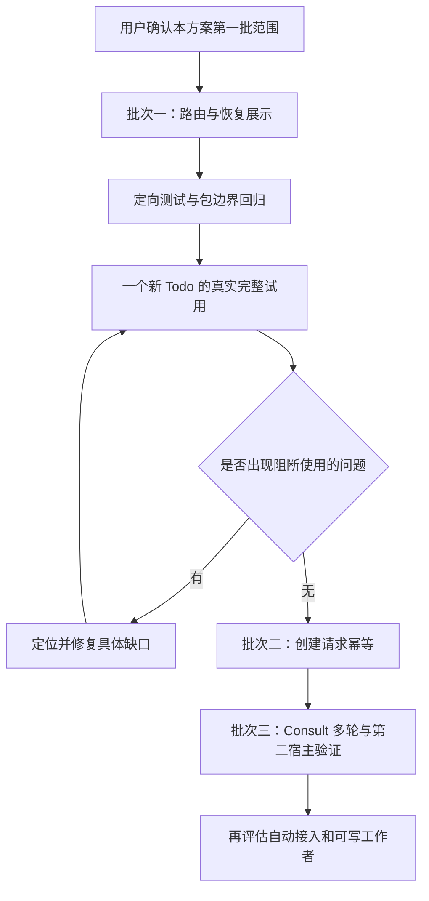

# 下一步：把 Todo 接成顺畅的任务推进流程

日期：2026-09-24，Asia/Shanghai。
状态：已核实现状，已完成 Claude 长期会话 round-189 讨论；**方案待用户确认，未开始业务开发**。
本轮只写方案和进度文档，不创建、完成或归档 Todo，不提交、推送或切换运行时。

## 1. 本轮结论

下一步不是继续大规模拆目录，也不是立即做自治 Agent Team。
先让用户在一个新任务里自然完成：

```text
说明目标 → 确认方案 → 实施 → 检查 → 必要的人工验收 → 明确完成，保留未归档
                         ↕
                    暂停、恢复原任务
                         ↕
                    按需咨询顾问
```

Todo 负责串起这些工作，Consult 提供建议；不要求每个任务都咨询或派多个 Agent。
用户不需要记住内部工具顺序，助手也不能用事后补记录冒充全过程受管执行。
这里的“顺畅”首先是少重复解释、恢复不重做、下一步可信，而不是新增工具的数量。

## 2. 已有基础与真实缺口

核对基准：main，HEAD `49a0d9055a24bc2619ab0cec37aa9d795924d0af`。
开始本轮时工作区干净，相对本地 `origin/main` 领先 10 个提交；没有 fetch，
不把跟踪引用当作远端实时状态。

| 范围 | 已确认事实 | 本次应做什么 | 备注 |
| --- | --- | --- | --- |
| 分层 | Consult 执行链已拆为 Core、MCP、Runner、Agent Runtime；共享本机能力在 Platform | 复用现有边界 | Todo 写入 Store、部分本地执行 CLI 等仍在 MCP 包，不宣称全仓迁移完成 |
| 工程验证 | 9 月 23 日两轮根回归各 1095 passed / 1 skipped，Python 54，source/dist smoke 各 28，类型检查、构建及 Claude 静态审查通过 | 保留证据，未来变更后按影响重验 | 历史候选详见[验证报告](../reviews/2026-09-23-runtime-separation-verification.md)，不是今天重跑 |
| 真实 Consult | 9 月 24 日 Claude fresh 单轮已完成 request、Runner start、read、synthesize | 后续补多轮与恢复使用证据 | 没有用户采用决定，不等于完整顾问或多 Agent 验收 |
| 开发入口 | 用户授权 setup 后，全局 MCP 已指向源码 bootstrap，check exit 0 | 在下一次试用入口核实实际加载情况 | 磁盘配置正确不证明旧进程已重载；不擅自重启或杀进程 |
| 新任务开工 | `start-task` 对已有 managed 能分流，新任务仍可落入 legacy 流程 | 收敛新任务的默认路由 | MCP `start-task` Prompt 仍直接建议手写 phase，与 managed 保护不一致 |
| 真实 Todo | `summarizeTodos` 22 项通过且用户已验收，Todo done、未归档 | 保留完成结果，换一个新任务验证 | 先开发后补受管计划，不是完整计划先行的证据 |
| 恢复与 Next | 已有结构化 context、control、coverage、delivery、检查门禁 | 改善展示与来源，而非再建状态机 | 本地 OBS-003、拆分 Todo 的 Next 都落后于可核实进展 |
| 创建可靠性 | `todoAdd(text, ref?, repo?)` 显式 ref 查重；无 request_id | 单独补请求重试幂等 | 同标题生成另一个 slug，不等于同一次请求重试安全 |

OBS-003 的源码修复和历史回归已经存在，不重新开发。旧问题文档仍有过时描述，
需要明确标注历史与当前状态。旧文档提到的 OBS-001/002 backlog ID 不在当前
本机索引中，不据此自动恢复或新建任务。

## 3. 开发顺序：一批改进，一次试用，再扩大



图中的返工只针对实际失败的步骤及受影响检查，不重复用户已完成的验收，
不重开旧测试 Todo。批次二、三是后续路线，不随第一批确认自动获得全部执行授权。

| 批次 | 交付内容 | 进入与完成条件 | 备注 |
| --- | --- | --- | --- |
| 一：日常推进 | managed 默认路由；有来源的下一步建议；恢复与错误提示；文档纠偏 | 用户确认后实施；定向测试、构建与边界检查通过 | 不改六态、控制状态机或完成语义，不大搬 TodoStore |
| 一后的真实试用 | 一个新任务从实施前计划到完成，含一次暂停恢复及按需 Consult | 新任务的范围与验收先确认；过程记录和实际文件相符 | 单宿主、单顾问；不以重测旧函数凑闭环 |
| 二：创建可靠性 | 同次请求重试返回同一任务；参数冲突可见；半次创建可恢复 | 第一轮使用缺口已收敛后，锁定创建契约再实施 | 手动和自动创建都受益；不是按自然语言强行合并任务 |
| 三：扩展验证 | 同一 Discussion 的 rehydrate；恢复原结果；第二宿主接入 | 复用已有实现，只修实际暴露的缺口 | 不承诺本批已支持新 Provider、PTY 或可写 Agent Team |

如果真实试用先暴露重复创建，批次二的优先级可以前移；如果暴露新产品语义，
先说明场景、与 Claude 讨论并请用户决定，不以“修复”名义扩大范围。

## 4. 批次一设计

### 4.1 用户看到一条流程，内部复用现有机制

建议默认规则：**新建、已决定由 Todo 跟踪、需要开发交付的任务，实施前先确认受管计划。**
普通问答和不需要跟踪的小修改不强制建 Todo；这是既有产品方向，不增加一次
“是否建 Todo”的机械确认。自动识别和记录的完整实现仍在后续，不与本批混写。

| 场景 | 助手应做什么 | 备注 |
| --- | --- | --- |
| 已有受管执行 | 读取同一 Todo/execution 的方案、操作、回执与恢复建议 | 不重建任务，不重新确认没有变化的计划 |
| 新的被跟踪开发任务 | 提出目标、范围、验收、交付，记录真实确认，再绑定工作区实施 | 计划确认不是结果验收 |
| 只要求设计 | 只交付设计 | 任务存在不授权写业务代码 |
| 已有非受管执行 | 展示实际记录与限制；若要继续进入受管开发，先确认本次范围 | 不事后补造先前过程，不批量迁移旧数据 |
| 连接缺工具或本地入口不可用 | 说明缺失点与可修复步骤 | 不静默改走 legacy，然后声称全过程受管 |
| 对 managed 手写 phase | 保持拒绝，提示正确操作及稳定 ID/当前版本的获取方式 | 修复引导，不解除正确门禁 |

同步检查 Skill、MCP instructions、MCP Prompts 和执行助手错误提示，
不能只改一份 Skill 而保留另一条相反的入口说明。
工具不替 LLM 判断任务价值、复杂度或用户意图。

### 4.2 Next 是建议，不是另一套状态或授权

复用现有 workflow、context/recovery、交付要求和本地 inspect。
增加最小的确定性投影，**不另存一套可以独立漂移的流程状态**。
历史 `execution.next` 保留为记录说明；新派生建议与它分开显示，出现冲突时
展示结构化事实及限制，不删除历史或把旧文本当命令。

| 投影内容 | 设计约束 | 备注 |
| --- | --- | --- |
| 建议动作与原因 | 从 control、未处置操作、closing、计划、候选与验收记录派生 | 不调用模型，不自行执行下一步 |
| 来源 | 指向 Todo/execution、计划、操作或检查记录 | 有来源才能解释为什么推荐此动作 |
| 版本与时间 | 使用来源记录版本及时间；读取时间不能冒充验证时间 | 没有 workflow 时明确标识，不伪造受管版本 |
| 新鲜度限制 | MCP context 继续标明 `workspace_observation=not_observed`、`readiness=null` | 不能凭磁盘里的旧检查断言当前文件通过 |
| 本地观察 | 执行助手实际 inspect 后，展示与该候选和版本匹配的结果 | 复用既有版本变化拒绝；不能把一次观察永久缓存为当前事实 |
| 人工决定 | 将待用户判断项说清楚，不自动采用、完成、取消或归档 | 建议动作不是授权 |

优先处理停止请求、原操作结果不明和未收尾操作，再谈计划、实施和检查。
检查已有有效结果时复用；只有候选、范围或验收相关条件发生变化，才重跑受影响项。
具体字段形状属于工程细化，实施前以现有契约和测试确定，不为展示新增调度器。

示例：不再只说“继续执行计划”，而是：

> 已记录实现和检查结果；本次尚未观察工作区是否变化。下一步先核对当前候选，
> 若现有结果仍有效，再汇总真正需要你判断的内容。

这不承诺工具能发现对话里一切新事实。没有进入结构化记录的实测或用户决定，
仍需要主助手核对来源后记录；投影不能凭空知道已经做过什么。

### 4.3 分层落点与边界

| 层 | 本批责任 | 备注 |
| --- | --- | --- |
| Skills / 主助手 | 理解意图、选任务、展示方案与建议、按授权调用 | 属于编排约束，无法拦住宿主绕过工具直接改文件 |
| Core | 纯状态投影与已有门禁复用 | 不运行 OS 观察、模型或任意命令 |
| MCP | 读取并返回投影，统一工具说明与 Prompt | 不为“刷新 Next”启动 Agent 或隐式执行检查 |
| 现有 TodoStore / 本地执行助手 | 提供已有状态；执行实际 inspect/check，核对版本与候选 | 当前仍有实现位于 MCP 包；仅新增必要接缝，不顺手全量迁移 |
| Runner / Agent Runtime | 继续承接已有精确 Consult Turn 执行与 Provider 生命周期 | 本批不改变其调度或权限边界 |

Core 能约束经过受管 API 的操作，不能保证宿主不直接写源码或 YAML。
真实宿主试用验证的是助手是否遵循工作流；单元测试验证的是工具契约，
两者不能互相替代。

## 5. 批次二：可靠创建，不做语义合并

一个手动创建请求也可能“写入成功、回复丢失、用户重试”。因此请求幂等不是
自动接入才需要的功能；它只是第一次明确单次创建、保存任务 ID 的试用之前
不必引入的额外数据层改动。

| 契约 | 建议 | 备注 |
| --- | --- | --- |
| 请求身份 | 同一数据根内按 repo + request_id 识别一次创建 | 由宿主保存并重用，不从标题生成；不同数据根不承诺全局 exactly-once |
| 同键同输入 | 返回原稳定 Todo ID 与创建回执 | 不重新追加任务或覆盖用户编辑 |
| 同键不同输入 | 返回冲突且不写入 | 内容指纹仅覆盖创建语义，不混入时间、传输或请求信封 |
| 不同键同文字 | 不按文字强行合并 | 既有显式 ref 身份规则继续适用；目标是否相同由主助手判断 |
| 并发与中断 | 锁内登记请求与归属；索引、文档之间失败时恢复原事务 | 文件锁不等于跨文件原子性，必须设计回执和部分写入恢复 |
| 已删除或撤销的原结果 | 迟到重试不能复活原请求 | 墓碑/回执及保留规则需在本批契约中明确，不能只返回不存在后再次创建 |
| 非目标 | 空白撤销工具、已有执行退出跟踪、自动自然语言接入 | 它们需要各自完整边界；不把“不跟踪”偷换成 cancelled |

旧[接入方案](2026-09-18-todo-intake-design.md)是讨论来源，不是直接照搬的代码清单。
其中 `not_planned` 等早期说法已被现行六态取代；不为实现本批恢复旧生命周期。
新数据面的具体回执契约确认后再实施，不自动迁移用户数据。

## 6. 测试与真实验收计划

先复用既有测试，再补缺失用例；不以不断增加流程步骤代替实际使用。

| 层次 | 新增或重点断言 | 通过标准与备注 |
| --- | --- | --- |
| 路由回归 | 新建被跟踪开发任务、已有 managed、仅设计、能力缺失；所有入口说明一致 | 不再向 managed 推荐手写 phase；能力缺失不静默降级 |
| Next 单测 | 正常实施、缺计划、阶段验收、整体验收、暂停/取消请求、unknown、closing、终态、陈旧说明 | 状态不被投影改变；动作有来源、版本和未观察限制；不自动归档 |
| 观察与恢复集成 | context 与 inspect 的区别、观察时版本变化、候选漂移、旧结果复用 | 旧记录不能变成当前通过；有效检查不因换会话机械失效 |
| 创建单测与多进程集成（批次二） | 同键重复、异内容冲突、并发、索引/文档部分失败、文档被用户改动、删除后迟到重试 | 一次请求收敛到同一结果，不覆盖用户内容或复活已撤销请求 |
| 既有安全回归 | 生命周期、control、closure、委派、交付、包边界和 source/dist smoke | 不削弱受管门禁；MCP 不导入 Runner/Runtime 执行 |
| 真实新 Todo | 实施前确认计划、绑定目录、实际修改、检查、暂停后恢复同一任务、用户完成决定、未归档 | 不补造之前的操作；遇到未知原操作先核查，不重新派发 |
| Consult 后续验证 | 同一 Discussion 的 rehydrate；显式 recover；第二宿主入口 | 单轮成功不能覆盖这些路径；恢复优先使用可控隔离故障，不在真实用户任务上强造 unknown |

开发时的工程命令入口为 `pnpm typecheck`、`pnpm build`、`pnpm test:boundaries`、
`pnpm test`、`pnpm agent:test`、`pnpm test:execution-smoke`、
`pnpm test:dev-exec-smoke`，cwd 为 `D:/dev/darkingtail/contribbot`。
先运行相关定向用例，批次验收再跑适用的全量与入口回归，记录精确候选及退出码。
这里列的是**未来开发检查计划，本轮没有执行这些测试**。

真实试用建议留在 `D:/dev/darkingtail/contribbot-test`，选择一个新的两三文件功能，
例如任务过滤函数及 CLI 展示；具体题目和输入契约在启动前确认。
不重开已 done 的 `summarizeTodos` Todo，也暂不为验证流程搭建庞大前后端工程。
跨平台文件处理继续使用 Node；Windows 通过不代表 Linux/macOS 已验证。

## 7. Claude 意见与主助手取舍

本轮沿用 session `0e4058f9-0d2b-423c-838b-eaa1bc6e13b2`，round-189。
北京时间 00:57:29 启动、00:59:55 返回，exit 0，实际 session ID 一致。
发送三个已提交文件的冻结快照及必要核实摘要，禁用模型工具、没有模型硬截止，
没有重试或增加顾问。stderr 有 CLI 兼容性提示，不将其写成空 stderr。
这是项目既有长会话脚本，不是通过本轮产品 Consult 验证了 resume。

| 议题 | Claude 意见 | 主助手判断 | 备注 |
| --- | --- | --- | --- |
| 下一批重点 | 路由、Next、恢复提示先于新状态机 | 采纳 | 已有能力接好，比继续拆包更直接 |
| 幂等价值 | 称主要是自然语言自动接入的正确性条件 | 不完全采纳，显式手动请求也存在重试风险 | 本计划列为独立下一批，不忽略问题 |
| 批次顺序 | 前文主张先试用再幂等，结尾表述又将幂等放在试用前 | 不照搬前后矛盾的顺序；采用批次一后先试用 | 明确绑定单次请求和任务 ID；结果不明时不重发 todo_add |
| 机制保障 | Core 有计划、候选和控制门禁；Skill 的默认不能防止绕过 | 采纳，但明确仅针对经过受管入口的操作 | 不宣传“宿主绝不会先写代码” |
| 语义查重 | 建议请用户选择是否跨会话识别同一目标 | 不把它与请求幂等捆绑成新选择 | 沿用明确 ID/上下文续接，有歧义再问；不做标题强制合并 |

原始记录位于本机 `.catpaw/discussions/phase3-claude/round-189.*`，
不默认公开提交原始材料。顾问意见不是测试结果、独立验收或用户授权。

## 8. 非目标、风险与确认点

本轮不扩展自动巡检、知识库初始化/自我进化、Agent Team、PTY、新 Provider、
Python 调度接入、全部 TodoStore 迁移或新 WebUI。不新增主状态、不自动结束旧 Todo。
这些不是永久拒绝，而是在日常任务推进已验证后再设计。

| 风险 | 处理 | 备注 |
| --- | --- | --- |
| 只修提示词、另一个入口仍走旧流程 | 同时检查 Skills、MCP instructions/Prompts 和真实宿主行为 | 文案测试不能代替真实试用 |
| Next 看起来正确，但实测没有写入记录 | 展示来源与未知项；主助手按实际证据补充记录 | 不制造“自动全知”承诺 |
| 为了更好用而削弱安全门禁 | 保持 phase、候选、停止与完成约束，只改善引导 | 发现必须改语义时暂停说明，不自行放宽 |
| 创建幂等牵出全套退出系统 | 固定批次二为可靠创建，其他语义分开讨论 | 删除后的迟到请求仍必须覆盖 |
| 老看板、旧文档与事实冲突 | 保留历史并标注最新依据 | CatPaw 的 5 个 board errors 尚未诊断，不据此判定源码失败 |

**本次请用户确认一件事：先实施批次一，并在其后开展一个新 Todo 的完整试用。**
其中新建、已跟踪、需要开发交付的任务默认计划先行；用户只设计时不开发。
如果认可这一方向，不必再由用户选择内部字段或包名。批次二、三保留在路线中，
启动前按实际缺口确定精确范围；提交、推送、配置变更、远端写入和 Todo 完成仍依原有权限。

## 9. 后续能力诉求：一个 Todo 产生或包含多个 Todo

用户提出：“新建一个 Todo，领取前五个 Issue，并为每个新建 Todo。”
这是一项能力设想，不是本轮领取、创建或开发授权，也没有因此批准前述实施批次。
已与 Claude 长期会话 round-190 讨论。

用户随后澄清：这只是举例，认为后面应该支持。按**后续任务分解与关联能力诉求**
保留，不要求用户现在选择下面两类完成规则，也不把这一选择当作当前工作的阻塞。
具体关系、完成与控制规则留到该能力进入详细设计时讨论；本轮只是更新诉求定位，
沿用 round-190，不新增接口或实现取舍，不追加顾问调用。

当前 `TodoItem` 没有父子关联或跨 Todo 依赖；已有 `plan.steps[].depends_on`
是同一个 Todo 内的步骤，不是多个独立 Todo。现有 `todo_claim` 要求已存在的
Issue 关联 Todo，发布领取评论并记录结果，不等于获得 GitHub assignee 或独占开发权。
因此实现时要复用现有领取回执和恢复保护，不能只加一个父 ID 就宣称批量闭环完成。

以下是未来详细设计需要覆盖的两类例子，不是要求用户现在二选一：

| 用户想完成的事 | 上层 Todo 的完成条件 | 与下面五项的关系 | 备注 |
| --- | --- | --- | --- |
| 领取并建好五个任务 | 固定范围的五项都完成约定领取，并有可追踪的 Todo；按现有规则确认完成 | 上层产生任务，后续修复可独立推进 | 不必等五个修复完成，登记成功也不代表修复成功 |
| 把五个 Issue 解决并交付 | 五个子目标达到各自交付要求，并满足必要的总体范围/集成验收 | 整体目标拆解为独立子目标 | 不能只凭子任务 done 数量自动结束上层 |

主助手建议支持独立 Todo 间的关联：稳定 ID 引用，各自保留计划、执行、状态、
检查和交付，不把子 Todo 的完整对象复制嵌入父对象。
结构归属、任务来源和“完成是否依赖”不能混成同一个自动规则。
这仍是设计建议；字段、单/多父、层数、删除/重开时如何处理，留待该能力的详细设计。

| 必要边界 | 建议 | 备注 |
| --- | --- | --- |
| “前五个”的范围 | 实际执行前明确仓库、筛选和排序，冻结精确 Issue 列表 | 不因列表刷新就替换失败项 |
| 领取授权 | 允许用户一次明确授权固定五项的公开操作，逐项记录真实回执 | 不要求机械询问五遍；本轮设想不是该授权 |
| 部分成功 | 保留已成功项，定位原请求后恢复；已有 Todo 先查明是否可复用 | 结果不明不重发评论、不重复创建，不自动重开终态任务 |
| 关系与状态 | 不默认级联完成、取消或归档 | 父暂停不代表运行中的子操作已安全停止 |
| 子项 cancelled | 未满足原总体目标；由用户选择继续、调整范围或结束 | 不能算成成功，也不能用 with_gaps 豁免必需交付 |
| 与多 Agent 的区别 | 拆成五个 Todo 不等于同时启动五个 Agent | 调度、工作区和执行授权另行处理 |

Claude 指出仅做批量登记时可以只保留批次记录，不一定需要父 Todo。
主助手认可“不要为了嵌套而强造对象”的提醒，但认为用户明确需要持续管理这次
批量工作的目标时，父 Todo 也有价值，不必先新增另一种任务主体。
不采纳“少登记两项即可自行改成未纳入并结束”或“子取消即可用 with_gaps 收尾”
的宽泛表述：原定五项的目标没有被用户修改前，仍有未完成范围。

**当前只记录方向：后续支持 Todo 之间的任务分解与关联，不要求此刻确定详细规则。**
“领取并建好五个任务”偏任务产生/来源，“把五个 Issue 都解决”偏目标分解，
作为未来设计与验证的场景保留，不自动加入第一批开发。原先追问具体例子的完成条件
早于当前需要，现不再作为待用户回答的阻塞项；第一批方案仍按原范围等待确认。
