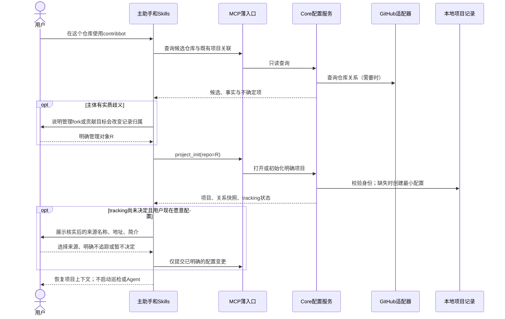
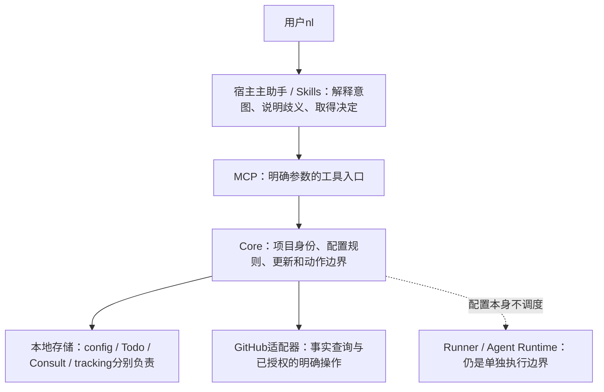

# Project 配置设计：主体、关系与追踪分开

日期：2026-09-25，Asia/Shanghai；2026-09-28 补充用户命名确认。
状态：**一级 `parent` 命名及保留分组已确认；完整 schema 仍为草案，没有实施授权。**
前提：用户已于 9 月 24 日认可六项分离原则；本轮要求“设计，必要时和 Claude 讨论”。
本轮续接原 Claude 长期会话完成 round-205/206，主助手复核并保留异议。
顾问回复不是独立验收、实现完成或用户采用决定。

本文是最新的具体结构建议。此前
[仓库关系与 nl 路由草案](2026-09-24-repository-relations-nl-routing.md)
保留历史推导；其旧配置示例、实施状态和范围不能直接当作当前定稿。

## 2026-09-28 已确认的命名

用户本轮“同意”确认以下范围，不是批准整份草案或开始实现：

| 内容 | 已确认的边界 | 备注 |
| --- | --- | --- |
| 一级 `fork` | 改名为 `parent`，表达主体的直接 fork 来源 | 不是删除或改变项目主体 |
| 根 `repository` | 继续表示 contribbot 管理的仓库 | 不因为来源关系而自动改成 parent |
| 状态与观察时间 | 仍保留在关系分组内 | 不顺带新增 `parent_status`、`parent_observed_at` 等顶层字段 |
| `contribution` | 本次不删除或改变 | 保留原草案，不代表其全部细节已获确认 |

本次只记录已讨论并获确认的命名，不新增内部字段取舍，也不修改业务代码、
活动配置或数据。**下文完整 YAML 与 `fork.*` 路径保留为 9 月 25 日的
历史候选写法，不是继续推荐旧一级名。** 后续完整 schema 应采用一级
`parent`；内部具体字段名与其他尚未确认的细节不由此次确认自动定稿。
当天的顾问意见、主助手纠偏和用户决定见
[2026-09-28 进度记录](../progress/2026-09-28.md)。

## 当前结论 schema（设计候选）

**完整字段、状态分支、必填/禁止规则和初始化示例见
[2026-09-28 全量规范](2026-09-28-project-config-schema.md)。**
以下仅保留此前的简略示例；“绑定可选”不再含混地表示键可以省略。
完整候选保留 `contribution`，并将其值为 `null` 的含义说明为无默认绑定。

下面是截至 2026-09-28 最接近当前结论的结构。`repository`、顶层
`parent`、`lifecycle`、`contribution`、`tracking` 的职责已经明确；
完整字段契约仍未实施。`parent.repository` 是为避免出现
`parent.parent` 而提出的子字段名，尚未作为独立产品决策确认。

```yaml
schema_version: 2

# contribbot 实际管理的仓库，也是本地项目数据的归属主体。
repository: darkingtail/antdv-next

# contribbot 项目自身的生命周期，不是 GitHub 仓库状态。
lifecycle:
  status: active # active | archived
  # archived_at: "2026-09-28T00:00:00+08:00" # 仅 archived 时存在

# 当前主体与直接 fork 来源的关系事实快照。
# 不是“我要追踪谁”，也不是某次 PR 的目标仓库。
parent:
  status: confirmed # unknown | none | confirmed
  repository: parent-owner/parent-repo # 仅 confirmed；示例，不是实际关系
  observed_at: "2026-09-28T00:00:00+08:00" # 成功观察时间

# 可选：当管理主体是 PR 目标项目时，默认从哪个 fork 提供代码。
# 它不是 parent；null 不代表没有 fork，也不阻止具体操作显式指定 head。
contribution:
  working_fork: null # owner/repo | null

# 用户主动选择的持续关注来源。
# pending / none 时省略 sources；configured 时必须是非空列表。
tracking:
  status: pending # pending | none | configured
  # sources:
  #   - repository: parent-owner/parent-repo
```

当前字段的核心规则：

| 字段 | 当前结论 | 备注 |
| --- | --- | --- |
| `repository` | 必填 | 不因它是 fork 就自动改成 parent |
| `parent.status` | `unknown` / `none` / `confirmed` | 未查明、确认不是 fork、确认存在直接 parent |
| `parent.repository` | 仅 `confirmed` 时存在 | 直接来源，不是 fork 网络的最初来源 |
| `contribution.working_fork` | 可选保留 | 与 parent 不等价，是否进入第一版实现仍待决定 |
| `tracking.sources` | 用户明确选择才写入 | parent 不自动成为 tracking source |
| 权限、token、角色、组织 | 不放入 schema | 按具体动作实时观察 |

因此，这份 schema 目前是**设计候选**：顶层 `parent` 的命名已确认，
完整字段与校验按新全量规范集中审阅，不因展示候选而获得实施授权。
`contribution` 保留，不以整理文档为由删减；若要调整首版范围，须另行讨论。
用户已明确不做旧数据兼容，不把“迁移方式待设计”作为新的前置条件；
本轮没有授权或执行活动数据清理。

## 1. 一句话说明

**一份项目记录明确管理一个仓库；来源关系、贡献入口、追踪意图分别描述，
权限针对具体仓库和动作核实。**

用户已认可的是这六项问题分开，不是六个新模式，也不是六份配置文件：

| 问题 | 本轮建议的表达 | 备注 |
| --- | --- | --- |
| 管理哪个仓库 | `repository` | 主体身份，不自动映射 parent |
| 主体从哪里 fork 来 | `parent` | 9 月 28 日已确认一级命名；最近一次成功观察，不是追踪授权 |
| 用哪个 fork 向主体贡献 | `contribution.working_fork` | 可选默认贡献仓库，不限制具体操作覆盖 |
| 持续关注哪些仓库 | `tracking` | 用户选择；parent 不自动加入 |
| 能对各仓库做什么 | 按需的访问与能力观察 | 不永久写在 config，不存 token |
| 项目是否仍在使用 | `lifecycle` | contribbot 项目生命周期，不等于 GitHub 仓库归档或 Todo 状态 |

不新增 `own/fork/tracking` 互斥类型，不持久化可从关系派生的 mode。
旧 mode 展示若保留，只作为摘要，不能用于决定权限、项目身份或动作授权。

## 2. 当前实现与差距

本节来自 9 月 25 日的工作区源码阅读，不是运行测试；
9 月 28 日仅补记命名确认，未重新验证这些实现；现有未提交候选全部保留。

| 已核实位置 | 当前行为 | 本轮设计影响与备注 |
| --- | --- | --- |
| `packages/mcp/src/core/storage/repo-config.ts` | v2 候选含 lifecycle、fork.repository/parent、单一 tracking.repository | 尚无明确主体；需要按下文调整，不能把当前候选当最终 schema |
| `packages/mcp/src/core/utils/resolve-repo.ts` | 扫描 fork 别名或查询 GitHub，自动归到 parent；保留进程缓存 | 必须退出隐式身份改写，不能换个函数继续做同样的事 |
| `packages/mcp/src/core/tools/core/repo-config-tool.ts` | 查看配置可初始化；用当前账号和同名仓库探测工作 fork | 查询/初始化要分开；名称不是关系证据 |
| `packages/mcp/src/core/tools/core/project-init.ts` | 输出 canonical parent，问外部 tracking | 改为显式主体和统一追踪来源；未确认不写 none |
| `packages/mcp/src/core/tools/linkage/sync-fork.ts` | `gh repo sync` 不显式传 source，依赖 fork 默认 parent | 请求必须明确两端，不能由 CLI 默认值偷偷选源 |
| `packages/mcp/src/core/tools/linkage/pr-create.ts` | 解析后的 repo 同时决定本地 Todo 目录和 PR base 仓库 | 必须分开本地项目与远端 head/base，并保留在途恢复机制 |
| `packages/mcp/src/core/storage/upstream-store.ts` | 已按来源仓库隔离追踪数据 | 可复用，但不代表多源配置/Skill 已实现或并发安全已验证 |
| `packages/mcp/src/core/utils/fs.ts` | 固定 `.tmp` 文件后 rename | 不能视为完整读改写锁，不能证明没有覆盖并发更新 |
| `packages/mcp/src/core/utils/repository-access.ts` | 存在未提交权限辅助实现，与配置工具重复 | 不是已接入全部写入口的能力，不据此声称权限问题已修复 |

## 3. 9 月 25 日的配置候选

本节完整示例保留确认前的 `fork` 写法，便于追溯。9 月 28 日已确认将
一级名改为 `parent` 并保留分组；不能直接把此示例作为最新定稿或实际配置。

以下仓库名称、关系和时间均为**虚构示意**，不是实际项目配置，也不会写入活动数据目录。
例子表示：管理 `team/ui`，它来自 `origin/ui`；用 `alice/ui` 向它贡献，
并且用户明确选择追踪 `origin/ui` 和 `reference/ui`。

```yaml
schema_version: 2

repository: team/ui

lifecycle:
  status: active

fork:
  status: confirmed
  parent: origin/ui
  observed_at: "2026-09-25T00:00:00+08:00"

contribution:
  working_fork: alice/ui

tracking:
  status: configured
  sources:
    - repository: origin/ui
    - repository: reference/ui
```

建议稳定顶层域、域内扩展，不建立通用仓库关系图。第一版限定 GitHub.com，
`repository` 及所有仓库引用使用 `owner/repo` 字符串；多平台地址、主机注册表和
独立 repo ID 系统不在本轮。真实需要时通过版本边界扩展，不靠字符串偷偷塞 host。

保留 `schema_version: 2` 作为当前候选版本；严格验证整个结构。
这不是让新加载器兼容之前写出的各种 v2 候选。形状不符就报错，不猜测转换、
不自动清空或从备份恢复。若实施时存在旧候选活动配置，单独说明后按用户授权处理。

原 `fork.repository` 所表示的“贡献工作 fork”信息移到
`contribution.working_fork`；主体明确为根 `repository`。
这不是无条件删除旧信息，更不是授权自动迁移旧数据。

### 3.1 repository：主体身份

`repo` 工具参数、配置中的 `repository`、本地目录身份必须一致。
正常的格式/大小写规范化不等于 fork→parent 的语义改写；目录键建议统一规范化，
仓库引用比较和去重使用相同规则。URL、SSH remote 等只在宿主入口解析，
存储拒绝路径越界、额外路径段及非法引用；不采用顾问临时正则作为完整 GitHub 规范。

同一个 fork F 可以独立成为项目，也可以被 R 项目引用为工作 fork。
F 与 R 的 Todo、Knowledge、Consult、追踪历史不会因此共享、合并或搬家。
普通配置更新不能改主体；改名、转移或改变管理主体是另行设计的操作。

### 3.2 fork：主体自身的关系快照

| status | 必需内容 | 备注 |
| --- | --- | --- |
| `unknown` | 仅 status | 尚未成功查明；禁止 parent/observed_at，不假装非 fork |
| `none` | observed_at | 最近一次成功查询确认不是 fork；禁止 parent |
| `confirmed` | parent、observed_at | parent 不能等于主体；表达直接来源，不是网络最初来源 |

`observed_at` 是成功观察时间，不是有效期。查看时标注“上次确认于……”。
查询失败、404、限流或离线不擦除已有快照；当前失败作为本次查询结果另行展示。
只有明确初始化/刷新操作保存新的事实，不在普通 config 查看中偷偷刷新文件。

执行相关写操作时核实当前事实。**历史快照较老，但本次已查明关系一致，可以继续
已有授权内的操作，不要求用户额外手动 refresh。** 当前查不清则停止依赖该事实的
写操作；发现关系变化则说明原快照和新事实，停止受影响的旧绑定操作，不静默换目标。
这不是全项目停工，本地 Todo 等不相关工作仍可继续。

### 3.3 contribution：贡献使用的默认入口

`working_fork` 为一个完整仓库名或 `null`；`null` 仅表示没有默认绑定。
不表示没有 fork，不强迫初始化时选 fork，也不阻止同仓库分支开发或 PR。
非 null 不得等于主体；同仓库开发使用主体本身，不伪装成 fork。

绑定时核实是 fork 且与主体处在相关 GitHub fork 网络中；同网络是候选关系，
不是对某次同步或 PR 一定成功的保证。每次操作核实具体 head/base、分支和权限。
不将 working_fork 限制为主体的直接子 fork，也不把其 parent 与主体 parent 混淆。

一个默认值不限制临时显式使用其他 fork；多个本地 worktree 也不要求增加此字段。
暂不增加 `contribution.target` 或自动维护双向关联。独立管理 F 时，向 R 发 PR
可以直接在操作里指定远端 base=R，本地 Todo 仍归 F，不要求同时新建 R 项目。

### 3.4 tracking：明确选择的来源集合

| status | 数据 | 备注 |
| --- | --- | --- |
| `pending` | 不带 sources | 用户尚未作出选择，取消/无回复仍 pending |
| `none` | 不带 sources | 用户明确当前不追踪任何来源 |
| `configured` | 非空 sources 数组，每项含 repository | 不允许重复或主体自身；parent 只有被明确选择才出现 |

不需要穷尽询问全世界的候选再进入 configured：用户明确选 X，就保存 `[X]`，
不是强迫再回答 parent 的问题，也不是永远不能增加 parent。
新增、删除和替换均按用户明确的集合变更；删除最后一项须有清楚的停止追踪决定，
不能将“用户没回答”解释为空集合。移除来源不删除其历史处理记录。

建议第一版就支持列表维护，因为“parent + 其他来源”至少需要两项。
**多源配置不等于多源自动执行**：每次执行明确选择一个来源，不新增自动 fan-out、
并行调度、来源优先级或全源巡检。来源分支、路径过滤等以后可在来源对象内扩展，
本轮不提前塞未实现字段。版本锚点、游标和运行结果继续属于追踪数据而非 config。

单次明确查询别的仓库不必先改 config；已授权的单次来源操作也不隐式加入持续列表。
真正写入的追踪记录始终保留明确来源身份，不能混入当前默认源。

| 主体关系 | 追踪选择 | config 映射 | 备注 |
| --- | --- | --- | --- |
| 非 fork | 不追踪 | fork.none + tracking.none | 关系类别 1 |
| 非 fork | 其他源 | fork.none + sources `[X]` | 类别 2 |
| fork | 不追踪 | fork.confirmed(P) + tracking.none | 类别 3 |
| fork | 仅 parent | fork.confirmed(P) + sources `[P]` | 类别 4 |
| fork | 仅其他源 | fork.confirmed(P) + sources `[X]` | 类别 5 |
| fork | parent 与其他源 | fork.confirmed(P) + sources `[P,X]` | 类别 6 |

关系 unknown 与意图 pending 不被硬塞入以上已查明/已决定的六类。

### 3.5 lifecycle：不扩大归档语义

继续使用 active / archived；archived 带 archived_at，active 不带。
归档不改变 Todo、GitHub 仓库或正在运行的操作，不自动恢复项目。
默认列表和巡检排除归档项目，新的维护执行依既有门禁要求显式恢复。

本轮不采纳“归档就禁止所有本地配置维护”的扩大解释；用户明确维护归档配置时，
保持 archived，不借编辑配置隐式恢复、启动任务或绕过执行门禁。

## 4. 权限和事实放哪里

建议第一版不增加 `access.yaml`，也不将 `role/org/permission` 放回 config。
一次调用对实际涉及的仓库去重查询，结果带仓库名、当前认证身份（或未核实）、
观察时间、访问结果、可观察到的权限以及具体操作的允许/拒绝/未核实理由。
认证身份不必总是个人账号；不得保存或输出 token。

读取成功不一定能观察到完整权限；403 可能限流，404 可能与认证/可见性有关。
公开可读也不代表有写权限。不能由一个项目级 role 代表主体、parent、工作 fork
和追踪来源。具体写操作需考虑目标、分支、规则和当前凭据能力；预检不承诺 API
最终一定接受，实际返回仍为事实。权限未知时不写，不伪造允许或自动重试变更。

关系事实、用户意图和易变观察三者虽然不都拆文件，但来源与更新权限必须清楚：

| 内容 | 权威来源与保存位置 | 备注 |
| --- | --- | --- |
| 主体、工作 fork 绑定、追踪选择、生命周期 | 用户决定，config | 普通查看不能改 |
| fork/parent 快照 | GitHub 成功观察，经 init/refresh 保存到 config | 带时间，不能被当作当前写入许可 |
| 当前权限、可达性、操作条件 | 本次 GitHub 观察结果 | 不作永久配置；失败不覆盖旧关系 |
| Todo、执行、Consult、追踪游标、Knowledge | 各自现有数据域 | 不塞入 config，不因配置修改完成任务 |

## 5. 初始化和 nl 使用体验

工具层要求明确 `repo=owner/repo`，不再接受隐式仓库默认。
宿主可以从当前目录获得候选，但候选与确定的项目主体不同。



如果用户或调用方已明确 `repo=F`，就操作 F，不再问一次“其实是不是 parent”。
只有“在这里 init”之类未明确主体、又存在真实歧义时，才把候选含义说清后询问。
已有用户选择的唯一关联可以帮助宿主恢复上下文；当 F 自己也有项目或有多个关联，
不能静默选其中一个。反向查找只是发现候选，不回到工具层自动 remap。

普通 `repo_config` 查看无配置时返回 not_initialized，不创建目录。
只有明确的 `project_init` 可创建最小配置；网络不可用时使用 unknown 事实，
tracking 留 pending，不猜权限、parent 或来源。已有合法项目的本地 Todo 不因此阻塞。
归档项目 init 不恢复。知识初始化、自动建 Todo、扫描和 Agent 启动不是本次 init 副作用。

| nl 示例 | 建议处理 | 备注 |
| --- | --- | --- |
| “用源仓库 main 更新我的 fork main” | fork-sync，source=源仓库、destination=我的 fork | 不去 daily-sync；明确方向不反复追问 |
| “同步上游分支” | 先识别 Git 分支动作，再由上下文确定两端 | 不机械追问是不是追踪；两条同步边都合理才询问 |
| “同步上游” | 结合当前任务和关系判断，有实质歧义才询问 | 说明各选项会改分支还是只记录来源变化 |
| “看看 reference/ui 最近更新” | 明确来源的查询/追踪工作流 | 不自动添加长期来源，不执行分支同步 |
| “以后也关注 reference/ui” | 核实并展示候选，确认后追加来源 | 不自动把 parent 加进去 |

## 6. 同步、PR 与 Todo 的边界

### 6.1 fork-sync

明确请求包含项目 repo、source_repository、destination_repository、branch。
当前适配器建议只实现同名分支同步；不同分支名须明确提示尚未支持，不能悄悄换分支。
没有指定分支时先读出源仓库的实际默认分支，核实目标的同名分支，
并在操作说明里显示，不假定 main。

选 parent→主体或主体→工作 fork 时，核实与这次操作有关的实时关系。
working_fork 同网络不等于其 parent 一定是主体；直接展示实际源和目标，
不为简化候选逻辑强行限制合法贡献绑定。

执行适配器显式传两端，不依赖 `gh` 默认 parent：

```text
gh repo sync <destination> --source <source> --branch <branch>
```

本轮不执行此命令。实现后默认不使用 force，不覆盖分叉提交。
同网络、已绑定、权限预检均不是一定可快进的保证；失败按实际原因返回。
远端分支同步不等于用户本地工作目录更新，未明确包含本地就不 checkout/pull。
请求结果不明不能仅凭超时就重新发起远端变更。

### 6.2 PR：本地项目、head 与 base 三者分开

接口草案沿用必填 `repo` 表示本地项目，语义相当于 project_repo，
不另造两个含义相同的项目参数。远端端点另外明确：

```text
pr_create(
  repo,                 # 本地项目和Todo归属
  base_repository,      # 远端PR目标仓库
  base_branch,
  head_repository,      # 代码来源仓库
  head_branch,
  todo_item?, ...
)
```

这是拟议契约，不是当前可调用的工具签名。宿主可提出默认值，但具体写入请求
必须确定实际端点；跨仓库不能自动把 repo 改成 parent。
来源 Issue、PR 关联和远端恢复记录保留完整仓库身份，而不仅是 #number。
同组织不同仓库还要按 GitHub API 的 head_repo 等约束构造请求，不靠同名仓库猜测。

| 场景 | 本地 repo | PR base | PR head | 备注 |
| --- | --- | --- | --- | --- |
| 管理目标，通过工作 fork 贡献 | team/ui | team/ui | alice/ui | Todo 属 team/ui |
| 独立管理自己的 fork，向目标贡献 | alice/ui | team/ui | alice/ui | 不需创建 team/ui 项目；Todo 留 alice/ui |
| 有权限的同仓库开发 | team/ui | team/ui | team/ui | working_fork 可为 null |

现有 PR 在途记录、结果恢复和本地关联恢复必须保留；不能修改端点后把同一次请求
误认成新操作。公开 PR 成功但关联失败时恢复原结果，不重复创建。
改变默认工作 fork 不重写已有执行、检查、交付计划或历史 PR，也不自动 done/归档。

## 7. 分层与更新安全



这张图定义职责，不承诺本轮迁移所有现有包。MCP 不理解 nl、不自行选 parent、
不启动模型；Skills 负责工作流，Core 对所有入口统一校验。
不重新合并已拆分的 Consult/Runtime，也不为配置另造一个 Agent Runtime。

配置更新需要完整读改写保护，而不仅是 rename：
调用方以用户看到的配置快照 digest 提交意图；在同一路径的跨进程短锁内重新读取，
先比较 expected_digest，再应用语义更新、全量校验、用唯一临时文件原子替换。
初始化同样在锁内处理“文件仍不存在”。不要在持锁期间进行慢速网络请求或等用户答复。

冲突时返回最新状态与差异，不自动套用用户对旧快照的决定。锁归属或残留无法确定时，
不擅自删除锁或清数据；工程实现复用经验证的本地锁机制，补多进程/崩溃恢复测试。
没有遵守锁的外部编辑器仍可能竞争，不承诺消除所有手改竞态；检测到漂移须停止。
不为此新增业务 revision 字段，schema_version 也不是并发版本号。

## 8. 与 Claude 的一致与分歧

两轮均原生 --resume 成功、session 身份一致；只发送原则、源码行为摘要、
候选与反例，没有完整业务源码、diff 或凭据。CLI 自身可保留会话元数据，
工具禁用不等于严格读取隔离。顾问首轮“查阅事实”实为使用主助手摘要，不是自行读码。

| 议题 | 顾问意见 | 主助手综合与备注 |
| --- | --- | --- |
| 主体显式、取消自动 parent 归属 | 支持 | 采纳方向；工具显式 repo 已明确时不重复问 |
| sources 列表 | 支持完整列表维护，不等于调度 | 纳入草案，第一版范围仍待用户确认 |
| 反向 contribution.target | 首轮提出 | 不采纳；PR base 可显式指定，不增加双向配置一致性负担 |
| 空 working_fork | 首轮会提示必须指定 fork | 不采纳；同仓库开发/PR 不受阻 |
| 多进程安全 | 首轮认为原子替换足够，次轮认可锁/digest | 采纳修正；其示意代码仍漏比较调用方 expected_digest，不能直接抄用 |
| 工作 fork 必须是主体直接子 fork | 次轮坚持 | 不采纳；官方 PR 契约是同网络，gh 支持显式 source，按操作核验，不为同步简化限制绑定 |
| 快照旧就强制用户手动 refresh | 次轮建议 | 不采纳；执行前实时核实一致即可，查不清/变化才停相关动作 |
| 归档配置一律禁止维护 | 首轮提出 | 不扩大现有语义；明确本地维护不自动恢复或执行任务 |
| 示例与校验 | 首轮出现主体等于 parent | 撤下错误例子，拒绝自引用；没有采用顾问示例作为真实配置 |

## 9. 后续实施批次与验收

以下是待批准的实施顺序，不是开工记录。无需为了设计重跑当前业务测试。

| 批次 | 范围 | 完成判据与备注 |
| --- | --- | --- |
| A：配置与身份 | 严格 schema、明确 repo、存储隔离、更新保护；审计 resolveRepo 全部调用方 | 错误身份拒绝，R/F 不串库；所有相关原有调用方覆盖后再切换，不留新旧语义混用 |
| B：入口与 nl | init/查看/refresh 分离，来源列表维护，独立 fork-sync Skill 与其他 Skills 调整 | 不误询问、不误写 none、不查配置就建项目；各宿主传明确 repo |
| C：动作端点 | fork-sync、PR head/base、本地 Todo/Issue/远端恢复关系 | 不默认错源、不硬编码 main、不重复公开写入；保留执行与交付门禁 |
| D：回归与实测 | 单测、类型/构建、全部业务回归、真实 nl 试用 | 真实远端写入另行授权；mock/文档检查不充当真环境验收 |

| 验收场景 | 预期 | 备注 |
| --- | --- | --- |
| 六类关系及 pending/unknown | 严格区分，都有可表达的配置 | 检查格式，也检查实际行为 |
| 自 parent、自工作 fork、自追踪、重复源 | 拒绝无效值 | 按统一仓库比较规则 |
| 未知键/版本、目录和 repository 不符 | 清楚报错，不转换 | 不做旧数据兼容 |
| F/R 同时有独立项目，工具显式 repo=F | 只读写 F | 不被 parent 或反向关联截走 |
| 来源确认取消、模糊简称、候选变更 | pending 或保留原选择；先核实再确认 | 展示真实地址/名称/简介 |
| 添加第二源、删除最后源、移除后查历史 | 集合正确、最后项决定明确、历史仍在 | 不自动全源执行 |
| 查配置无项目、init 两次、归档再 init | 查看不创建；init 幂等且不恢复归档 | 没有巡检/知识生成副作用 |
| 关系查询失败但有旧 parent | 保留快照，显示失败 | 不伪造 none，不擦除事实 |
| 旧快照 + 实时一致/变化/失败 | 一致可用；变化或失败阻止相关写入 | 不机械要求手动 refresh |
| 权限变化、403限流、404、规则拒绝 | 区分未核实/具体拒绝，保留实际结果 | 不用 role 粗判万能许可 |
| 工作 fork 为同网络兄弟仓库 | 绑定/PR 依据网络核验，sync依据显式两端 | 真实远端支持不能仅由 mock 证明 |
| 两个进程同时更新不同字段 | 后到的旧 digest 冲突，不覆盖先前更新 | 加锁范围覆盖整个读改写 |
| 锁残留、写失败、临时文件竞争 | 原文件完整，报告恢复边界 | Windows/macOS/Linux 需真实验证 |
| 跨仓库 PR 关联本地 Todo | repo/base/head 各归各，不串记录 | 回执恢复不重新创建 PR |
| PR 成功而本地关联失败，随后配置变更 | 恢复原请求端点和关联 | 不以新默认值重发原请求 |
| 修改 config 后已有执行/Consult | 已有目标、证据、决定及生命周期不被改写 | 非配置直接依赖保持原行为 |
| 同步分支 nl / 上游变化 nl | 正确区分动作，有真实歧义才询问 | 不靠增加 Skill 名称就宣称修复 |

## 10. 需要用户确认的新增选择

六项分离原则和 9 月 28 日的一级 `parent` 命名不用重复确认。
该命名确认不代表下列完整行为取舍均已获批准。当前最影响产品的新增建议为：

| 选择 | 推荐 | 影响与备注 |
| --- | --- | --- |
| 项目主体与存储 | R 可以是 fork；R/F 可各自独立，工具不自动归 parent | 改变当前 resolver 的基础行为，属于核心语义，不只是字段改名 |
| 追踪来源范围 | 第一版使用完整来源列表，包含用户选择的 parent/其他源；只明确选源执行 | 比旧单源候选多列表维护，不附带调度/自动巡检 |
| 事实与观察边界 | parent 快照留 config，权限只按需查，不增加 access.yaml | 避免配置膨胀；旧事实需标时间，写入要实时核实 |

本轮不进入实施。确认结构后先核对影响面并形成精确实施范围，再开始修改。
不新增一般仓库图、反向 target、多平台、多源调度、自动 Todo、权限历史或数据迁移。

## 11. 来源与限制

| 来源 | 用途 | 备注 |
| --- | --- | --- |
| 当前源码，见第 2 节 | 判断已有耦合与修改面 | 仅静态阅读，非业务测试 |
| `.catpaw/discussions/phase3-claude/round-205.*`、`round-206.*` | 本次设计咨询与主助手反例 | 原文保留，分歧不改写成一致通过 |
| `https://docs.github.com/en/rest/repos/repos#get-a-repository` | parent 是直接来源，source 是网络最初来源 | 2026-09-25 实际读取官方说明 |
| `https://docs.github.com/en/rest/pulls/pulls#create-a-pull-request` | 同网络 PR、head/base 与 head_repo 参数 | 不证明用户具体权限或任意分支可成功 |
| `https://cli.github.com/manual/gh_repo_sync` | 显式 source/destination、同名分支、默认快进与 force 区别 | 不把 CLI 能力当作操作授权 |
| `https://docs.github.com/en/rest/using-the-rest-api/troubleshooting-the-rest-api` | 404 认证可见性、403/429 限流 | 不从失败推断无 fork/永久无权限 |

验证限制：只核对设计材料与文档，不运行新业务测试、GitHub 实写、初始化、
setup、迁移或数据恢复。业务候选和原有未提交改动保留；不提交、不推送。
